# CLM reference: model, regulation, and lifecycle

**Part of:** CLM Discovery initiative document set  
**Audience:** Architects, GRC, compliance, product  
**See also:** [Executive brief](./01-executive-brief.md) · [Vault gap & plugin](./03-vault-gap-and-plugin.md) · [PKI primer](./certs-management-for-dummies.md)

This document defines what enterprise CLM is, what is changing in regulation (including SC-081), and the full lifecycle stage model. It is **reference material**, not Release 1 funding scope (see [Release 1 commitment](./03-vault-gap-and-plugin.md#release-1-commitment-vs-product-vision)).

---

## What CLM should be

### 2.1 Working definition

> **Enterprise CLM** is the ongoing work of discovering certificates across the estate, classifying and tagging them, enforcing policy, automating deployment and renewal, maintaining status and event history, integrating change and ownership records, and producing standards-based audit evidence from creation through retirement.

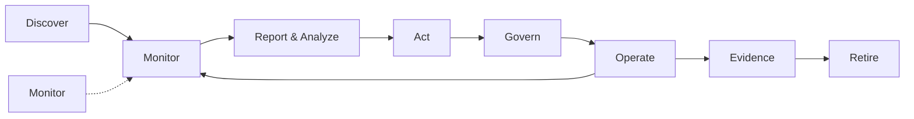

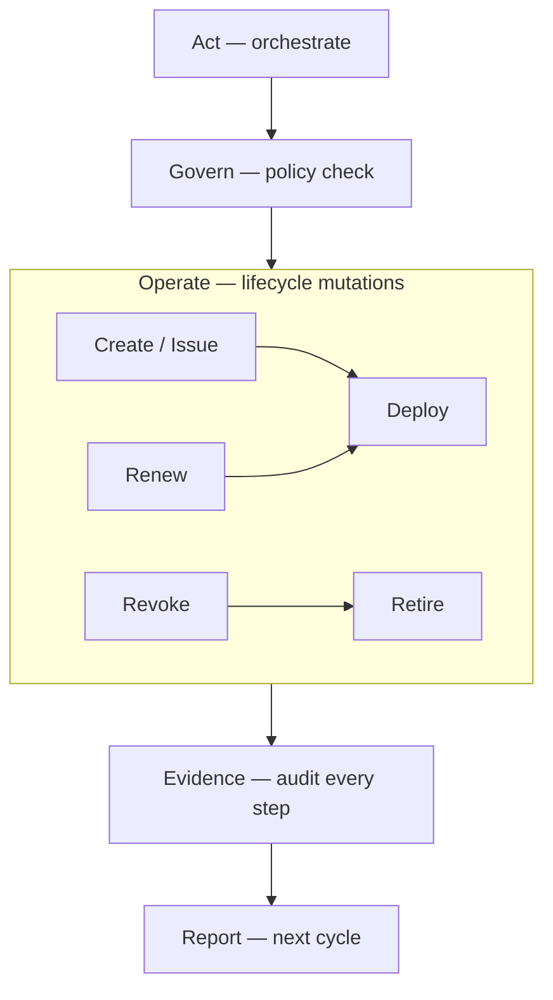

**Important distinction:** **Report** is not the same as **Evidence**.

| Term | Meaning | When |
|---|---|---|
| **Report & Analyze** | Operational output for humans and automation: new/changed certs, deltas since last scan, risk highlights, standards violations, trends | After initial discovery **and** on every continuous monitoring cycle |
| **Act** | Configurable **orchestration** triggered by report findings: alert owner, create ticket, import to inventory, queue for operate, escalate | Immediately after analysis (manual review or policy-driven auto) |
| **Operate** | **Certificate lifecycle mutations** executed under policy: **create** (issue/enroll), **renew**, **revoke**, deploy, retire | When Act (or manual operator) triggers a lifecycle change |
| **Evidence** | Immutable **traceability / audit** record: who/what/when/policy/before-after state for every Act and Operate event | After every Act and Operate step — for auditors and change management |

Shorter mnemonic: **Discover → Report → Act → Operate → Evidence** (with Govern enforcing policy throughout; Retire as terminal Operate state).

**Act vs Operate — do not conflate:**

| | **Act** | **Operate** |
|---|---|---|
| **Nature** | Workflow orchestration / triage | Actual cert lifecycle change |
| **Examples** | Alert owner, open ticket, import metadata, queue renew | Issue cert, renew cert, revoke cert, deploy to endpoint, remove old cert |
| **Analogy** | "Something should happen" | "It happened" |
| **Feeds evidence?** | Yes — act initiated, policy matched, queue state | Yes — create/renew/revoke outcome, fingerprints, deploy result |

Both **Act** and **Operate** must be fully traceable. Evidence is not optional for either.

### 2.1.1 The continuous loop (where reporting really lives)

Reporting is **not** a one-time post-discovery artefact and **not** only at retirement. It is the **bridge between visibility and action**:

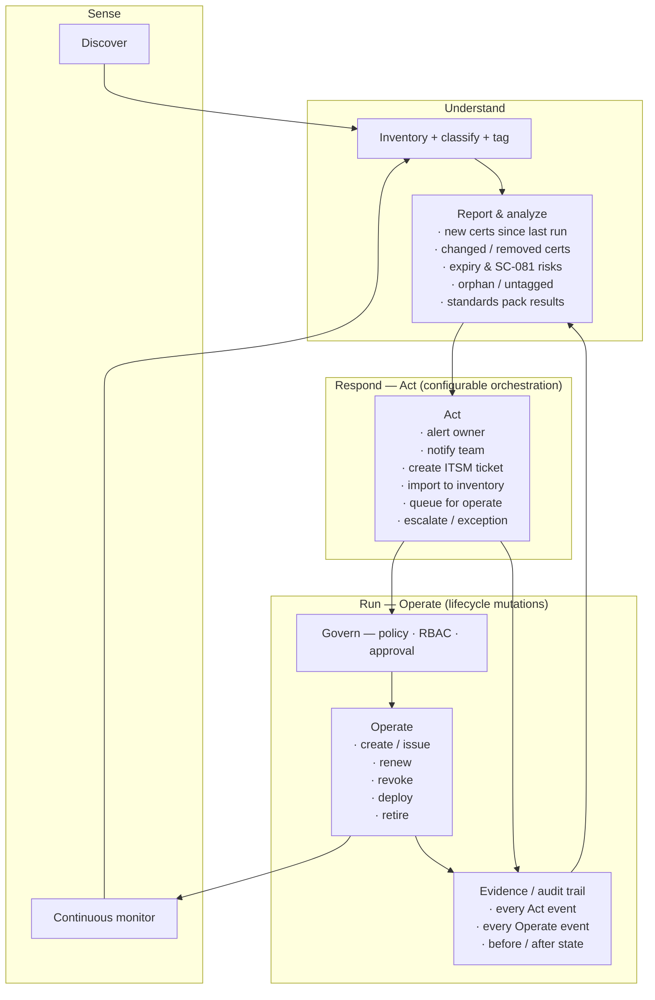

**First discovery run** produces a baseline report ("here is everything"). **Every subsequent monitor cycle** produces a **delta report** ("here is what changed and what needs attention"). That delta report is what drives day-to-day operations — not the initial inventory dump alone.

### 2.2 Three layers (not one product feature)

| Layer | Question it answers | Typical owners |
|---|---|---|
| **Visibility** | What certs exist, where, how risky? | Security, platform, audit |
| **Control** | Who may issue/renew/revoke under what policy? | PKI, IAM, risk/compliance |
| **Operations** | Do certs stay valid, correctly deployed, and retired cleanly? | SRE, app teams, change management |

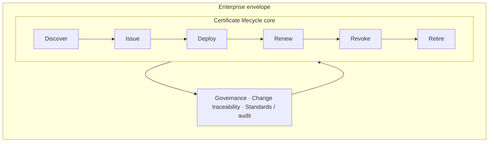

Vault primarily serves **Control + Operations for Vault-managed certs**. Enterprise CLM requires all three layers across the **whole estate**.

### 2.3 Core capability model

| # | Capability | What "good" looks like |
|---|---|---|
| 1 | **Discovery** | Automated scan of endpoints, LB, K8s, stores, cloud APIs |
| 2 | **Inventory** | Normalised, **human-readable** record: service, endpoint, owner, subject, SANs, issuer, chain, expiry, location — not serial/key_id as primary key |
| 3 | **Classification** | External/public vs internal/private vs self-signed vs unknown |
| 4 | **Tagging** | Owner, environment, service, criticality, compliance scope |
| 5 | **Assessment** | Expiry risk, weak crypto, policy violations, orphan certs |
| 6 | **Reporting & analysis** | Baseline + delta reports: new/changed/removed certs, risk highlights, standards results, trends |
| 7 | **Action engine** | Configurable orchestration from report findings: alert, ticket, import, queue-for-operate, escalate — **policy-driven** |
| 8 | **Governance, policy & RBAC** | Policy engine (YAML/OPA, Org→Team→Project inheritance, NL→draft→review→publish), approvals, exceptions, fine-grained RBAC; integrates Vault ACL + Identity |
| 9 | **Operate — create / issue** | Enroll or issue new cert (Vault PKI, ACME, SCEP, external CA) under policy |
| 10 | **Operate — renew** | Re-issue before expiry; key rotation; overlap window |
| 11 | **Operate — revoke** | Invalidate cert (CRL/OCSP where applicable); emergency revocation |
| 12 | **Operate — deploy** | Agent, cert-manager, LB API, config management |
| 13 | **Operate — retire** | Remove superseded cert/key from endpoints and stores |
| 14 | **Monitoring** | Continuous re-scan, drift detection, CT anomalies — feeds back into reporting |
| 15 | **Traceability & audit** | Immutable event log for **every** Act and Operate step; export for auditors |
| 16 | **Change traceability** | ITSM ticket / change record linked to events, incl. auto-approved |
| 17 | **Status & history** | Logical cert identity + fingerprint + endpoint bindings + event timeline |
| 18 | **Standards packs** | Versioned rules (SC-081, ISM, DORA, PCI, internal policy) — input to reports |
| 19 | **Import & replace** | Register unmanaged certs, migrate to Vault-managed issuance with verified cutover |

The discovery prototype sits in **1–4, 6 (baseline report), partially 5, 15–18**. **Report → Act → Operate (9–13) → Evidence (15–16)** is the full operational loop, under **Governance, policy & RBAC (8)**. **Import & replace (19)** is the bridge from visibility to Vault as control plane. That is **Release 2** priority, not Release 1.

> **Not separate lifecycle stages:** Policy sits under **Govern** (§4 lifecycle stage 4, §2.8–§2.10). API-first integration is a platform requirement for how the tool is built and consumed, not a certificate lifecycle stage (§2.11).

**Platform non-negotiables for any plugin we build:** **traceability/auditability** on every action, **fine-grained RBAC**, **customisable policy** (within Govern), and **API-first** delivery (see §2.6–2.11).

### 2.4 Report content: what a good operational report includes

Every report run (baseline or delta) should answer:

| Section | Content | Drives action |
|---|---|---|
| **Summary** | Total certs, new since last run, expiring <30/60/90 days, critical violations | Executive / program view |
| **New in environment** | Certs or endpoints not seen before | Import, tag, assign owner |
| **Changed** | Fingerprint/expiry/issuer/binding changes | Investigate drift or renewal |
| **Removed** | Previously seen, no longer present | Confirm decommission vs scan gap |
| **Risk highlights** | SC-081 over-length, weak crypto, orphan, untagged, external unmanaged | Prioritised remediation queue |
| **Standards pack results** | Pass / Fail / Exception / N/A per rule (SC-081, ISM, PCI, etc.) | Audit readiness |
| **Recommended actions** | Per finding: suggested act (alert / import / renew / replace) | Human review or auto-policy |

Reports should be exportable (HTML/PDF/CSV) **and** machine-readable so the **action engine** can consume them without a human in the loop where policy allows.

### 2.5 Action engine: configurable responses

All actions are **policy-configurable** — nothing is hard-coded. Examples:

| Trigger (from report) | Act (orchestrate) | Operate (if queued) |
|---|---|---|
| New cert discovered, no owner tag | Notify platform team · require tag | — |
| New external public cert | Alert owner · import · **queue create/replace** | Create/issue · deploy · retire old |
| Expiring in <30 days, `managed_by: external` | Alert owner · **queue renew** | Renew · deploy · verify |
| SC-081 validity violation | Flag critical · alert · **queue replace** | Create · deploy · revoke/retire old |
| Compromised cert suspected | Alert security · **queue revoke** | Revoke · deploy replacement · retire |
| Policy-approved auto-renew | Queue renew (auto) | Renew · deploy (auto) · evidence |

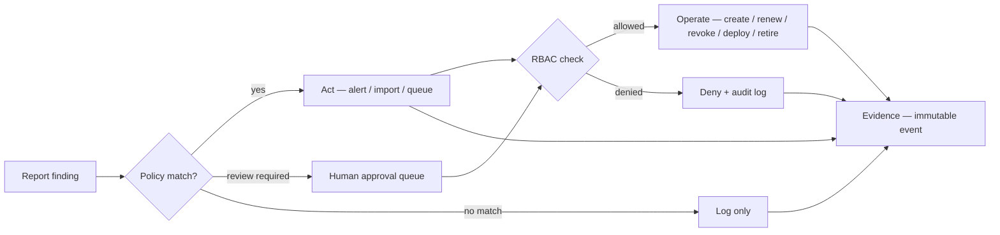

Auto-approved Act and Operate steps still produce **evidence** — they are not invisible automation.

### 2.5.1 Operate action items (create / renew / revoke → evidence)

These are the **lifecycle mutations** the action engine queues or an operator triggers. Each operation is a discrete, auditable step — not a black-box "renew cert" button.

| Operate action | What happens | Typical Vault integration | Evidence emitted |
|---|---|---|---|
| **Create / issue** | New cert enrolled or issued under policy (new workload, import & replace, SC-081 cutover) | `pki/issue`, ACME, SCEP, `pki_external_ca` | `operate.issued` — serial, SPKI fingerprint, role, policy_id, Vault request_id, approver |
| **Renew** | Re-issue before expiry; optional key rotation and overlap window | `pki/issue` (same role), Agent auto-renew | `operate.renewed` — old/new fingerprint, expiry delta, deploy status |
| **Revoke** | Invalidate cert (CRL/OCSP); emergency or policy-driven | `pki/revoke`, CRL publish | `operate.revoked` — reason, timestamp, affected endpoints, Vault request_id |
| **Deploy** | Push cert/key to target (Agent, cert-manager, LB API, config mgmt) | Agent template, K8s secret, webhook | `operate.deployed` — target, method, verify result (TLS handshake) |
| **Retire** | Remove superseded cert/key from endpoint and stores | Agent reload, LB update, manual confirm | `operate.retired` — old fingerprint removed, status → `retired` |

**Evidence chain for a typical renew:**

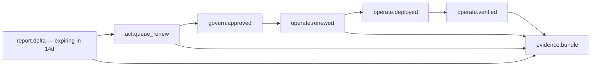

Every Operate step carries a **correlation_id** linking back to the report finding and Act that triggered it. Auditors can trace: *finding → policy → approval → issue → deploy → outcome*.

### 2.6 Traceability & auditability (platform requirement)

Whatever tool or plugin we build, **traceability is not a nice-to-have** — it is a core product requirement for regulated customers (APRA, DORA, PCI, ISO, FedRAMP themes).

**Every event that must be auditable:**

| Event category | Examples | Minimum audit fields |
|---|---|---|
| **Sense** | Discovery run, monitor cycle, scan target | run_id, timestamp, actor/service, scope, cert count |
| **Report** | Baseline generated, delta generated, export | report_id, findings summary, standards pack version |
| **Act** | Alert sent, ticket created, import queued, escalation | act_type, policy_id, trigger_finding, recipient |
| **Govern** | Policy check, approval granted/denied, exception applied | policy_id, approver, decision, exception_expiry |
| **Operate** | Create, renew, revoke, deploy, retire | operation, cert_fingerprint before/after, Vault request_id, outcome |
| **RBAC** | Access granted/denied to plugin function | user/service identity, role, resource, action, result |

**Design principles:**

- **Append-only event store** — events are never deleted or silently overwritten
- **Correlation IDs** — link report → act → operate → evidence in one chain
- **Point-in-time replay** — reproduce "what did we know and do on date X?" for auditors
- **Vault audit log correlation** — plugin events reference Vault API request IDs where Operate touches Vault PKI/Agent
- **Export** — SIEM, CSV, PDF evidence bundles for audit packs

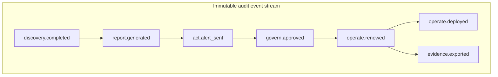

### 2.7 RBAC — fine-grained access control (platform requirement)

Enterprise CLM touches high-risk operations (issue, renew, revoke, import, replace). **Fine-grained RBAC** is required so teams can delegate without over-privileging.

**Integrate with Vault identity model** where possible (Vault policies, namespaces, identity groups) — do not invent a parallel auth system unless necessary.

**Suggested role dimensions:**

| Dimension | Examples |
|---|---|
| **Resource scope** | By environment (dev/test/prod), namespace, tag, compliance scope |
| **Function** | discover, view inventory, view reports, export reports, tag/edit metadata, act (alert only), act (queue operate), operate (create), operate (renew), operate (revoke), operate (import/replace), manage policies, manage RBAC, view audit, export audit |
| **Data sensitivity** | View cert metadata vs view full chain vs trigger lifecycle change |
| **Approval** | Requester vs approver vs operator vs auditor (read-only) |

**Example roles (illustrative):**

| Role | Can do | Cannot do |
|---|---|---|
| **Auditor** | View inventory, reports, audit export | Any operate or act |
| **App owner** | View own tagged certs, receive alerts, request renew | Revoke prod certs, change policies |
| **Platform operator** | Discover, tag, report, queue renew/replace in non-prod | Revoke prod without approval |
| **PKI admin** | Full operate in prod with policy | Bypass audit or RBAC |
| **Security admin** | Policies, RBAC, standards packs, emergency revoke | — |

**RBAC enforcement points:**

- API and UI for every plugin function
- Action engine — policy may only auto-act within role bounds
- Operate — create/renew/revoke requires explicit permission + optional approval workflow
- Audit — all RBAC denials logged (failed access is evidence too)

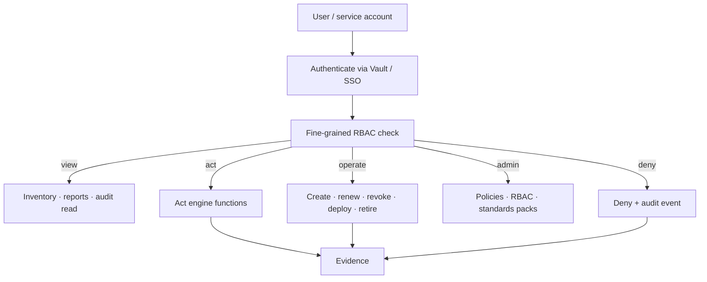

### 2.8 Policy engine architecture (part of Govern)

Policy-driven automation lives under **Govern** — it is not a separate certificate lifecycle stage (see §4 lifecycle stage 4). The policy engine is how Govern enforces *what may happen* when Report findings trigger Act and Operate.

**Is a policy engine overkill?**

| Approach | Verdict |
|---|---|
| Hard-coded `if finding == "expiring"` in Go | **Underkill** — no customer customisation, weak audit story |
| Full OPA + Rego + Sentinel + custom DSL on day 1 | **Overkill** — slow to ship, hard to explain |
| **Versioned policy documents (Release 1) → embedded OPA (Release 2+)** | **Right size** — customisable, auditable, evolvable |

#### Three policy layers (do not conflate)

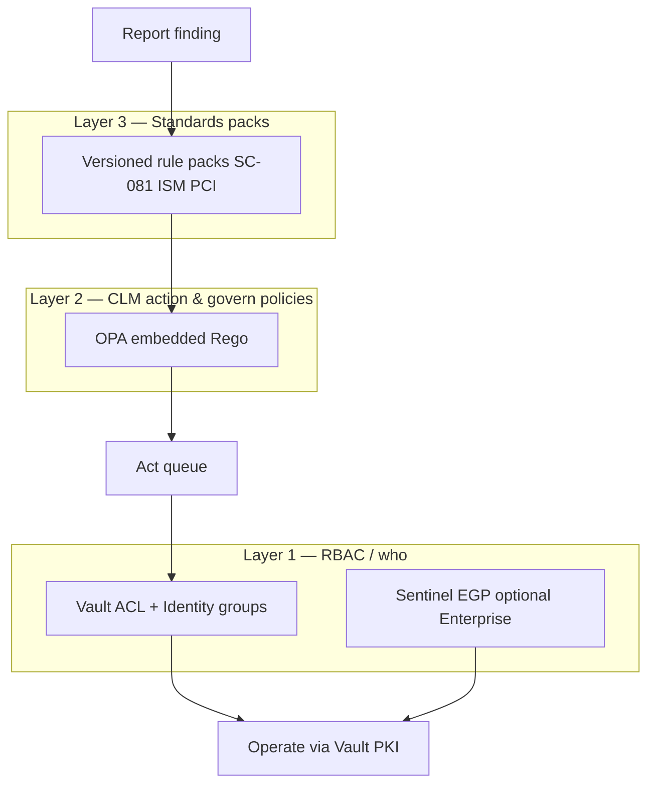

| Layer | Question | Recommended engine | Release |
|---|---|---|---|
| **1 — RBAC / who** | Who may view, act, operate? | **Vault ACL + Identity groups**; optional **Sentinel EGP** on PKI paths (Enterprise) | 1 |
| **2 — Act / govern / operate gates** | What happens when finding X matches? | **YAML policy documents → embedded OPA (Rego)** | 1 YAML, 2 OPA |
| **3 — Standards packs** | Is this cert compliant? | **Versioned rule packs** (not a general policy engine) | 1 |

**Primary recommendation for Layer 2:** [OPA](https://www.openpolicyagent.org/) embedded in the plugin (`github.com/open-policy-agent/opa` in Go). Input = finding + cert metadata + actor + effective inherited policy; output = structured decision (`actions`, `require_approval`, `policy_id@version`).

**Why not Sentinel as the primary CLM action engine?** Sentinel excels at **Vault API request-path** control (EGP/RGP). The plugin needs **finding → act → operate** orchestration that lives outside Vault's request evaluation order. Use Sentinel optionally as a **hard gate** on `pki/issue`, `pki/revoke`, etc. — defense in depth, not replacement.

**Policy storage:** Vault KV v2 under namespace hierarchy (versioned, same trust boundary as PKI). See §2.10.

#### Policy families and starter catalogue

| Family | Purpose | Example policy name |
|---|---|---|
| **Act** | Orchestrate from findings | `external-public-import`, `expiry-30d-external` |
| **Operate gate** | Approve before Vault PKI call | `prod-revoke-2of2`, `prod-replace-1of2` |
| **Auto-approval** | Safe unattended operate | `vault-nonprod-auto-renew` |
| **Exception** | Temporary non-compliance allowance | `exception-sc081-migration` |
| **Discovery** | New shadow cert handling | `new-cert-require-tagging` |
| **RBAC binding** | Role × action × scope matrix | `operate-renew-prod-pki-admin` |

Ship **10–15 opinionated defaults**; customers fork and extend.

#### Example: Act policy (YAML — Release 1 friendly)

```yaml
apiVersion: clm/v1
kind: ActionPolicy
metadata:
  name: external-expiring-alert-and-queue
  version: "1.2.0"
  priority: 100
spec:
  scope:
    environments: ["production", "staging"]
    tags: { compliance_scope: pci }
  match:
    finding_types: ["expiring_soon", "expiry_critical"]
    cert:
      managed_by: external
      trust_type: public_tls
      days_to_expiry_lte: 30
  actions:
    - type: alert
      channel: owner
      severity: high
    - type: create_ticket
      system: servicenow
      template: clm-expiry-external
    - type: queue_operate
      operation: renew
      auto_approve: false
  evidence:
    record: true
    standards_refs: ["pci-4.2.1.1", "sc081-v3"]
```

#### Example: Operate gate policy

```yaml
apiVersion: clm/v1
kind: OperateGatePolicy
metadata:
  name: prod-revoke-requires-approval
spec:
  match:
    operation: revoke
    environment: production
  gate:
    require_approval: true
    approver_groups: ["pki-admins", "security-oncall"]
    min_approvers: 2
    emergency_override:
      allowed: true
      roles: ["security-admin"]
      evidence: mandatory
```

#### Runtime evaluation flow

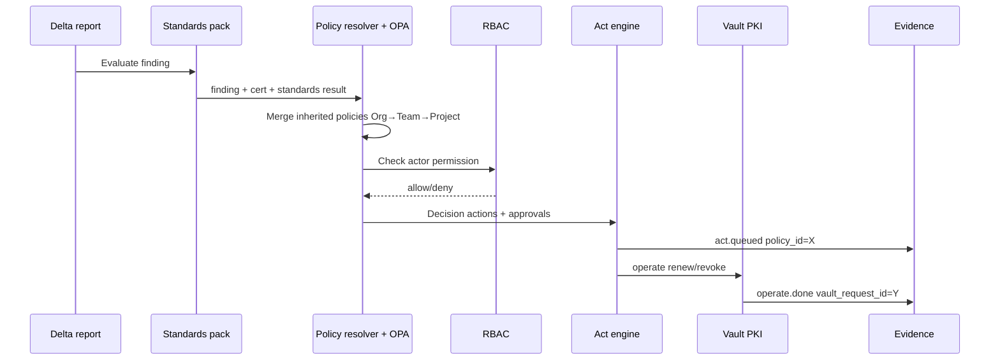

Every decision logs: **`policy_id`, `policy_version`, `input_hash`, `matched_rules`, `decision`**.

### 2.9 Policy authoring: natural language → draft → review → publish

Natural language is the **authoring interface**, not the runtime engine. At execution time the plugin evaluates **only published, structured policy** (YAML/Rego) — preserving auditability and RBAC.

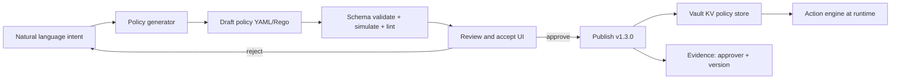

#### Authoring workflow

| Step | What happens |
|---|---|
| **1. Natural language** | User describes intent scoped to Org, Team, or Project namespace |
| **2. Generate policy** | LLM or template+LLM outputs structured `ActionPolicy`, `OperateGatePolicy`, or `PolicyBundle` — not free text |
| **3. Review and accept** | Human sees: plain-English summary, generated YAML/Rego, diff vs current, **simulation** on sample findings |
| **4. Publish** | Approved policy gets `policy_id`, `version`, `approved_by`, `effective_at` — stored in Vault KV |
| **5. Runtime** | Engine evaluates **published policy only** — never raw NL |

#### Review UI (three panes)

The reviewer must see:

- **Summary** — human-readable explanation of what the policy will do
- **Machine policy** — YAML/Rego (source of truth)
- **Impact preview** — how many certs/findings from last delta report would match; blast radius (prod vs non-prod, auto-approve vs manual)

#### Guardrails (non-negotiable)

1. **Schema validation** — reject drafts that fail JSON schema
2. **Simulation before publish** — run against last N delta reports or fixtures
3. **Approval tiers** — alert-only (team lead); operate (PKI admin); prod auto-approve (security/compliance)
4. **No silent overwrite** — publish = new version; prior versions retained
5. **Evidence** — `policy.published { version, approved_by, summary, nl_session_id }`
6. **Inheritance validation** — reject drafts that weaken Org `mandatory: true` rules (see §2.10)

#### Example: natural language → draft

**User input (project scope):**

> For PCI-scoped production certs that are external and expire in under 30 days: alert the owner, create a ServiceNow incident, queue a renew, and require two PKI admins to approve before operate runs.

**Generated draft:**

```yaml
apiVersion: clm/v1
kind: ActionPolicy
metadata:
  name: pci-prod-external-expiry-30d
  version: "0.1.0-draft"
  draft_from: "nl-policy-session-abc123"
spec:
  scope:
    environments: [production]
    tags: { compliance_scope: pci }
  match:
    finding_types: [expiring_soon]
    cert:
      managed_by: external
      trust_type: public_tls
      days_to_expiry_lte: 30
  actions:
    - type: alert
      channel: owner
      severity: high
    - type: create_ticket
      system: servicenow
      template: clm-pci-expiry
    - type: queue_operate
      operation: renew
  govern:
    require_approval: true
    approver_groups: [pki-admins]
    min_approvers: 2
```

**Product framing:** *"Describe what you want in plain English; we turn it into an auditable policy you approve before it ever touches production."*

#### Phasing

| Release | Capability |
|---|---|
| **Release 1** | Form-based policy builder + templates + review and publish (no LLM) |
| **Release 2** | NL → YAML draft + simulation + approval workflow |
| **Release 3** | NL → Rego for advanced customers; policy conflict detection; "why did this cert match?" explainer |

### 2.10 Hierarchical policy inheritance: Org → Team → Project

Enterprise customers need **central guardrails** with **delegated team autonomy** and **project-specific nuance**. Both CLM policies and Vault RBAC should follow the same hierarchy.

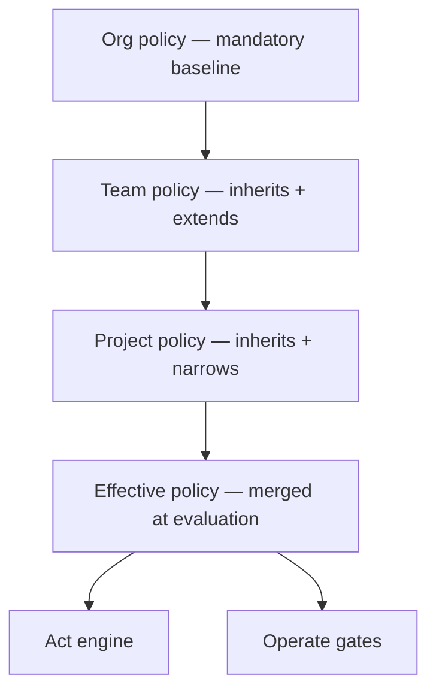

#### Precedence rules

| Rule | Behaviour |
|---|---|
| **Org mandatory** | Cannot be weakened by team/project (only formal exception workflow) |
| **Most specific wins** | Project > Team > Org for conflicting *allow* rules |
| **Deny wins** | Any level `deny` blocks the action |
| **Merge actions** | Non-conflicting actions stack (org alert + team ticket + project queue) |
| **Operate gates** | Most restrictive approval wins (org requires 2 approvers → team cannot reduce to 0) |
| **Exceptions** | Scoped override with expiry; logged in evidence |

**Evaluation pseudologic:**

```text
namespace = cert.namespace          # e.g. acme-corp/platform/payments-api/
chain = walk_up(namespace)          # [project, team, org]
policies = [load(ns/clm/policies/*) for ns in reverse(chain)]
effective = merge_mandatory_first(policies)
effective = apply_deny_overrides(effective)
effective = attach_rbac_from_vault_identity(caller, namespace)
```

#### Vault layer mapping

**Namespace hierarchy = Org → Team → Project:**

```text
root
└── acme-corp/                              # Org
    ├── clm/policies/org-default.yaml
    ├── clm/inventory/
    ├── platform/                           # Team
    │   ├── clm/policies/team-platform.yaml # inherits org-default
    │   └── payments-api/                   # Project
    │       └── clm/policies/project-payments.yaml
    └── retail/                             # Another team
        └── clm/...
```

**Vault PKI** can mirror the same tree:

```text
acme-corp/pki/
acme-corp/platform/pki/intermediate/
acme-corp/platform/payments-api/pki/role/web-server
```

**Inventory tags** tie certs to scope when a dedicated project namespace is not used:

```yaml
tags:
  org: acme-corp
  team: platform
  project: payments-api
  environment: production
  compliance_scope: pci
```

Policy resolution uses **namespace path + tags** — walk up the tree and merge.

#### Two inheritance layers (do not conflate)

| Layer | What inherits | Vault mechanism |
|---|---|---|
| **CLM policies** (Act / Govern / Operate gates) | Org → Team → Project business rules | Plugin policy store under namespace hierarchy (KV v2) |
| **Vault RBAC** (who can call what) | Org → Team → Project permissions | ACL policies + Identity groups + namespaces |

#### Worked example: three-level inheritance

**Org baseline** — `acme-corp/clm/policies/org-default.yaml` (`mandatory: true`):

```yaml
apiVersion: clm/v1
kind: PolicyBundle
metadata:
  name: org-default
  scope: org
  namespace: acme-corp/
  mandatory: true
  version: "2.0.0"
spec:
  operate_gates:
    - match: { operation: revoke, environment: production }
      gate: { require_approval: true, min_approvers: 2, approver_groups: [security-oncall, pki-admins] }
    - match: { operation: renew, cert: { managed_by: external, environment: production } }
      gate: { require_approval: true, min_approvers: 1 }
  act_policies:
    - name: org-sc081-violation
      match:
        finding_types: [standards_violation]
        standards_rule: sc081.max_validity_days
      actions:
        - type: alert
          channel: compliance
          severity: critical
        - type: queue_operate
          operation: replace
      govern: { require_approval: true }
  rbac:
    deny_auto_approve_in: [production]
```

**Vault ACL (org auditors)** — identity group `org-auditors` at `acme-corp/`:

```hcl
path "acme-corp/clm/inventory/*" {
  capabilities = ["read", "list"]
}
path "acme-corp/clm/reports/*" {
  capabilities = ["read", "list"]
}
path "acme-corp/clm/audit/*" {
  capabilities = ["read", "list"]
}
```

**Team policy** — `acme-corp/platform/clm/policies/team-platform.yaml`:

```yaml
apiVersion: clm/v1
kind: PolicyBundle
metadata:
  name: team-platform
  scope: team
  namespace: acme-corp/platform/
  inherits: acme-corp/clm/policies/org-default@2.0.0
  version: "1.1.0"
spec:
  act_policies:
    - name: platform-external-expiry
      match:
        finding_types: [expiring_soon]
        cert: { team: platform, managed_by: external, days_to_expiry_lte: 30 }
      actions:
        - type: alert
          channel: team-platform-oncall
        - type: create_ticket
          system: servicenow
          assignment_group: platform-pki
        - type: queue_operate
          operation: renew
    - name: platform-vault-nonprod-auto-renew
      match:
        finding_types: [expiring_soon]
        cert:
          team: platform
          managed_by: vault
          environment_in: [development, staging]
          days_to_expiry_lte: 14
      actions:
        - type: queue_operate
          operation: renew
          auto_approve: true
```

**Vault ACL (team operators)** — identity group `platform-operators` at `acme-corp/platform/`:

```hcl
path "acme-corp/platform/clm/inventory/*" {
  capabilities = ["create", "read", "update", "list"]
}
path "acme-corp/platform/clm/act/*" {
  capabilities = ["create", "update"]
}
path "acme-corp/platform/clm/operate/renew" {
  capabilities = ["create", "update"]
}
path "acme-corp/platform/pki/issue/*" {
  capabilities = ["update"]
}
```

**Project policy** — `acme-corp/platform/payments-api/clm/policies/project-payments.yaml`:

```yaml
apiVersion: clm/v1
kind: PolicyBundle
metadata:
  name: project-payments-api
  scope: project
  namespace: acme-corp/platform/payments-api/
  inherits: acme-corp/platform/clm/policies/team-platform@1.1.0
  version: "1.0.0"
spec:
  act_policies:
    - name: pci-payments-expiry-strict
      match:
        finding_types: [expiring_soon]
        cert:
          project: payments-api
          tags: { compliance_scope: pci }
          days_to_expiry_lte: 60
      actions:
        - type: alert
          channel: owner
          severity: critical
        - type: create_ticket
          system: servicenow
          priority: p1
        - type: queue_operate
          operation: renew
      govern:
        require_approval: true
        min_approvers: 2
        approver_groups: [payments-pki-delegates]
  operate_gates:
    - match:
        operation: renew
        cert: { project: payments-api, environment: production }
      gate:
        require_approval: true
        min_approvers: 2
        require_change_ticket: true
```

#### Effective policy for a PCI prod cert in `payments-api` expiring in 45 days

| Source | Rule applied |
|---|---|
| Org | SC-081 violation → replace + compliance alert |
| Org | Prod external renew → ≥1 approver |
| Org | Prod revoke → 2 approvers (mandatory) |
| Team | External expiry ≤30d → ServiceNow (45d: not yet triggered) |
| **Project** | PCI expiry ≤60d → **P1 ticket + 2 approvers** ← applies to this cert |

#### NL authoring with inheritance

Natural language is scoped to namespace:

- **Org:** *"All production revokes need two approvers."*
- **Team:** *"For platform team, auto-renew Vault-managed staging certs within 14 days."*
- **Project:** *"For payments-api PCI certs, alert at 60 days and require a change ticket."*

Publish validator **rejects** team/project drafts that weaken org `mandatory: true` rules.

#### Optional: Sentinel at Vault boundary (Enterprise)

Org-level EGP on `acme-corp/*/pki/revoke` — hard stop regardless of CLM plugin policy:

```sentinel
import "strings"

main = rule when strings.has_prefix(request.path, "acme-corp/") {
    request.operation is "update" and
    strings.has_suffix(request.path, "revoke") implies
    token.meta.approval_count >= 2
}
```

CLM plugin policies orchestrate *what should happen*; Sentinel enforces *what the Vault API allows* — defense in depth.

### 2.11 Customer & platform requirements — API-first design

**API-first integration is a customer and platform requirement** — how the plugin is built, delivered, and consumed — not a certificate lifecycle phase. Enterprise buyers expect to automate via CI/CD, ITSM, SIEM, and GitOps without UI dependency; the UI is a client of the same API.

Enterprise CLM must fit into existing operating models without forcing operators through a portal for every action. **API-first** means the plugin is designed as a **programmable control plane**.

**Design principle:** *If you can do it in the UI, you can do it via API — with the same RBAC, policy checks, and audit events.*

#### Why API-first matters for this plugin

| Stakeholder | API-first benefit |
|---|---|
| **Platform / SRE** | Trigger discovery, pull delta reports, queue renewals from pipelines |
| **Security / GRC** | Export posture JSON, subscribe to compliance events, feed SIEM |
| **App teams** | Tag certs, request renew/replace, check status via API — no portal dependency |
| **Integrators** | ServiceNow/Jira/PagerDuty via webhooks + REST without vendor lock-in to UI workflows |
| **HashiCorp story** | Same pattern as Vault itself — automate everything, UI optional |

A UI-only CLM tool becomes shelfware in regulated enterprises where **everything auditable must be automatable**.

#### Architecture: API as the centre

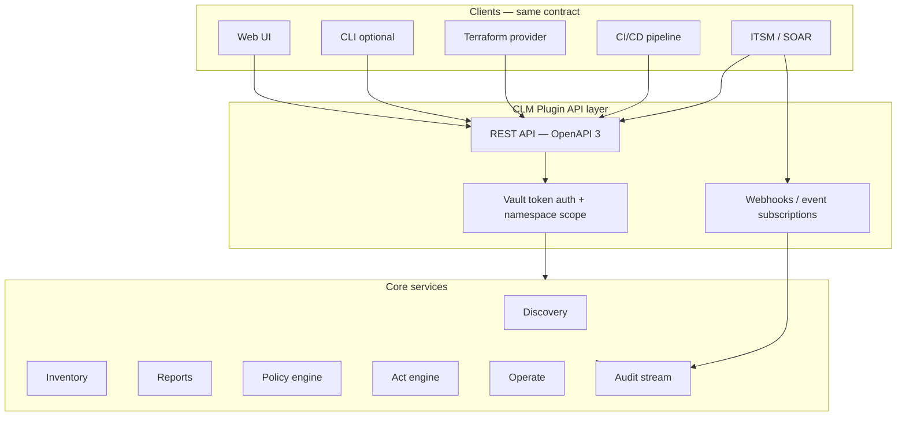

#### API surface (logical groups)

All paths are namespace-scoped (e.g. `/{namespace}/clm/v1/...`) and authenticated via **Vault token** (or delegated JWT/OIDC where configured).

| API group | Key operations | Typical integrator |
|---|---|---|
| **Discovery** | `POST /scans`, `GET /scans/{id}`, `GET /scans/{id}/results` | Pipeline, scheduled job |
| **Inventory** | `GET/POST/PATCH /certificates`, `GET /certificates/{id}`, bulk tag/import | CMDB sync, GitOps |
| **Reports** | `POST /reports/run`, `GET /reports/{id}`, `GET /reports/{id}/findings` | GRC dashboard, audit export |
| **Policies** | `GET/POST /policies`, `POST /policies/draft`, `POST /policies/{id}/publish`, simulate | Policy-as-code, NL authoring backend |
| **Act** | `POST /acts`, `GET /acts/{id}`, approval queue | SOAR, manual operator tools |
| **Operate** | `POST /operate/issue`, `/renew`, `/revoke`, `/deploy`, `/retire` | Vault PKI orchestration, runbooks |
| **Audit** | `GET /events`, `GET /events/{correlation_id}`, export | SIEM, auditor tooling |
| **Webhooks** | `POST /subscriptions` — event types, HMAC secret, retry policy | ServiceNow, Slack, PagerDuty |

**Contract requirements:**

- **OpenAPI 3** spec published and versioned (`/clm/v1`, `/clm/v2`) — breaking changes only on major version
- **Idempotency** — `Idempotency-Key` header on mutating operate/act calls
- **Pagination + filtering** — inventory and audit queries scale to large estates
- **Async jobs** — long scans and report runs return `202 Accepted` + job ID + webhook on completion
- **Structured errors** — machine-readable error codes (`POLICY_DENIED`, `RBAC_DENIED`, `APPROVAL_REQUIRED`) for automation branching
- **Correlation IDs** — client may pass `X-Correlation-ID`; echoed in audit events

#### Example: pipeline-driven delta check

```bash
# 1. Trigger monitor scan (async)
curl -s -X POST \
  -H "X-Vault-Token: $VAULT_TOKEN" \
  -H "X-Correlation-ID: pipeline-run-8842" \
  "https://vault.example.com/v1/acme-corp/clm/v1/scans" \
  -d '{"profile":"production-tls","async":true}'

# 2. Fetch delta report findings (machine-readable)
curl -s \
  -H "X-Vault-Token: $VAULT_TOKEN" \
  "https://vault.example.com/v1/acme-corp/clm/v1/reports/delta-latest/findings?severity=gte:high"

# 3. Queue renew for approved findings (policy + RBAC enforced server-side)
curl -s -X POST \
  -H "X-Vault-Token: $VAULT_TOKEN" \
  -H "Idempotency-Key: renew-payments-api-001" \
  "https://vault.example.com/v1/acme-corp/platform/clm/v1/operate/renew" \
  -d '{"certificate_id":"cert-abc","reason":"pipeline_sc081_prep"}'
```

Every call produces the same audit events as the UI — no "API bypass" path.

#### Integration patterns

| Pattern | Mechanism | Release |
|---|---|---|
| **Pull** | REST GET — inventory, reports, audit export | 1 |
| **Push** | Webhooks on `report.generated`, `act.queued`, `operate.completed`, `policy.published` | 1 (basic), 2 (full) |
| **Infrastructure-as-code** | Terraform provider for scan targets, tags, policies | 2 |
| **GitOps** | Policy bundles in Git → CI validates + publishes via API | 2 |
| **ITSM** | Webhook → ServiceNow/Jira; optional bidirectional status sync | 2 |
| **SIEM** | Audit stream export (JSON lines, syslog, or vendor connector) | 1 |
| **Vault-native** | Plugin mounts under Vault API; same token, namespace, audit device | 1 |

#### Ease-of-use principles (beyond raw API)

API-first does not mean "hard to use." Pair the API with:

| Principle | Implementation |
|---|---|
| **Sensible defaults** | Pre-built scan profiles, starter policies, one-command baseline report |
| **Progressive disclosure** | Simple REST for 80% cases; advanced filters and OPA bundles for power users |
| **Discoverability** | OpenAPI docs, example curl/terraform in docs, Postman collection |
| **UI parity** | UI built on public API — catches API gaps early |
| **CLI wrapper (optional)** | Thin client over REST for operators (`clm scan run`, `clm report delta`) — not a second logic path |
| **Terraform provider (Release 2+)** | Declarative scan targets, tags, policy publish — fits HashiCorp buyer workflow |

#### What not to do

- **UI-only features** — if it is not in the API, it does not ship
- **Undocumented internal RPC** — integrators depend on OpenAPI contract only
- **Separate auth system** — reuse Vault tokens, namespaces, identity groups
- **Synchronous-only long jobs** — discovery at scale must be async + webhook
- **Bespoke export formats** — reports and audit export as JSON first; HTML/PDF as render views of same data

#### Phasing

| Release | API / integration deliverables |
|---|---|
| **Release 1** | OpenAPI v1 for discovery, inventory, reports, act queue, audit read; webhooks for report + act events; Vault token auth |
| **Release 2** | Operate API, policy publish/simulate API, idempotency, Terraform provider alpha, ITSM webhook templates |
| **Release 3** | Bulk operations, CMDB sync API, LB deploy hooks, SDK (Go/Python), event streaming at scale |

**Product framing:** *"Automate certificate visibility and compliance the same way you automate Vault — API-first, namespace-scoped, fully auditable."*

---


---

## What is changing: rules and governance landscape

### 3.1 The hard deadline: CA/B Forum SC-081v3

**Authoritative source:** [CA/B Forum Ballot SC081v3](https://cabforum.org/2025/04/11/ballot-sc081v3-introduce-schedule-of-reducing-validity-and-data-reuse-periods/) (approved 11 April 2025; Apple proposed; all major browser vendors voted yes).

**Scope:** Publicly trusted TLS server certificates only (Web PKI). Internal/private PKI is not directly bound, though many enterprises align voluntarily.

| Effective date | Max cert validity | Max domain/IP validation reuse |
|---|---:|---:|
| Before 15 Mar 2026 | 398 days | 398 days |
| From 15 Mar 2026 | **200 days** (ballot ceiling) | 200 days |
| From 15 Mar 2027 | **100 days** | 100 days |
| From 15 Mar 2029 | **47 days** | **10 days** |

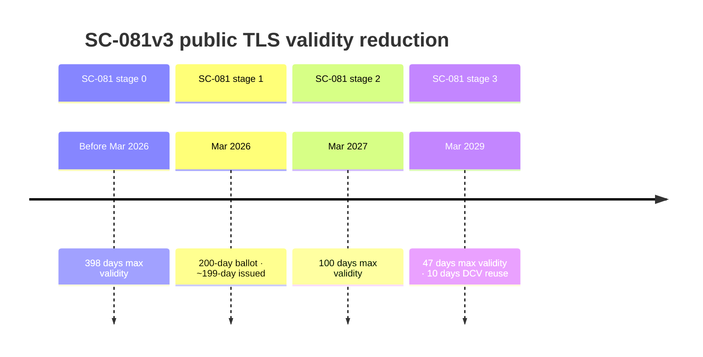

> **Ballot vs issued lifetime:** SC-081 sets a **200-day ballot ceiling** from 15 March 2026. Major public CAs (DigiCert, Sectigo) enforce **199-day maximum issued validity** in practice (from 24 February 2026). Model renewal cadence and compliance packs on **issued lifetimes (199)**, not the ballot number alone.

**Operational implication:** ~8 renewals per cert per year by 2029, plus frequent domain revalidation. Manual processes will not scale. NCSC UK explicitly warns operators to prepare and automate ([NCSC Web PKI guidance, Dec 2025](https://www.ncsc.gov.uk/guidance/provisioning-and-managing-certificates-in-the-web-pki)).

### 3.1.1 What this means for your organisation (not just a CA industry change)

SC-081v3 is not a problem for certificate authorities alone — it **redefines operating load for every organisation that runs public TLS**. The rule change flows downhill as follows:

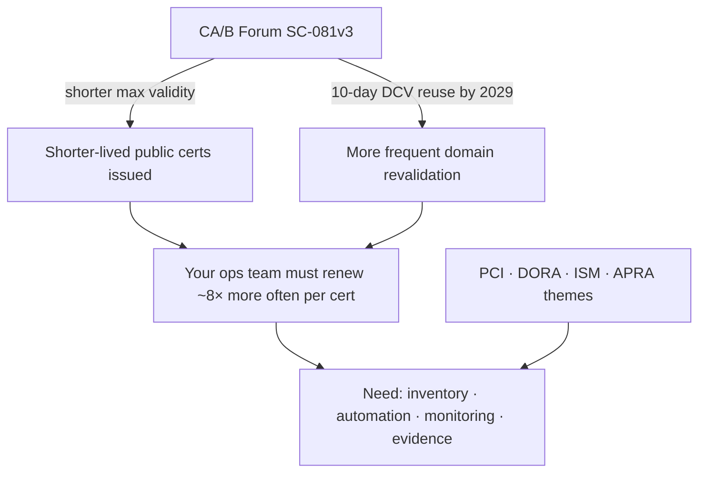

| What changes | Today (typical) | By Mar 2029 (public TLS) | Organisational impact |
|---|---|---|---|
| **Max cert lifetime** | Up to ~398 days (pre-Mar 2026) → **199 days issued** (CA practice) / 200-day ballot ceiling now | **47 days** | Renewal is a **continuous** process, not an annual project |
| **Renewals per cert per year** | ~1 | **~8** | Same headcount cannot handle 8× events without automation |
| **Domain validation reuse** | Up to 398 days | **10 days** | DNS/HTTP proof must be automated and reliable |
| **Failure window** | Weeks to notice + fix expiry | **Days** | Silent renewal failure → customer-facing outage quickly |
| **Inventory expectation** | Often incomplete / spreadsheet | PCI **mandatory**; DORA **register**; ISM **timely renewal** | "We didn't know we had that cert" is no longer a defensible answer |

**What leadership should expect:**

1. **Platform / SRE** — Renewal becomes a **pipeline**, not a calendar reminder. Manual ticket-driven renewals do not survive 47-day cadence.
2. **Security / GRC** — Auditors will ask for **inventory + evidence of timely renewal** (PCI 4.2.1.1 is already mandatory; DORA Art. 7 for EU finance). SC-081 adds **cadence pressure**, not a substitute for those obligations.
3. **Application owners** — Every public-facing service needs a **named owner**, renewal path, and deploy verification — or it becomes an outage and audit finding.
4. **Vault customers specifically** — Vault may manage **some** certs well (especially with 2.0 External CA), but **shadow certs** on LBs, legacy apps, and third-party CAs still create **estate-level** exposure unless discovery + inventory exist.

**Bottom line:** The new rules mean organisations must **see all certs, renew reliably, and prove it** — at a frequency manual processes cannot sustain.

| Standard | Mandates 47 days? | What it actually requires |
|---|---|---|
| **CA/B Forum** | Yes (public TLS) | Industry/browser enforcement |
| **ASD ISM / ACSC** | No | Key/cert lifecycle, timely renewal, appropriate validity, automation recommended ([cryptography guidelines](https://www.cyber.gov.au/business-government/asds-cyber-security-frameworks/ism/cybersecurity-guidelines/guidelines-cryptography), [key management guide](https://www.cyber.gov.au/sites/default/files/2025-08/Managing%20cryptographic%20keys%20and%20secrets_D4.pdf)) |
| **APRA CPS 234 / CPG 234** | No | Controls commensurate with risk; key lifecycle incl. renewal/revocation; control testing ([CPS 234](https://www.apra.gov.au/standards/cps-234)) |
| **APRA CPS 230** | No | Operational resilience — cert outages = service disruption risk |
| **Canada (GC / CSE)** | Via CA/B ref | Public TLS must follow [GC Recommendations for TLS Server Certificates](https://wiki.gccollab.ca/images/9/92/Recommendations_for_TLS_Server_Certificates_-_14_May_2021.pdf); validity **must not exceed CA/B Forum guidelines**; mandated via [Web Sites Configuration Requirements](https://www.canada.ca/en/government/system/digital-government/policies-standards/enterprise-it-service-common-configurations/web-sites.html) |

**Key ACSC quote (joint AU/UK/CA/NZ/JP guidance):**

> "Certificate expiry dates need to be set to an appropriate timeframe… renewed in a timely manner or revoked if compromise is detected."

**APRA does not appear to have adopted SC-081v3 as a prudential rule.** Supervisory pressure is indirect: if renewal cadence outpaces controls, that becomes a CPS 234/230 weakness.

**Canada** delegates public TLS validity limits to CA/B Forum by reference — GC guidance states certificate validity *"MUST not exceed CA/B forum guidelines"* and requires CAs to conform to CA/B Forum Baseline Requirements ([GC TLS recommendations PDF](https://wiki.gccollab.ca/images/9/92/Recommendations_for_TLS_Server_Certificates_-_14_May_2021.pdf), §2.1.2). As SC-081 phases take effect, GC-operated public TLS inherits the same reduction schedule indirectly.

### 3.3 Other jurisdictions (summary)

| Regime | Cert inventory? | Renewal discipline? | 47-day rule? |
|---|---|---|---|
| **NCSC UK** | Yes (monitor what's in use where) | Yes (ACME, ARI) | Warns explicitly on SC-081 |
| **DORA RTS Art. 7 (EU finance)** | **Yes — certificate register** | **Yes — prompt renewal** | No |
| **PCI DSS 4.2.1.1** | **Yes — mandatory since Mar 2025** | Yes | No |
| **NIST SP 1800-16** | Yes (best practice) | Yes | No |
| **FedRAMP SC-17** | Yes | Yes | No |
| **MAS TRM 10.2 (Singapore)** | Implicit | Yes (expiry/revocation) | No |
| **RBI (India payments)** | Implicit | "Renew well in time" | No |
| **ISO 27001 A.8.24** | Policy-driven | Yes (lifecycle) | No |
| **Canada GC / CSE** | Via CA/B ref | Yes (timely renewal) | Via CA/B (public TLS) |

**Pattern:** Regulators require **discipline and evidence**. CA/B Forum requires **cadence**. Enterprises need tooling that satisfies both.

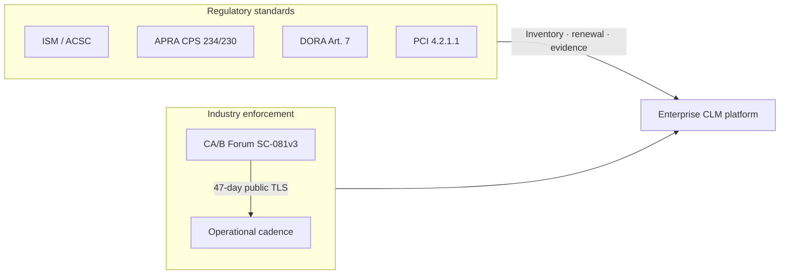

---


---

## Lifecycle stages: why they matter, what to cover, business impact

> **Terminology (read once):**
>
> | Term | Meaning | Section |
> |---|---|---|
> | **Lifecycle stage 1–13** | What full enterprise CLM requires — capability depth model | This section (§4) |
> | **Release 1–3** | What the plugin ships and when — delivery roadmap | §9 |
> | **SC-081 enforcement stage** | CA/B ballot validity reduction schedule — industry rule, not a product release | §3.1 |

Below is the detailed breakdown with **business impact priority** (P1 = highest).

**Priority key:**

- **P1 — Critical:** Direct outage, regulatory, or security exposure
- **P2 — High:** Significant operational or audit risk
- **P3 — Medium:** Maturity / efficiency / scale enabler
- **P4 — Lower:** Advanced / niche / long-horizon

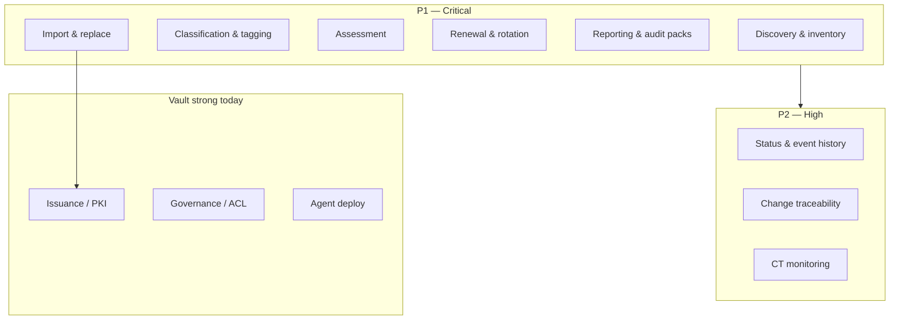

---

### Lifecycle stage 1: Discovery & inventory

**Why:** You cannot govern or renew what you cannot see. SC-081v3 increases renewal frequency; unknown certs become outage and audit findings.

**What to cover in detail:**

- Network TLS scan (host:port, SNI)
- Cloud LB / CDN / API gateway APIs
- Kubernetes secrets, cert-manager CRDs
- File/store discovery (where permitted)
- CT log correlation for public domains
- Normalised inventory schema (**human-readable first**: service, endpoint, owner; correlate Vault certs by serial/SPKI)

**What it means operationally:** First authoritative answer to "how many certs do we have, and where?"

| Business impact | Priority |
|---|---|
| Prevents expiry outages on unknown assets | **P1** |
| Required for PCI 4.2.1.1, DORA register, FedRAMP SC-17 | **P1** |
| Foundation for all automation and reporting | **P1** |
| Reduces manual audit preparation time | **P2** |

**Vault today:** No native network discovery. HCP Certificates Inventory covers **Vault-issued only**. Vault Radar scans **secrets in code**, not TLS endpoints.

---

### Lifecycle stage 2: Classification & tagging

**Why:** External public certs face SC-081v3; internal certs face different policy. Automation and reporting must be scoped.

**What to cover:**

- Trust type: public / private / self-signed / unknown chain
- Owner, team, environment (dev/test/prod)
- Service/application, criticality tier
- Compliance scope (APRA-critical, PCI, etc.)
- Automation policy assignment
- Change process routing

**What it means:** Enables targeted renewal SLAs, scoped reports, and policy-driven auto-approval.

| Business impact | Priority |
|---|---|
| Correct prioritisation under 47-day regime (public first) | **P1** |
| Accountability when certs expire | **P1** |
| Scoped automation reduces blast radius | **P2** |
| Enables chargeback / team-level reporting | **P3** |

**Vault today:** PKI roles and namespaces provide **issuance** scoping, not post-hoc tagging of discovered external certs.

---

### Lifecycle stage 3: Assessment & risk posture

**Why:** Inventory alone is not action. Teams need prioritised remediation.

**What to cover:**

- Expiry windows (30/60/90 days)
- Weak algorithms / key sizes
- Overlong validity vs SC-081 phase
- Orphan certs (no owner/service)
- Duplicate certs across endpoints
- Drift: issued cert ≠ deployed cert
- CT unexpected issuance

| Business impact | Priority |
|---|---|
| Prevents "wrong cert renewed first" | **P1** |
| Supports APRA/ISM risk-based control narrative | **P2** |
| Reduces audit finding volume | **P2** |
| CT monitoring catches mis-issuance / compromise | **P2** |

**Vault today:** HCP saved views for expired/revoked **Vault certs**. No cross-estate risk scoring.

---

### Lifecycle stage 4: Governance, policy & RBAC

**Why:** Automation at scale without policy recreates chaos faster. **Policy engine, inheritance, and RBAC all live here** — not as separate lifecycle phases.

**What to cover:**

- Allowed CAs, max TTL, key types, SAN rules
- **Policy engine:** YAML/OPA policies, Org→Team→Project inheritance, operate gates, exceptions (§2.8–§2.10)
- **Policy authoring:** NL → draft → review → publish (§2.9)
- Approval workflows (manual + policy-based auto-approve)
- Exception/waiver with expiry
- Role separation (requester / approver / operator / auditor)
- Fine-grained RBAC integrated with Vault ACL + Identity (§2.7)
- Internal vs external policy differences

| Business impact | Priority |
|---|---|
| Prevents unauthorised issuance | **P1** |
| Customisable policy without hard-coded logic | **P1** |
| Required for regulated entity control frameworks | **P2** |
| Enables safe automation at 47-day cadence | **P2** |

**Vault today:** **Strong** for PKI roles, ACL policies, namespaces, EAB for ACME — but no CLM action/operate policy engine or Org→Team→Project inheritance for discovery/report/act workflows.

---

### Lifecycle stage 5: Issuance & enrollment

**Why:** Controlled creation under policy.

**What to cover:**

- Vault PKI (internal CA)
- ACME (Vault 1.14+), SCEP/EST/CMPv2 (Enterprise)
- External CA via Vault Agent `pki_external_ca`
- CSR workflows for exceptions

| Business impact | Priority |
|---|---|
| Core to Vault value proposition | **P1** (for Vault-managed) |
| Less relevant for already-orphaned external estate | **P2** |

**Vault today:** **Strong** for Vault-as-CA and ACME. External CA integration improving via Agent.

---

### Lifecycle stage 6: Deployment / binding

**Why:** Issuance without deployment still causes outages.

**What to cover:**

- Vault Agent templates
- cert-manager, ACME clients
- LB/CDN API integration
- Post-deploy verification (TLS handshake check)
- Rollback on failed deploy

| Business impact | Priority |
|---|---|
| Directly prevents renewal "success" that still breaks prod | **P1** |
| Complex integrations vary by customer | **P2–P3** |

**Vault today:** Agent/template pattern is solid for **workloads already in Vault ecosystem**. No generic multi-platform deploy orchestration.

---

### Lifecycle stage 7: Monitoring & alerting

**Why:** At 47-day validity with 10-day DCV reuse, silent renewal failure becomes outage within days.

**What to cover:**

- Expiry alerts by tag/criticality
- Failed renewal detection
- Drift detection
- CT log alerts
- Escalation paths

| Business impact | Priority |
|---|---|
| Prevents overnight expiry incidents | **P1** |
| CPS 230 operational resilience story | **P2** |

**Vault today:** Audit logs + HCP inventory views. No enterprise-wide alerting fabric for non-Vault certs.

---

### Lifecycle stage 8: Renewal & rotation

**Why:** SC-081v3 makes this the dominant operational load.

**What to cover:**

- Scheduled renewal (renew at 25–33% remaining life — NCSC recommendation)
- ARI (RFC 9773) support for ACME
- Emergency rotation (compromise, CA distrust)
- Key rotation on renewal (best practice)
- Overlap period for failed retry

| Business impact | Priority |
|---|---|
| Core business case for SC-081v3 | **P1** |
| RBI "renew well in time", DORA "prompt renewal" | **P1** |

**Vault today:** **Strong** for Vault-issued / ACME-managed paths. No renewal orchestration for discovered external certs on non-integrated systems.

---

### Lifecycle stage 9: Revocation & decommission

**Why:** Compromised or retired certs must be invalidated and removed.

**What to cover:**

- CRL/OCSP publication (for CA)
- Revocation workflows
- Removal from all binding points
- Trust store cleanup

| Business impact | Priority |
|---|---|
| Incident response | **P1** (during incidents) |
| Day-to-day hygiene | **P2** |

**Vault today:** PKI revocation supported. NCSC correctly notes Web PKI revocation is unreliable — short lifetimes + rotation preferred.

---

### Lifecycle stage 10: Change traceability

**Why:** Auto-approved renewals still need audit evidence. Regulators ask "show me what changed and under what authority."

**What to cover:**

- Change record per renewal (ITSM integration)
- Policy ID that authorised auto-approval
- Before/after cert fingerprint
- Deploy verification result
- Linked ticket for exceptions

| Business impact | Priority |
|---|---|
| APRA/ISO/DORA audit evidence | **P1** |
| Differentiates "automation" from "untracked automation" | **P2** |

**Vault today:** Audit log entries exist per Vault API call. **No** structured change-record model, ITSM integration, or business-readable lifecycle timeline.

---

### Lifecycle stage 11: Status management & event history

**Why:** Hostname alone is insufficient — one service identity rotates through many cert instances.

**What to cover:**

- Logical `cert_instance_id` (stable service identity)
- Physical cert identity (serial + issuer, fingerprint)
- Endpoint bindings (hostname:port, IP, service ID)
- Event timeline (see diagram below)

| Business impact | Priority |
|---|---|
| Root-cause analysis on recurring failures | **P2** |
| Audit lineage ("which cert replaced which") | **P2** |
| Enables reliable automation | **P2** |

**Vault today:** Serial-based PKI storage. No cross-system logical identity or endpoint binding model.

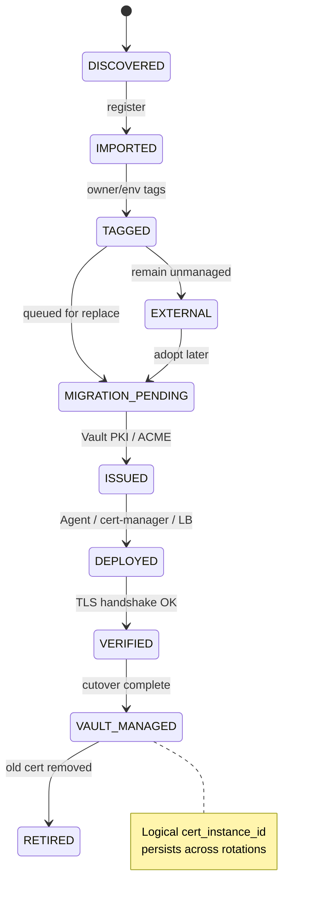

---

### Lifecycle stage 12: Reporting, analysis & action

**Why:** Discovery and monitoring produce data; **reports turn data into decisions**. Without structured analysis and configurable action, inventory becomes a static spreadsheet. Auditors need evidence, but operators need **delta reports and risk highlights every cycle**.

**What to cover:**

**Reporting & analysis (continuous, not one-off):**

- Baseline report after first discovery
- Delta report on each monitor cycle: new / changed / removed certs
- Risk highlights: expiry, SC-081, orphan, untagged, weak crypto, external unmanaged
- Standards pack results (SC-081, ISM, DORA Art.7, PCI 4.2.1.1, internal)
- External vs internal slices, by owner/environment/service
- Trend view over time (optional Release 2+)
- Export: HTML/PDF/CSV + machine-readable for action engine

**Action engine (configurable, policy-driven):**

- Alert owner / team (email, Slack, PagerDuty)
- Create ITSM ticket (ServiceNow, Jira)
- Import to inventory (`managed_by: external`)
- Queue renew / import & replace / **create / revoke** (operate queue)
- Escalate or route to exception workflow
- Log-only (no action) for low-priority findings
- All actions recorded as evidence regardless of auto vs manual

| Business impact | Priority |
|---|---|
| Turns discovery into operational workflow | **P1** |
| Delta reports catch new shadow certs early | **P1** |
| Configurable actions reduce manual triage | **P1** |
| Audit-ready standards results (distinct from evidence trail) | **P1** |
| Executive / program reporting on SC-081 readiness | **P2** |

**Vault today:** HCP CSV/JSON export (max 1,000 rows) for Vault-issued certs only. No delta analysis, no risk report, no standards packs, no action engine.

---

### Lifecycle stage 12b: Audit evidence (separate from operational reporting)

**Why:** Operational reports drive action; **audit evidence** proves actions were taken correctly over time. Auditors ask for point-in-time posture **and** proof that remediation occurred.

**What to cover:**

- Immutable event history linked to report findings
- Point-in-time reproducible posture snapshots
- Exception workflow with approver + expiry
- Evidence bundle export (finding → action → outcome)

| Business impact | Priority |
|---|---|
| APRA/ISO/DORA audit proof | **P1** |
| Closes loop: report finding → action taken → evidenced | **P2** |

**Vault today:** Audit logs for Vault API calls only — not linked to cross-estate report findings or action outcomes.

---

### Lifecycle stage 13: Import & replace (certificate adoption)

**Why:** Discovery finds certs Vault does not manage. Without a migration path, inventory is a report — not a remediation program. SC-081v3 and DORA/PCI expectations require moving unmanaged certs under controlled, auditable lifecycle — ideally Vault-managed.

**What to cover:**

- **Import (register):** Add discovered cert to inventory with metadata, chain, endpoint bindings, tags, and `managed_by: external` status
- **Assess for replacement:** SAN coverage, trust type (public vs internal), deployment target, renewal method today
- **Plan replacement:** Choose Vault PKI (internal) vs Vault Agent + ACME / `pki_external_ca` (public)
- **Issue:** New cert from Vault under policy (manual approval or auto-approved by policy)
- **Deploy:** Agent template, cert-manager, or LB API hook
- **Verify:** TLS handshake, optional app smoke test
- **Cutover:** Overlap window where old + new coexist if required
- **Retire:** Remove old cert from endpoint; update status to `managed_by: vault`
- **Evidence:** Change record, before/after fingerprint, linked event history
- **Optional revoke:** Old public cert if still valid and policy requires

**What "import" does not mean (by default):** Importing every legacy private key into Vault for long-term custody. The default pattern is **inventory import + Vault-issued replacement**, not permanent key storage of external certs.

**What it means operationally:** Shadow certs become Vault-managed assets with full lifecycle history — the core migration story for SC-081 preparation.

| Business impact | Priority |
|---|---|
| Closes gap between Vault inventory and real-world estate | **P1** |
| Enables SC-081 migration programs (manual → automated) | **P1** |
| DORA/PCI remediation path, not just inventory finding | **P2** |
| Strengthens Vault upsell (PKI + Agent) without competing with PKI | **P2** |
| Bulk migration campaigns (e.g. all prod public certs by Q3) | **P3** |

**Vault today:** Strong at **issuing** and **deploying** Vault-managed certs (PKI, Agent, ACME). No workflow to **adopt** an external cert discovered elsewhere — no import-to-inventory, no replace orchestration, no `external → vault` status transition.

---


---

## Business impact priority summary

Consolidated view for roadmap and presentation:

| Priority | Capabilities | Primary driver |
|---|---|---|
| **P1 — Do first** | Discovery, inventory, classification, **baseline + delta reports**, **action engine**, **OpenAPI v1 + webhooks**, **audit event stream (v1)**, **RBAC (core roles)**, SC-081 in reports, tagging | SC-081v3 + PCI/DORA + pipeline/ITSM integration |
| **P2 — Do next** | **Operate loop** (create/renew/revoke/deploy/retire via Vault), import & replace, full traceability chain, fine-grained RBAC, ITSM hooks | Audit evidence + Vault migration + delegated ops |
| **P3 — Mature** | Multi-platform deploy, CMDB sync, advanced drift, PQC readiness packs | Scale and efficiency |
| **P4 — Selective** | Full ITSM replacement, all-cloud LB integrations, legacy VPN auto-wrap | Customer-specific professional services |

---

