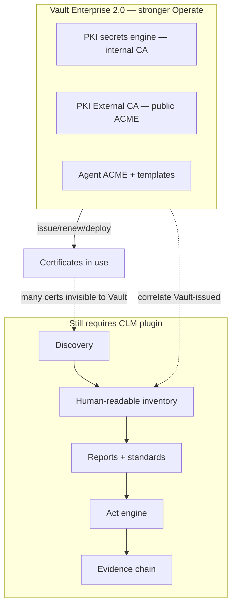
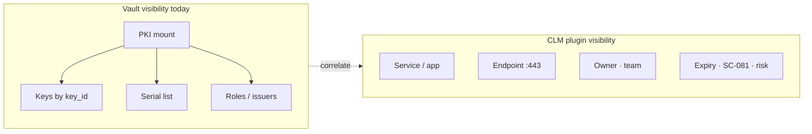
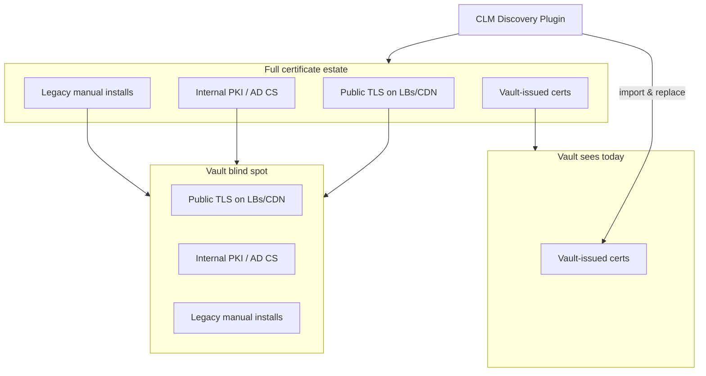
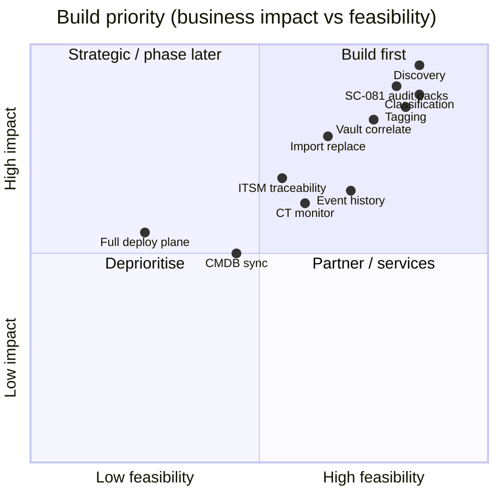
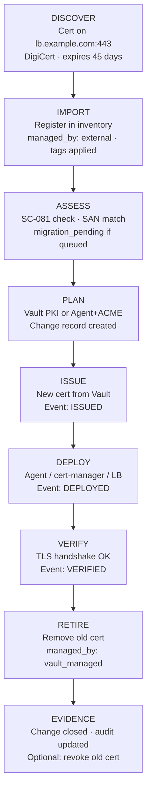
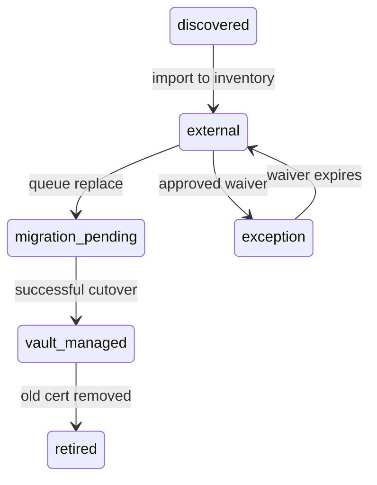
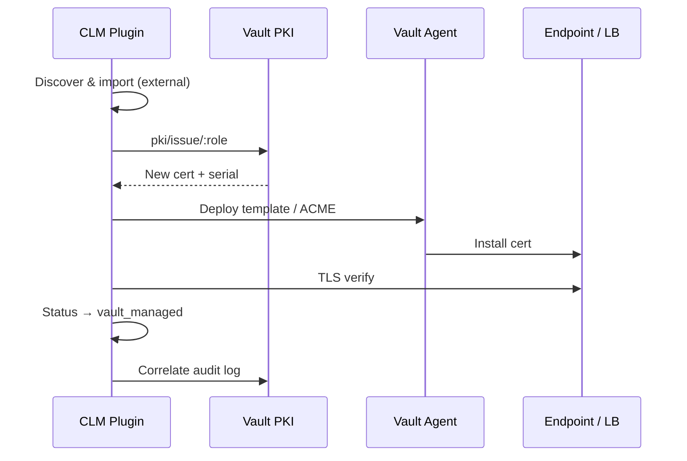

# Vault gap analysis and plugin specification

**Part of:** CLM Discovery initiative document set  
**Audience:** HashiCorp field, PKI architects, engineering, PM  
**See also:** [Executive brief](./01-executive-brief.md) · [CLM reference](./02-clm-reference.md) · [Business case](./04-business-case.md)

---

## HashiCorp Vault: current capability map

### 6.0 Vault version scope: 1.x baseline vs Enterprise 2.0

Most of this report describes gaps against **Vault 1.x**: the PKI secrets engine, Agent templates, and (on HCP) Certificates Inventory reporting that enterprises deploy today. **Vault Enterprise 2.0** ([release notes](https://github.com/hashicorp/vault/releases/tag/v2.0.0), [product blog](https://www.hashicorp.com/en/blog/vault-enterprise-20-modernizes-identity-security-at-scale)) improves certificate issuance and renewal, but does not close the CLM visibility and compliance story.

#### What Vault Enterprise 2.0 adds for certificates

| Feature | What it does | Impact on this report |
|---|---|---|
| **PKI External CA secrets engine** (Enterprise plugin) | Dedicated engine to acquire **public** certs from ACME CAs (Let's Encrypt, DigiCert, Sectigo); CSR and identifier workflows; cert caching ([docs](https://developer.hashicorp.com/vault/docs/secrets/pki-external-ca)) | Strengthens **Operate — create/renew** for public TLS via Vault; supersedes Agent-only `pki_external_ca` as first-class path |
| **Vault Agent: native ACME** | Agent supports public CA ACME workflows directly | Better **deploy/renew** automation for Vault-managed public certs |
| **Agent template integration (Public PKI CA)** | Templates auto re-render when External CA cert is issued or renewed | Closes part of deploy-on-renew gap for Agent users |
| **`sys/billing/certificates`** (Enterprise) | API endpoint returning count of **Vault PKI-issued** certificates ([docs](https://developer.hashicorp.com/vault/api-docs/system/billing#read-billing-certificate-count)) | Utilization metric only; not a CLM inventory or human-readable estate view |
| **`sys/billing/overview`**, External CA consumption | License metric **`normalized_external_ca_cert_units`** (PKI External CA cert consumption), alongside other consumption metrics | Billing/entitlement; separate from `sys/billing/certificates`; not compliance posture |
| **PKI engine improvements** | ACME challenge IP allow/deny ranges; AuthorityKeyID in issue responses; SCEP/EST/CMPv2 hardening | Better control, not estate discovery |

#### What remains out of scope for Vault 2.x (plugin still needed)

| CLM need | Vault 2.0 status |
|---|---|
| Discover certs Vault did not issue (LB, legacy, external CA outside Vault) | **Still no** network/service discovery |
| Human-readable inventory (service, endpoint, owner) | **Still PKI-internal** (serial/key/mount) in OSS UI; HCP table unchanged in scope |
| Unified Vault + non-Vault estate view | **Still Vault-issued centric** |
| SC-081 / ISM / DORA / PCI standards packs + delta reports | **Still no** |
| Report → Act → Operate → Evidence loop | **Still no** plugin-level orchestration |
| Import & replace for shadow certs | Partially easier if target is External CA engine; workflow still missing |
| Cross-estate audit chain linked to report findings | **Still audit logs only** |

**Summary:** Vault 2.x is a real step forward for issuing and renewing public and private certs through Vault. The plugin still owns visibility, compliance reporting, and orchestration on top. It should integrate with PKI External CA and Agent ACME as Operate targets, not compete with them.



### 6.1 What Vault does well

| Area | Capability | Notes |
|---|---|---|
| **Internal CA / PKI** | Dynamic X.509 issuance, roles, TTL, CRL/OCSP | Core product strength (1.x + 2.x) |
| **Public CA via Vault** | **2.0:** PKI External CA engine (ACME); **1.x:** Agent `pki_external_ca` | 2.x first-class; 1.x Agent-based |
| **Protocols** | ACME (1.14+); SCEP, EST, CMPv2 (Enterprise) | Good enrollment coverage |
| **External CA delivery** | Vault Agent templates, cert caching; **2.0:** auto re-render on External CA renew | Works for Vault-centric workloads |
| **Access control** | Policies, namespaces, PKI roles, EAB | Strong governance for issuance |
| **Audit** | API audit logs for all PKI operations | Raw evidence, not CLM reports |
| **HCP reporting** | Certificates Inventory (Vault-issued) | CN, expiry, role in table — but PKI-telemetry model (mountpath, serial); not service/endpoint/owner view |
| **Secrets scanning** | Vault Radar (HCP) | Code/repos — **not** TLS discovery |
| **Short-lived certs** | Design centre — TTL-based, ephemeral certs | Aligns philosophically with SC-081 direction |

### 6.2 Where Vault stops

| Gap | Detail |
|---|---|
| **PKI-native visibility UX** | OSS UI lists certs by **serial number only**; Keys by **key_id**; navigation is mount → roles/issuers/certs — PKI operator model, not CLM (see §6.3) |
| **No network/service discovery** | Cannot scan endpoints to find non-Vault certs |
| **Inventory = Vault-issued only** | HCP reporting explicitly limited to certs Vault manages |
| **No external estate view** | Public DigiCert/Sectigo certs on LBs unknown to Vault invisible |
| **No owner/service tagging model** | For discovered assets |
| **No logical lifecycle identity** | Serial-based; no service-centric history across rotations |
| **No change-record integration** | Audit logs ≠ ITSM change evidence |
| **No standards compliance engine** | No SC-081 / ISM / DORA rule packs |
| **No operational report or action loop** | No delta reports, risk highlights, or configurable act-on-finding |
| **No external vs internal analytics** | Not a first-class reporting dimension |
| **Radar ≠ CLM** | Different problem (secret sprawl in code vs cert sprawl on wire) |
| **Deploy orchestration** | Agent-centric; not a universal CLM delivery plane |
| **No import & replace workflow** | Cannot adopt external certs into Vault-managed lifecycle with orchestrated cutover |
| **No unified CLM audit trail** | Vault audit logs are API-level only — no cross-estate report→act→operate chain |
| **No plugin-level RBAC** | Vault RBAC covers PKI API; not discovery/report/act/operate on external estate |

### 6.3 Visibility gap: PKI-internal grouping vs human-readable CLM view

A gap that is easy to overlook because Vault **does** have certificate inventory — but it is organised for **PKI operators**, not for **estate owners, app teams, or auditors** asking *"which certs protect which services, and what is at risk?"*

#### What Vault shows today (validated)

| Surface | How certs are grouped / identified | Human-readable? |
|---|---|---|
| **Vault OSS PKI UI — Certificates** | List shows **serial number only**; click each serial to load CN/SANs/expiry on detail page | **No** — list view is opaque ([open issue #27249](https://github.com/hashicorp/vault/issues/27249)) |
| **Vault OSS PKI UI — Keys** | Grouped by **key_id** / managed key name | **No** — crypto asset model, not service model |
| **Vault OSS PKI UI — Navigation** | Secrets engine **mount** → Roles / Issuers / Certificates / Keys | PKI config topology, not application topology |
| **`LIST /pki/certs` API** | Returns serial numbers only; metadata requires **per-cert GET** | **No** at list scale ([API docs](https://developer.hashicorp.com/vault/api-docs/secret/pki#list-certificates)) |
| **HCP Certificates Inventory** | Table with Common name, Valid until, Role, Mountpath, Serial — filterable saved views | **Partial** — better than OSS, still **Vault-issued only**, PKI columns (mountpath, mount accessor, serial), 1,000-row export cap |

HashiCorp acknowledges the OSS UI limitation: with millions of certs, the list endpoint cannot return metadata without performance impact; operators at scale are directed to **audit logs** for tracking ([PKI considerations](https://developer.hashicorp.com/vault/docs/secrets/pki/considerations)).

#### What operators and auditors actually need

| Human-readable dimension | Example | Vault PKI / HCP inventory |
|---|---|---|
| **Service / application** | `payments-api`, `customer-portal` | Not first-class |
| **Endpoint / binding** | `lb.prod.example.com:443`, K8s ingress | Not shown (no discovery) |
| **Owner / team** | Platform team, app owner email | Not first-class |
| **SANs / hostname coverage** | `api.example.com`, `*.example.com` | Detail page only (OSS); CN column (HCP) |
| **Trust type** | Public TLS vs internal vs self-signed | Not first-class |
| **Compliance status** | SC-081 pass/fail, days to expiry risk | Not available |
| **Logical cert identity** | Same service across rotation (fingerprint chain) | Serial-per-row; no service-centric history |
| **Managed by** | Vault vs external vs unknown | Vault-assumed only |

#### Why this matters for the plugin

Vault answers *"what did PKI issue under this mount and role?"* Enterprise CLM must answer *"what certificates exist across the estate, where are they used, who owns them, and what needs action?"*

The plugin's **inventory + classification + tagging + reports** layer is deliberately **human-readable first**:

- Primary keys: service, endpoint, logical cert ID — not serial/key_id
- Vault-issued certs **correlated in** (via serial/SPKI fingerprint) but displayed alongside external/discovered certs in one view
- Reports and dashboards speak in **owner, environment, risk, standards** language — the same language ITSM and audit workflows use



**Plugin positioning line:** *Vault manages issuance; the plugin makes the certificate estate readable, searchable, and actionable.*



**Positioning nuance:** Vault is an excellent control plane for secrets and PKI. It is not a full enterprise CLM platform for heterogeneous estates. HashiCorp's own messaging pairs Vault with Radar for secrets exposure and partner integrations (DigiCert TLM, etc.) for broader CLM.

### 6.4 Market positioning: competitors and build / buy / partner

The obvious question: **why build next to Vault when Venafi and others already sell full CLM?**

#### Who owns what today

| Vendor / product | Strength | Gap vs this plugin |
|---|---|---|
| **Venafi / CyberArk** | Broad discovery (credentialed stores, appliances), connector library, mature workflow | Separate control plane from Vault; weak correlation with Vault token/namespace/audit |
| **Keyfactor / AppViewX** | Enterprise CLM, HSM integration, policy workflow | Not Vault-adjacent; migration story is vendor-centric |
| **DigiCert TLM / Sectigo CLM** | CA-native lifecycle, public TLS focus | CA-tied; limited shadow-cert, internal PKI, and Vault orchestration |
| **Vault PKI + 2.0 External CA** | Issuance, ACME public CA, Agent deploy, audit | No estate discovery, no human-readable inventory, no standards reporting for non-Vault certs |
| **This plugin** | Vault-native discovery, compliance, orchestration, shadow-cert migration | Narrow discovery in Release 1; not a Venafi replacement |

#### Why not Venafi / AppViewX / Keyfactor?

Incumbents solve broad CLM well, especially credentialed store discovery, code-signing, and appliance connectors. Many large FSIs already own one. We are not positioning this as a day-one rip-and-replace.

**What to say in the room:**

> We are not rebuilding Venafi. We are closing the Vault blind spot: certs Vault did not issue, reported in audit language, remediated back through Vault PKI, External CA, or Agent, on the same token, namespace, and audit model the customer already runs.

#### Build vs buy vs partner

| Option | When it wins | When it loses |
|---|---|---|
| **Buy (Venafi / Keyfactor / DigiCert TLM)** | Greenfield CLM, no Vault standardisation, need credentialed store discovery on day one | Vault-heavy estate paying twice; shadow certs invisible to Vault; duplicate RBAC and audit |
| **Partner / OEM incumbent** | Fast time-to-market for connector breadth | Margin, roadmap dependency, weak Vault-native story |
| **Build (this plugin)** | Vault-standardised org with a shadow-cert problem; wants migration without a second control plane | No Vault PKI adoption; needs full appliance connector library immediately |
| **Integrate Ansible Automation Platform** | Deploy collectors and remediation playbooks on hosts Ansible already manages | Ansible alone does not discover certs or produce compliance reports |

**Recommended stance:** Build the narrow wedge; partner for breadth. Ansible Automation Platform is the deliberate integration point for collector placement and deploy/remediation playbooks. It is not a dependency on a broader IBM security portfolio. For credentialed store discovery beyond Release 1, use partners or customer-run agents rather than claiming Venafi parity on day one.

#### Product sponsor rationale (HashiCorp / IBM)

After the acquisition, leadership may ask why to build this inside Vault instead of pointing at an existing IBM asset.

| Question | Answer |
|---|---|
| **Proposed sponsor** | **Vault product line** (PKI / secrets platform). Extends adoption and closes a gap Vault 2.0 does not address. |
| **Why not IBM Verify / Guardium / Concert?** | Those products serve identity governance, SIEM/SOAR, and broad GRC/resilience. Different buyer, different architecture. For certificate discovery, SC-081 reporting, and Vault-native remediation, they add operational cost and integration burden that Vault customers rarely want. This wedge stays lightweight and Vault-adjacent. |
| **Why build vs OEM Venafi?** | OEM buys connector breadth. Build keeps the same token, namespace, and audit model and gives a path to migrate shadow certs into Vault PKI / External CA. |
| **Open question for leadership** | Whether IBM plans a separate CLM SKU. This doc assumes a Vault-adjacent build unless directed to partner or OEM. We are not recommending bundling with the heavy IBM security stack. |

**Internal one-liner:** Treat this as a Vault add-on: it surfaces certs Vault missed, drives PKI and External CA adoption, and avoids asking customers to bolt on another GRC suite.

#### Ideal customer profile (and who this is weak for)

| Strong fit | Weak fit |
|---|---|
| Vault Enterprise / HCP customer with PKI or External CA in production | No Vault deployment; shopping for standalone CLM |
| Known shadow certs (LBs, legacy apps, third-party public CA) | Already happy with Venafi and no intent to migrate toward Vault |
| ANZ FSI / gov with APRA, ISM, PCI inventory pressure | Needs mainframe and full appliance library in Release 1 |
| Platform team wants one audit chain (plugin → Vault API) | Expects zero customer effort on ownership assignment and remediation |

**Set expectations:** The plugin finds orphans and can queue action. The customer still assigns owners and runs remediation (or automates via policy and Ansible where that is configured).

#### Public vs internal TLS

| Cert type | What Vault does | What the plugin orchestrates |
|---|---|---|
| **Internal / private TLS** | Vault PKI issues and renews | Discover, classify, replace with Vault PKI + Agent |
| **Public TLS (ACME-capable CA)** | Vault 2.0 PKI External CA or Agent ACME | Discover, queue renew/replace via Vault driving the public CA (not swapping in an internal CA cert) |
| **Public TLS (non-ACME CA)** | Integrate via CSR/API where available | Inventory, expiry reporting, manual/ITSM workflow; no pretending the cert is Vault-issued |
| **HSM / appliance-bound keys** | Vault PKI with HSM backend | Replace is not the same as re-key; new cert may need a CSR from the appliance; verify and rollback plan (Release 2) |

#### Out of scope (say it upfront)

- **Service mesh / SPIFFE / SPIRE SVIDs:** mesh control planes manage their own short-lived identities; correlate only if the customer exports inventory
- **Code-signing, S/MIME, document signing:** deferred (Release 3+ or partner)
- **Competing as a public CA:** never; Vault + External CA handles issuance

### 6.5 Discovery scope boundaries and collector topology

Experts will ask whether you can see certs that never listen on a port. State the boundary clearly.

#### Discovery scope matrix

| Source / method | Release 1 (in scope) | Release 2 | Deferred / partner |
|---|---|---|---|
| **TLS network scan** (host:port, SNI) | Yes, core | Expand profiles | — |
| **Cloud LB / CDN APIs** (AWS ALB/NLB, GCP, Azure) | Yes, major providers | More resource types | Every niche LB |
| **Kubernetes** (secrets, cert-manager CRDs) | Yes | Drift detection | — |
| **Certificate Transparency logs** | Correlation for owned domains | Active monitoring | Real-time CT streaming at scale |
| **Vault / HCP inventory correlation** | Yes (serial/SPKI match) | Deep audit chain | — |
| **Credentialed store scan** (Windows cert store, Java keystore, IIS) | No | Pilot via optional agent | Venafi-level parity: partner or Release 3 |
| **Network appliances** (F5, NetScaler, Palo Alto) | Metadata via API where customer provides creds | Read-only cert export hooks | Universal appliance library |
| **Non-listening certs** (client/mTLS, code-signing, S/MIME) | No in Release 1–2 | mTLS inventory if exported from mesh/API | Credentialed store agents |
| **Mainframe / legacy OS** | No | Customer-specific | Services engagement |

#### Collector topology (Release 1)

```mermaid
flowchart TB
    subgraph control["Plugin control plane (Vault-adjacent)"]
        API[OpenAPI + policy + reports]
        INV[Unified inventory]
    end
    subgraph collectors["Discovery collectors"]
        NET[Network TLS scanner]
        CLD[Cloud LB API reader]
        K8S[K8s cert-manager / secret reader]
        CT[CT log correlator]
    end
    subgraph optional["Optional / Release 2+"]
        AGT[Customer-placed agent (credentialed stores)]
        AAP[Ansible Automation Platform (deploy / remediate)]
    end
    NET --> INV
    CLD --> INV
    K8S --> INV
    CT --> INV
    AGT -.-> INV
    API --> INV
    API --> AAP
```

**Deployment notes:**

- Network scanners run from customer-controlled jump hosts or subnets with firewall access to target `:443` (and configurable ports). They do not run inside the Vault server process.
- Cloud API readers use customer IAM roles. The plugin should not store cloud root keys.
- Ansible Automation Platform (optional): run discovery playbooks on hosts Ansible already manages; use for cert deploy/remediation where Vault Agent is not viable. Integration only, not portfolio lock-in.

#### HSM / appliance re-key (Release 2)

"Issue from Vault and deploy" assumes you can place a new private key on the target. With HSM-bound or appliance-bound keys, replacement usually looks like this:

1. Generate CSR on the appliance (or HSM)
2. Issue or sign via Vault PKI or a public CA workflow
3. Import the signed cert back to the appliance
4. Verify TLS and keep a rollback plan

The plugin can orchestrate and record that path. It cannot swap keys on hardware by itself.

#### Inventory identity resolution (hard problem)

Turning sightings from network scan, cloud LB API, CT log, and Vault correlation into one logical cert record is harder than it looks:

- Same cert on multiple IPs or LBs (wildcard `*.example.com`, CDN fronting)
- Multi-SAN certs covering unrelated services
- Rotated certs: new serial, same endpoint
- CT entries for domains you have not scanned yet

Release 1 uses endpoint + SPKI fingerprint + SAN set heuristics, with explicit `possible_duplicate` and `needs_review` states. We do not silently auto-merge. Better entity resolution is Release 2 work.

#### Crypto-agility / PQC

SC-081's rationale includes preparing for crypto-agility. Full PQC issuance is Release 3+ vision, but Release 1 should already report algorithm inventory (RSA vs ECDSA, key length, SHA-1 and weak cipher flags) in standards packs. Auditors are starting to ask before PQC mandates land.

#### Revocation, CRL, and trust-store cleanup (deferred)

Enterprise CLM covers revocation propagation, CRL/OCSP at scale, and trust-store cleanup on retire. Vault PKI revokes Vault-issued certs. The plugin can orchestrate and record revoke requests in Release 2, but it does not replace enterprise CRL infrastructure or appliance trust-store management in Release 1–2. Treat that as Release 3, partner, or customer PKI ops.

---


---

## Gap analysis: enterprise CLM vs Vault (+ plugin opportunity)

| CLM capability | Enterprise need | Vault today | Gap severity | Plugin opportunity |
|---|---|---|---|---|
| Network/service discovery | P1 | None | **Critical** | **Core plugin value** |
| Unified inventory (Vault + non-Vault) | P1 | Partial (Vault only) | **Critical** | **Core plugin value** |
| Human-readable visibility (service/endpoint/owner) | P1 | Partial (serial/key/mount) | **High** | **Core differentiator** |
| External vs internal classification | P1 | None | **High** | Yes |
| Owner/env/service tagging | P1 | None (for discovered) | **High** | Yes |
| Expiry/risk prioritisation | P1 | Partial (Vault certs) | **High** | Yes |
| SC-081 / ISM / DORA standards packs | P1 | None | **High** | **Differentiator** |
| Operational reports (baseline + delta) | P1 | None | **High** | **Core plugin value** |
| Action engine (orchestration) | P1 | None | **High** | **Core plugin value** |
| Governance, policy & RBAC | P1 | Partial (Vault PKI ACL) | **High** | **Platform requirement** |
| Policy authoring (NL → review → publish) | P2 | None | **Medium** | **Differentiator** |
| API-first design (customer requirement) | P1 | Partial (Vault API only) | **High** | **Platform delivery** |
| Operate — create / renew / revoke | P1 | Partial (Vault PKI; **2.0 + External CA**) | **High** | Integrate + orchestrate |
| Traceability & audit (full chain) | P1 | Partial (Vault API logs) | **High** | **Platform requirement** |
| RBAC — fine-grained | P1 | Partial (Vault policies) | **High** | **Platform requirement** |
| Audit posture reports | P1 | Basic export | **High** | Yes |
| Status + event history | P2 | Audit logs only | **Medium** | Yes |
| Change traceability (ITSM) | P2 | None | **Medium** | Release 2 |
| Renewal orchestration (non-Vault) | P2 | None | **Medium** | Release 2 (integrate, not replace) |
| CT log monitoring | P2 | None | **Medium** | Release 2 |
| Import to inventory (unmanaged certs) | P1 | None | **High** | Release 1 (metadata) / Release 2 (workflow) |
| Replace with Vault-managed cert | P2 | Partial (issue+deploy only) | **High** | **Core Release 2 differentiator** |
| Certificate adoption status (`external` → `vault`) | P2 | None | **High** | Yes |
| Issuance / PKI | P1 | **Strong** | Low | **Integrate with Vault PKI — don't rebuild** |
| Policy / ACL governance | P1 | **Strong** | Low | Use existing Vault |
| Agent-based deploy | P2 | **Good** | Low | Complement |
| Revocation (as CA) | P2 | **Good** | Low | Complement |

### Gap analysis conclusion

The plugin should **not** compete with Vault PKI. It should:

1. **See** what Vault cannot see — and present **all** certs in human-readable terms (service, endpoint, owner), not serial/key/mount grouping alone
2. **Classify and report** in regulatory language customers audit against
3. **Act** on findings (configurable orchestration)
4. **Operate** — create, renew, revoke, deploy, retire — via Vault where appropriate
5. **Evidence** — traceable audit trail for every Act and Operate step
6. **Enforce RBAC** — fine-grained control over who can view, act, and operate
7. **Govern with policy** — customisable, inherited Org→Team→Project rules with human-reviewed publishing
8. **Integrate via API** — OpenAPI-first, webhooks, Vault-native auth; automate without UI dependency

That is the HashiCorp-adjacent pitch: Vault secures and issues; the plugin finds shadow certs, drives remediation under policy, runs the lifecycle where appropriate, and gives auditors a traceable record through the same API your pipelines already use.

---


---

## Proposed plugin: scope and priorities

### 9.0 Release 1 commitment vs product vision

> Scope Release 1 only. The rest of this document describes the full CLM vision. Treat it as reference material, not committed delivery.

| **Release 1 (committed)** | **Release 2+ (vision, not initial scope)** |
|---|---|
| TLS + cloud LB + K8s discovery | Credentialed store agents, appliance libraries |
| Human-readable inventory (service, endpoint, owner) | Full entity resolution, CMDB sync |
| Vault serial/SPKI correlation | Full Report → Act → Operate → Evidence loop |
| SC-081 + PCI baseline/delta reports + algorithm inventory | ISM/DORA/APRA template packs at scale |
| Alert + webhook on findings | ITSM integration, NL policy authoring, OPA/Rego |
| Audit event stream (discover, report, alert) | Operate audit chain linked to Vault request_id |
| Core RBAC (viewer, auditor, admin) | Fine-grained operate permissions, approver separation |
| OpenAPI v1 read + webhooks | Operate API, Terraform provider, bulk migration |
| Import metadata to inventory (`managed_by: external`) | Import & replace workflow, PKI External CA orchestration |
| Blind-spot reveal demo as POV opening | Venafi-level enterprise CLM parity |

**Release 1 in one sentence:** Scan the estate, show what Vault cannot see, report SC-081/PCI violations in plain terms, and alert. Prove the blind spot.

When you present to engineering or finance, fence §2.8–§2.10 (policy depth), §4 lifecycle stages, and §10 import & replace as direction, not commitment.

### 9.1 Product name (working)

**Vault CLM Discovery & Compliance** (plugin / add-on)

### 9.2 Release roadmap

> See **§9.0** for what Release 1 commits to vs vision.


#### Release 1 — Prove the blind spot (0–3 months) — COMMITTED

**Goal:** One scan that shows certs Vault cannot see, plus an audit-ready SC-081/PCI report. This is the POV opening demo (§12).

**In scope:**

- TLS discovery (IP/DNS targets, configurable scan profiles)
- Cloud LB APIs (AWS, GCP, Azure, major resource types)
- Kubernetes secrets and cert-manager CRDs
- CT log correlation for owned domains
- Inventory normalisation with honest dedup (`possible_duplicate`, `needs_review`; see §6.5)
- Human-readable fields: service, endpoint, owner (manual tag and import)
- External / internal / self-signed classification
- SC-081v3 and PCI 4.2.1.1 standards packs (including algorithm inventory and weak crypto flags)
- Baseline posture report and delta report each monitor cycle
- Alert and webhook on critical findings (expiry, SC-081 violation, untagged prod)
- Audit event stream v1: discover, report, alert (append-only)
- RBAC v1: viewer, auditor, admin (environment-scoped)
- OpenAPI v1: inventory, reports, audit read; webhooks `report.generated`, `finding.critical`
- Vault correlation via serial/SPKI fingerprint
- Import discovered certs as metadata (`managed_by: external`)

**Out of Release 1:** Operate (issue/renew/revoke), import & replace workflow, YAML/OPA policy engine, NL authoring, Org→Team→Project inheritance, ITSM, fine-grained operate RBAC.

**Business outcome:** "Vault sees N certs. We found M. Here are the SC-081 violations." That should land in ten seconds.

#### Release 2 — Close the loop (3–6 months) — VISION

**Goal:** Move from finding to action, including migration to Vault-managed lifecycle. Depends on Release 1 proof and a customer pilot.

- Logical cert instance ID + event history
- Change record emission (webhook / ServiceNow/Jira)
- Auto-approved policy events still logged with policy reference
- CT log monitoring for owned domains
- Renewal queue with priority scoring (fed by report findings)
- **Action engine v2:** queue create, renew, revoke, import & replace, ITSM tickets
- **Policy engine v1:** YAML policy bundles, Org→Team→Project inheritance, form-based authoring + review and publish
- **Policy engine v2:** embedded OPA (Rego), NL → draft → simulate → review → publish, inheritance validator
- **Operate via Vault:** create/issue, renew, revoke, deploy, retire — each step audited
- **Audit chain v2:** correlate report_id → act_id → operate_id → Vault request_id
- **RBAC v2:** fine-grained permissions per function; approver vs operator separation
- **API v2:** operate endpoints, policy publish/simulate, idempotency keys, Terraform provider alpha
- **Webhooks v2:** `operate.completed`, `policy.published`, ITSM payload templates
- **Import & replace workflow (certificate adoption):**
  - Register unmanaged cert with full binding context
  - Plan replacement (Vault PKI vs Agent + ACME)
  - Issue → deploy → verify → retire old cert
  - Status transition: `external` → `migration_pending` → `vault_managed`
  - Before/after fingerprint in event history
- Trigger Vault PKI issue, **PKI External CA order (2.0)**, or Agent renewal for in-scope targets
- Drift detection: inventory vs live scan

**Business outcome:** Report problems and migrate certs under Vault management, with audit evidence.

#### Release 3 — Enterprise integration (6–12 months) — VISION

**Goal:** Scale for regulated enterprise operating models.

- CMDB/service catalog enrichment
- DORA / APRA-mapped report templates
- Multi-tenant / namespace alignment with Vault Enterprise
- API for SOC/SIEM integration
- Selective deploy hooks (K8s, major LB platforms)
- Exception/waiver workflow with expiry
- Bulk migration campaigns (scoped by tag/environment)
- PQC readiness packs (algorithm migration planning)

### 9.3 Priority matrix



**Build first (high impact, high feasibility):** Discovery, inventory, classification, standards packs, tagging, Vault correlation, inventory import.

**Build second:** Import & replace workflow, history, change traceability, CT, renewal queue.

**Partner or phase later:** Universal deploy orchestration, full ITSM, bulk migration at scale.

---


---

## Import & replace: detailed design (certificate adoption)

This section expands lifecycle stage 13 / capability 19 — the bridge from discovery to Vault as control plane.

### 10.1 Why this capability exists

Most enterprises have a large **unmanaged certificate estate**:

- Public certs from DigiCert/Sectigo on cloud load balancers
- Internal certs from legacy Microsoft AD CS
- Certs installed manually on VMs, VPN gateways, legacy apps
- Acquired systems nobody owns

Vault's HCP Certificates Inventory and PKI engine only know about **certs Vault issued**. Everything else is invisible to Vault lifecycle, renewal, and audit — even if Vault is deployed in the same organisation.

**Import & replace** is the controlled migration path:

> Discover shadow cert → register in inventory → replace with Vault-managed cert → verify → retire old cert → prove it in audit trail.

### 10.2 Three meanings of "import" (be precise)

| Type | What happens | When to use | Risk |
|---|---|---|---|
| **Inventory import** | Metadata + chain + bindings stored in plugin inventory. No private key in Vault. | Default for all discovered certs | Low |
| **Operational import** | Adds deployment context, owner, renewal method, migration plan | Before replace workflow | Low |
| **Custody import** | Cert/key stored in Vault KV or similar for legacy apps that cannot use dynamic issuance yet | Exception cases only | Medium–High |

**Default pattern:** Inventory import + Vault-issued replacement. **Not** long-term import of every external private key into Vault.

### 10.3 Replace workflow



### 10.4 Status model for adoption

| Status | Meaning |
|---|---|
| `discovered` | Seen by scan, not yet registered |
| `external` | In inventory, not Vault-managed |
| `migration_pending` | Queued or in progress for replace |
| `vault_managed` | Replaced; Vault issues/renews going forward |
| `retired` | Old cert removed after successful cutover |
| `exception` | Waived from migration (approver + expiry required) |



Logical `cert_instance_id` persists across statuses — the service identity stays stable while physical cert fingerprints change.

### 10.5 Vault integration points (do not rebuild PKI)

| Step | Vault capability | Plugin role |
|---|---|---|
| Issue (internal) | `pki/issue/:role` | Select role, call API, record serial/fingerprint |
| Issue (public) | Agent `pki_external_ca` + ACME | Trigger/configure Agent, track outcome |
| Deploy | Vault Agent templates | Generate config, monitor render success |
| Audit | Vault audit log | Correlate plugin events with Vault request IDs |
| Inventory correlate | HCP Certificates Inventory API | Match by serial/SPKI; avoid duplicate records |



Vault does **not** natively offer "import this external leaf cert and adopt it." The plugin orchestrates **re-issue from Vault**, not import-into-PKI-as-managed-object.

### 10.6 Business scenarios

| Scenario | Import | Replace target | Value |
|---|---|---|---|
| Public cert on AWS ALB, manual renewal | Scan + inventory | Agent + ACME or Vault PKI + manual ALB update | SC-081 survival |
| Internal cert from AD CS | Scan + inventory | Vault PKI issue + Agent deploy | Centralised internal CA |
| Orphan cert, unknown owner | Scan + tag gap report | Hold until owner assigned | Audit hygiene |
| PCI PAN-path cert not in inventory | Scan + classify | Vault-managed + inventory update | PCI 4.2.1.1 remediation |
| Post-acquisition cert estate | Bulk import | Phased migration campaign | M&A integration |

### 10.7 Capability checklist

| Capability | Release | Priority |
|---|---|---|
| Import discovered cert to inventory (metadata) | 1 | P1 |
| `managed_by` status field | 1 | P1 |
| Mark migration candidate (SC-081 / expiry / policy) | 1 | P2 |
| Replacement plan UI/API | 2 | P2 |
| Trigger Vault PKI issue from plugin | 2 | P2 |
| Trigger Agent / ACME path | 2 | P2 |
| Deploy verify (TLS handshake) | 2 | P2 |
| Retire old cert + update history | 2 | P2 |
| Change record on replace | 2 | P2 |
| Bulk migration by tag/environment | 3 | P3 |
| LB API deploy hooks (AWS/GCP/Azure) | 3 | P3 |

### 10.8 Positioning line

> **Discovery finds shadow certs. Import registers them. Replace migrates them under Vault-managed lifecycle.**

---

