# Certificate Lifecycle Management: Research Report & Vault Gap Analysis

**Prepared for:** CLM plugin / discovery prototype initiative  
**Purpose:** Establish a shared definition of enterprise CLM, map regulatory change, prioritise business impact, and assess where HashiCorp Vault stops short, to justify a complementary plugin.

**Version:** 1.6.1 · **Updated:** 27 Jun 2026 · **Changed by:** David Joo

> **How to read this document:** Start with **§1**, **§6.4**, and **§9.0** if you have ~15 minutes (executives and field). **§8.6** is for procurement. **§2–§4**, **§6.5**, and the policy sections (§2.8–§2.10) go deeper on the full CLM vision. That depth is reference material, not Release 1 funding scope.

> **Vault version scope:** Most of the gap analysis assumes **Vault 1.x** (built-in PKI, Vault Agent `pki_external_ca`, HCP Certificates Inventory), which is still what most customers run. **Vault Enterprise 2.0** (GA April 2026) adds useful issuance and lifecycle automation (see **§6.0**). Some of that overlaps with plugin Operate paths, but it does not replace discovery, a human-readable estate inventory, standards reporting, or the Report → Act → Operate → Evidence loop. Where 2.x changes the picture, we call it out.

> **Diagrams:** This document uses [Mermaid](https://mermaid.js.org/) for figures.  
> **Preview support:** GitHub/GitLab render Mermaid natively. In Cursor/VS Code, use the built-in preview or install *Markdown Preview Mermaid Support*. Plain markdown viewers without Mermaid will show code blocks only.

---

## 1. Executive summary

Certificate Lifecycle Management (CLM) is often reduced to "issue and renew certs." That is not enough for regulated or large enterprises.

**Full CLM** is more than issuance. You need to know which certificates you have, govern how they are created and changed, renew and revoke reliably, and keep audit evidence even when policy auto-approves a change.

Two forces are converging:

1. **Industry enforcement.** CA/B Forum Ballot SC-081v3 is shortening public TLS certificate validity toward **47 days by 15 March 2029**. The **200-day ballot ceiling applies from 15 March 2026**; major CAs issue at **199 days** in practice. Before that: 398 days pre-March 2026, then 100 days from March 2027.
2. **Regulatory expectation.** Standards such as ISM, DORA, PCI DSS 4, and sector rules (APRA, MAS, RBI) do not typically mandate "47 days," but they do require inventory, timely renewal, lifecycle governance, and demonstrable control effectiveness.

**HashiCorp Vault is strong as CA and secrets platform:** dynamic PKI issuance, ACME/SCEP/EST/CMPv2 (Enterprise), Agent-based delivery, audit logs, and (on HCP) certificate inventory for **Vault-issued** certs. **Vault Enterprise 2.0** adds a dedicated **PKI External CA** engine and native Agent ACME for public CA workflows. It still does not give you full-estate CLM visibility (§6.0).

**Where enterprises actually hurt:** Vault does not discover certs it did not issue. It does not show certs in terms a human can use (service, endpoint, owner rather than serial/key/mount). It does not bind certs to owners and endpoints, track status across rotations, integrate change records, run standards-based compliance reports, or manage the full estate (external public, internal private, orphaned/unknown).

That gap is real and commercially meaningful, especially for ANZ financial services, government, and any organisation under SC-081v3 plus APRA/ISM audit pressure.

**Recommendation:** Build a Vault-adjacent **CLM Discovery & Compliance plugin** (not a replacement CA). **Release 1 (funded wedge):** discover, human-readable inventory, SC-081/PCI reports, alert. Prove the blind spot (§9.0). **Release 2–3** (operate, import & replace, policy engine, enterprise integration) is vision, not the initial commitment.

**What you get in Release 1:** The plugin scans TLS endpoints and cloud load balancers, builds a human-readable inventory (including certs Vault never issued), flags SC-081 and PCI problems (including weak algorithms), exports audit reports, and sends alerts over API using your existing Vault login. It does not auto-fix certs, run a policy engine, or replace Venafi. The point is to prove the blind spot quickly.

**Market positioning:** A narrow wedge for **Vault-standardised estates with shadow certs**, not a Venafi replacement. See **§6.4** (competitive / build-buy-partner, internal funding) and **§6.5** (discovery scope). What Release 1 actually commits to: **§9.0**.

**Import and replace** (registering unmanaged certs, then migrating them to Vault-managed issuance) matters, but it is **Release 2** vision, not Release 1.

**Platform direction (phased):** Traceability on every Act and Operate event, fine-grained RBAC on Vault identity, policy-driven automation with Org → Team → Project inheritance, and API-first integration. Release 1 ships audit, core RBAC, and API read/webhooks. The full policy engine and operate loop come in **Release 2+** (§9.0).

---

### 1.1 Glossary (six terms)

| Term | Plain English |
|---|---|
| **SPKI fingerprint** | A hash of the certificate's public key, used to match the same cert across scans and in Vault |
| **DCV** | Domain Control Validation: proof you own the domain when ordering a public TLS cert |
| **ACME** | Protocol (e.g. Let's Encrypt) for issuing and renewing public certs without manual CSR upload |
| **SC-081** | CA/B Forum rule shortening max public TLS cert lifetime toward 47 days by March 2029 |
| **Shadow cert** | A certificate in use that Vault did not issue and does not know about |
| **External CA** | Vault 2.0 engine that obtains public certs from providers like DigiCert via ACME (orchestration, not a replacement CA) |

---

## 2. What CLM should be

### 2.1 Working definition

> **Enterprise CLM** is the ongoing work of discovering certificates across the estate, classifying and tagging them, enforcing policy, automating deployment and renewal, maintaining status and event history, integrating change and ownership records, and producing standards-based audit evidence from creation through retirement.

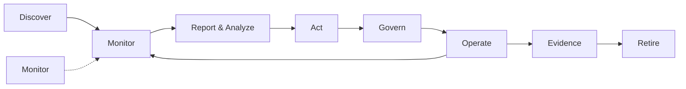

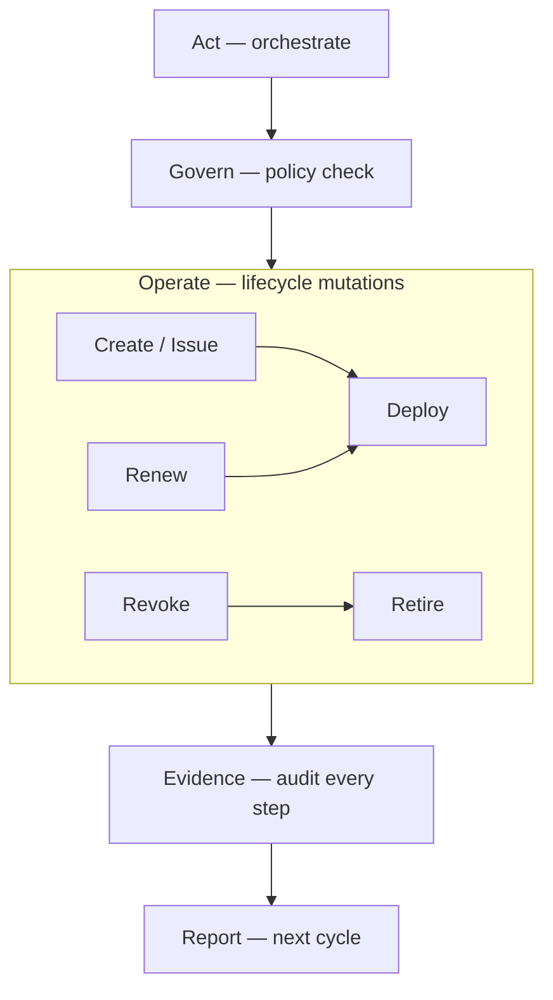

**Important distinction:** **Report** is not the same as **Evidence**.

| Term | Meaning | When |
|---|---|---|
| **Report & Analyze** | Operational output for humans and automation: new/changed certs, deltas since last scan, risk highlights, standards violations, trends | After initial discovery **and** on every continuous monitoring cycle |
| **Act** | Configurable **orchestration** triggered by report findings: alert owner, create ticket, import to inventory, queue for operate, escalate | Immediately after analysis (manual review or policy-driven auto) |
| **Operate** | **Certificate lifecycle mutations** executed under policy: **create** (issue/enroll), **renew**, **revoke**, deploy, retire | When Act (or manual operator) triggers a lifecycle change |
| **Evidence** | Immutable **traceability / audit** record: who/what/when/policy/before-after state for every Act and Operate event | After every Act and Operate step — for auditors and change management |

Shorter mnemonic: **Discover → Report → Act → Operate → Evidence** (with Govern enforcing policy throughout; Retire as terminal Operate state).

**Act vs Operate — do not conflate:**

| | **Act** | **Operate** |
|---|---|---|
| **Nature** | Workflow orchestration / triage | Actual cert lifecycle change |
| **Examples** | Alert owner, open ticket, import metadata, queue renew | Issue cert, renew cert, revoke cert, deploy to endpoint, remove old cert |
| **Analogy** | "Something should happen" | "It happened" |
| **Feeds evidence?** | Yes — act initiated, policy matched, queue state | Yes — create/renew/revoke outcome, fingerprints, deploy result |

Both **Act** and **Operate** must be fully traceable. Evidence is not optional for either.

### 2.1.1 The continuous loop (where reporting really lives)

Reporting is **not** a one-time post-discovery artefact and **not** only at retirement. It is the **bridge between visibility and action**:

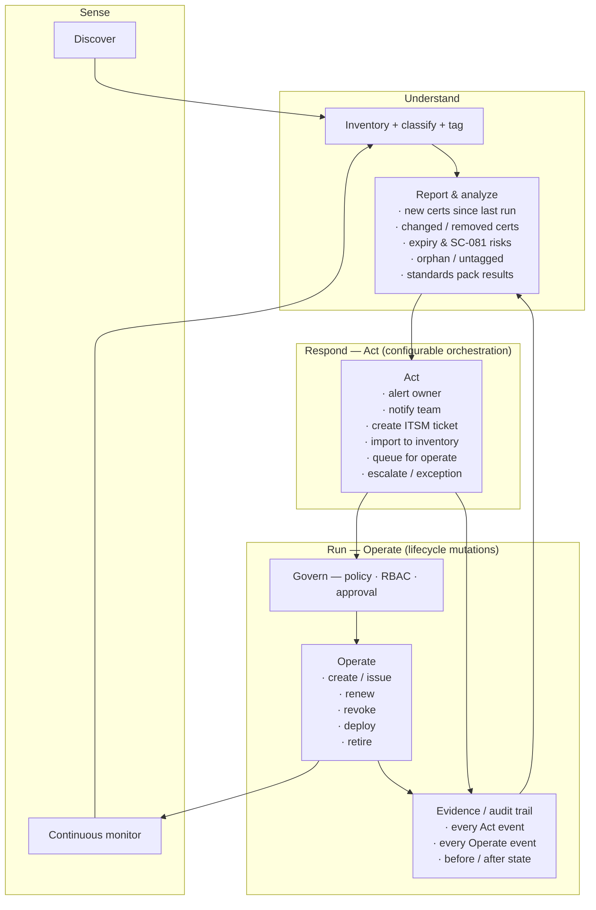

**First discovery run** produces a baseline report ("here is everything"). **Every subsequent monitor cycle** produces a **delta report** ("here is what changed and what needs attention"). That delta report is what drives day-to-day operations — not the initial inventory dump alone.

### 2.2 Three layers (not one product feature)

| Layer | Question it answers | Typical owners |
|---|---|---|
| **Visibility** | What certs exist, where, how risky? | Security, platform, audit |
| **Control** | Who may issue/renew/revoke under what policy? | PKI, IAM, risk/compliance |
| **Operations** | Do certs stay valid, correctly deployed, and retired cleanly? | SRE, app teams, change management |

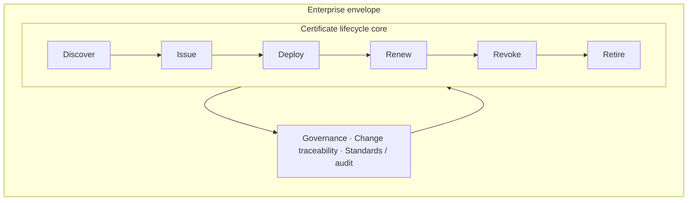

Vault primarily serves **Control + Operations for Vault-managed certs**. Enterprise CLM requires all three layers across the **whole estate**.

### 2.3 Core capability model

| # | Capability | What "good" looks like |
|---|---|---|
| 1 | **Discovery** | Automated scan of endpoints, LB, K8s, stores, cloud APIs |
| 2 | **Inventory** | Normalised, **human-readable** record: service, endpoint, owner, subject, SANs, issuer, chain, expiry, location — not serial/key_id as primary key |
| 3 | **Classification** | External/public vs internal/private vs self-signed vs unknown |
| 4 | **Tagging** | Owner, environment, service, criticality, compliance scope |
| 5 | **Assessment** | Expiry risk, weak crypto, policy violations, orphan certs |
| 6 | **Reporting & analysis** | Baseline + delta reports: new/changed/removed certs, risk highlights, standards results, trends |
| 7 | **Action engine** | Configurable orchestration from report findings: alert, ticket, import, queue-for-operate, escalate — **policy-driven** |
| 8 | **Governance, policy & RBAC** | Policy engine (YAML/OPA, Org→Team→Project inheritance, NL→draft→review→publish), approvals, exceptions, fine-grained RBAC; integrates Vault ACL + Identity |
| 9 | **Operate — create / issue** | Enroll or issue new cert (Vault PKI, ACME, SCEP, external CA) under policy |
| 10 | **Operate — renew** | Re-issue before expiry; key rotation; overlap window |
| 11 | **Operate — revoke** | Invalidate cert (CRL/OCSP where applicable); emergency revocation |
| 12 | **Operate — deploy** | Agent, cert-manager, LB API, config management |
| 13 | **Operate — retire** | Remove superseded cert/key from endpoints and stores |
| 14 | **Monitoring** | Continuous re-scan, drift detection, CT anomalies — feeds back into reporting |
| 15 | **Traceability & audit** | Immutable event log for **every** Act and Operate step; export for auditors |
| 16 | **Change traceability** | ITSM ticket / change record linked to events, incl. auto-approved |
| 17 | **Status & history** | Logical cert identity + fingerprint + endpoint bindings + event timeline |
| 18 | **Standards packs** | Versioned rules (SC-081, ISM, DORA, PCI, internal policy) — input to reports |
| 19 | **Import & replace** | Register unmanaged certs, migrate to Vault-managed issuance with verified cutover |

The discovery prototype sits in **1–4, 6 (baseline report), partially 5, 15–18**. **Report → Act → Operate (9–13) → Evidence (15–16)** is the full operational loop, under **Governance, policy & RBAC (8)**. **Import & replace (19)** is the bridge from visibility to Vault as control plane. That is **Release 2** priority, not Release 1.

> **Not separate lifecycle stages:** Policy sits under **Govern** (§4 lifecycle stage 4, §2.8–§2.10). API-first integration is a platform requirement for how the tool is built and consumed, not a certificate lifecycle stage (§2.11).

**Platform non-negotiables for any plugin we build:** **traceability/auditability** on every action, **fine-grained RBAC**, **customisable policy** (within Govern), and **API-first** delivery (see §2.6–2.11).

### 2.4 Report content: what a good operational report includes

Every report run (baseline or delta) should answer:

| Section | Content | Drives action |
|---|---|---|
| **Summary** | Total certs, new since last run, expiring <30/60/90 days, critical violations | Executive / program view |
| **New in environment** | Certs or endpoints not seen before | Import, tag, assign owner |
| **Changed** | Fingerprint/expiry/issuer/binding changes | Investigate drift or renewal |
| **Removed** | Previously seen, no longer present | Confirm decommission vs scan gap |
| **Risk highlights** | SC-081 over-length, weak crypto, orphan, untagged, external unmanaged | Prioritised remediation queue |
| **Standards pack results** | Pass / Fail / Exception / N/A per rule (SC-081, ISM, PCI, etc.) | Audit readiness |
| **Recommended actions** | Per finding: suggested act (alert / import / renew / replace) | Human review or auto-policy |

Reports should be exportable (HTML/PDF/CSV) **and** machine-readable so the **action engine** can consume them without a human in the loop where policy allows.

### 2.5 Action engine: configurable responses

All actions are **policy-configurable** — nothing is hard-coded. Examples:

| Trigger (from report) | Act (orchestrate) | Operate (if queued) |
|---|---|---|
| New cert discovered, no owner tag | Notify platform team · require tag | — |
| New external public cert | Alert owner · import · **queue create/replace** | Create/issue · deploy · retire old |
| Expiring in <30 days, `managed_by: external` | Alert owner · **queue renew** | Renew · deploy · verify |
| SC-081 validity violation | Flag critical · alert · **queue replace** | Create · deploy · revoke/retire old |
| Compromised cert suspected | Alert security · **queue revoke** | Revoke · deploy replacement · retire |
| Policy-approved auto-renew | Queue renew (auto) | Renew · deploy (auto) · evidence |

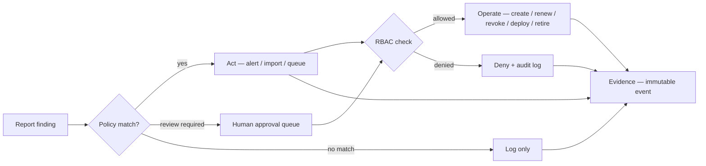

Auto-approved Act and Operate steps still produce **evidence** — they are not invisible automation.

### 2.5.1 Operate action items (create / renew / revoke → evidence)

These are the **lifecycle mutations** the action engine queues or an operator triggers. Each operation is a discrete, auditable step — not a black-box "renew cert" button.

| Operate action | What happens | Typical Vault integration | Evidence emitted |
|---|---|---|---|
| **Create / issue** | New cert enrolled or issued under policy (new workload, import & replace, SC-081 cutover) | `pki/issue`, ACME, SCEP, `pki_external_ca` | `operate.issued` — serial, SPKI fingerprint, role, policy_id, Vault request_id, approver |
| **Renew** | Re-issue before expiry; optional key rotation and overlap window | `pki/issue` (same role), Agent auto-renew | `operate.renewed` — old/new fingerprint, expiry delta, deploy status |
| **Revoke** | Invalidate cert (CRL/OCSP); emergency or policy-driven | `pki/revoke`, CRL publish | `operate.revoked` — reason, timestamp, affected endpoints, Vault request_id |
| **Deploy** | Push cert/key to target (Agent, cert-manager, LB API, config mgmt) | Agent template, K8s secret, webhook | `operate.deployed` — target, method, verify result (TLS handshake) |
| **Retire** | Remove superseded cert/key from endpoint and stores | Agent reload, LB update, manual confirm | `operate.retired` — old fingerprint removed, status → `retired` |

**Evidence chain for a typical renew:**

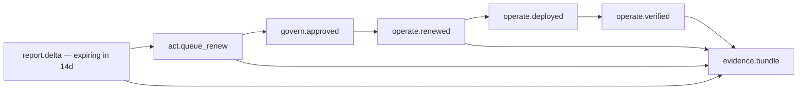

Every Operate step carries a **correlation_id** linking back to the report finding and Act that triggered it. Auditors can trace: *finding → policy → approval → issue → deploy → outcome*.

### 2.6 Traceability & auditability (platform requirement)

Whatever tool or plugin we build, **traceability is not a nice-to-have** — it is a core product requirement for regulated customers (APRA, DORA, PCI, ISO, FedRAMP themes).

**Every event that must be auditable:**

| Event category | Examples | Minimum audit fields |
|---|---|---|
| **Sense** | Discovery run, monitor cycle, scan target | run_id, timestamp, actor/service, scope, cert count |
| **Report** | Baseline generated, delta generated, export | report_id, findings summary, standards pack version |
| **Act** | Alert sent, ticket created, import queued, escalation | act_type, policy_id, trigger_finding, recipient |
| **Govern** | Policy check, approval granted/denied, exception applied | policy_id, approver, decision, exception_expiry |
| **Operate** | Create, renew, revoke, deploy, retire | operation, cert_fingerprint before/after, Vault request_id, outcome |
| **RBAC** | Access granted/denied to plugin function | user/service identity, role, resource, action, result |

**Design principles:**

- **Append-only event store** — events are never deleted or silently overwritten
- **Correlation IDs** — link report → act → operate → evidence in one chain
- **Point-in-time replay** — reproduce "what did we know and do on date X?" for auditors
- **Vault audit log correlation** — plugin events reference Vault API request IDs where Operate touches Vault PKI/Agent
- **Export** — SIEM, CSV, PDF evidence bundles for audit packs

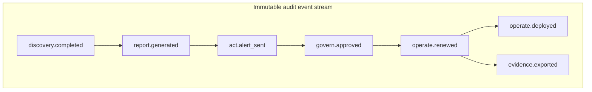

### 2.7 RBAC — fine-grained access control (platform requirement)

Enterprise CLM touches high-risk operations (issue, renew, revoke, import, replace). **Fine-grained RBAC** is required so teams can delegate without over-privileging.

**Integrate with Vault identity model** where possible (Vault policies, namespaces, identity groups) — do not invent a parallel auth system unless necessary.

**Suggested role dimensions:**

| Dimension | Examples |
|---|---|
| **Resource scope** | By environment (dev/test/prod), namespace, tag, compliance scope |
| **Function** | discover, view inventory, view reports, export reports, tag/edit metadata, act (alert only), act (queue operate), operate (create), operate (renew), operate (revoke), operate (import/replace), manage policies, manage RBAC, view audit, export audit |
| **Data sensitivity** | View cert metadata vs view full chain vs trigger lifecycle change |
| **Approval** | Requester vs approver vs operator vs auditor (read-only) |

**Example roles (illustrative):**

| Role | Can do | Cannot do |
|---|---|---|
| **Auditor** | View inventory, reports, audit export | Any operate or act |
| **App owner** | View own tagged certs, receive alerts, request renew | Revoke prod certs, change policies |
| **Platform operator** | Discover, tag, report, queue renew/replace in non-prod | Revoke prod without approval |
| **PKI admin** | Full operate in prod with policy | Bypass audit or RBAC |
| **Security admin** | Policies, RBAC, standards packs, emergency revoke | — |

**RBAC enforcement points:**

- API and UI for every plugin function
- Action engine — policy may only auto-act within role bounds
- Operate — create/renew/revoke requires explicit permission + optional approval workflow
- Audit — all RBAC denials logged (failed access is evidence too)

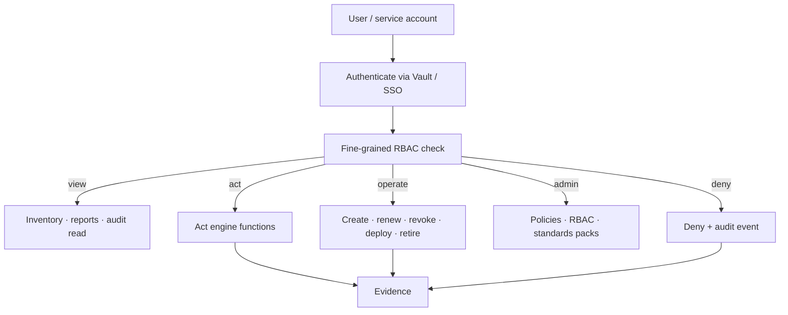

### 2.8 Policy engine architecture (part of Govern)

Policy-driven automation lives under **Govern** — it is not a separate certificate lifecycle stage (see §4 lifecycle stage 4). The policy engine is how Govern enforces *what may happen* when Report findings trigger Act and Operate.

**Is a policy engine overkill?**

| Approach | Verdict |
|---|---|
| Hard-coded `if finding == "expiring"` in Go | **Underkill** — no customer customisation, weak audit story |
| Full OPA + Rego + Sentinel + custom DSL on day 1 | **Overkill** — slow to ship, hard to explain |
| **Versioned policy documents (Release 1) → embedded OPA (Release 2+)** | **Right size** — customisable, auditable, evolvable |

#### Three policy layers (do not conflate)

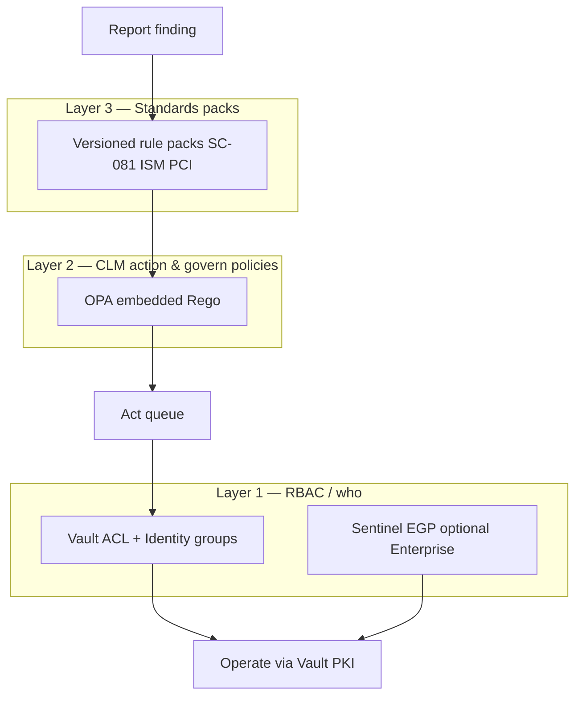

| Layer | Question | Recommended engine | Release |
|---|---|---|---|
| **1 — RBAC / who** | Who may view, act, operate? | **Vault ACL + Identity groups**; optional **Sentinel EGP** on PKI paths (Enterprise) | 1 |
| **2 — Act / govern / operate gates** | What happens when finding X matches? | **YAML policy documents → embedded OPA (Rego)** | 1 YAML, 2 OPA |
| **3 — Standards packs** | Is this cert compliant? | **Versioned rule packs** (not a general policy engine) | 1 |

**Primary recommendation for Layer 2:** [OPA](https://www.openpolicyagent.org/) embedded in the plugin (`github.com/open-policy-agent/opa` in Go). Input = finding + cert metadata + actor + effective inherited policy; output = structured decision (`actions`, `require_approval`, `policy_id@version`).

**Why not Sentinel as the primary CLM action engine?** Sentinel excels at **Vault API request-path** control (EGP/RGP). The plugin needs **finding → act → operate** orchestration that lives outside Vault's request evaluation order. Use Sentinel optionally as a **hard gate** on `pki/issue`, `pki/revoke`, etc. — defense in depth, not replacement.

**Policy storage:** Vault KV v2 under namespace hierarchy (versioned, same trust boundary as PKI). See §2.10.

#### Policy families and starter catalogue

| Family | Purpose | Example policy name |
|---|---|---|
| **Act** | Orchestrate from findings | `external-public-import`, `expiry-30d-external` |
| **Operate gate** | Approve before Vault PKI call | `prod-revoke-2of2`, `prod-replace-1of2` |
| **Auto-approval** | Safe unattended operate | `vault-nonprod-auto-renew` |
| **Exception** | Temporary non-compliance allowance | `exception-sc081-migration` |
| **Discovery** | New shadow cert handling | `new-cert-require-tagging` |
| **RBAC binding** | Role × action × scope matrix | `operate-renew-prod-pki-admin` |

Ship **10–15 opinionated defaults**; customers fork and extend.

#### Example: Act policy (YAML — Release 1 friendly)

```yaml
apiVersion: clm/v1
kind: ActionPolicy
metadata:
  name: external-expiring-alert-and-queue
  version: "1.2.0"
  priority: 100
spec:
  scope:
    environments: ["production", "staging"]
    tags: { compliance_scope: pci }
  match:
    finding_types: ["expiring_soon", "expiry_critical"]
    cert:
      managed_by: external
      trust_type: public_tls
      days_to_expiry_lte: 30
  actions:
    - type: alert
      channel: owner
      severity: high
    - type: create_ticket
      system: servicenow
      template: clm-expiry-external
    - type: queue_operate
      operation: renew
      auto_approve: false
  evidence:
    record: true
    standards_refs: ["pci-4.2.1.1", "sc081-v3"]
```

#### Example: Operate gate policy

```yaml
apiVersion: clm/v1
kind: OperateGatePolicy
metadata:
  name: prod-revoke-requires-approval
spec:
  match:
    operation: revoke
    environment: production
  gate:
    require_approval: true
    approver_groups: ["pki-admins", "security-oncall"]
    min_approvers: 2
    emergency_override:
      allowed: true
      roles: ["security-admin"]
      evidence: mandatory
```

#### Runtime evaluation flow

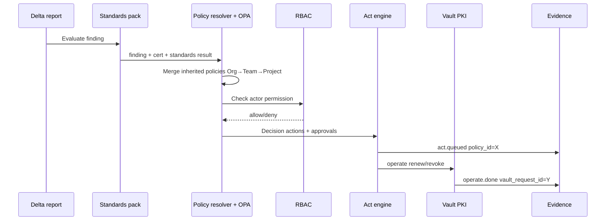

Every decision logs: **`policy_id`, `policy_version`, `input_hash`, `matched_rules`, `decision`**.

### 2.9 Policy authoring: natural language → draft → review → publish

Natural language is the **authoring interface**, not the runtime engine. At execution time the plugin evaluates **only published, structured policy** (YAML/Rego) — preserving auditability and RBAC.

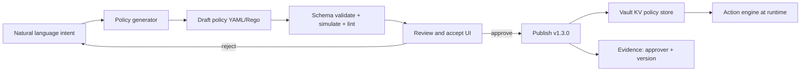

#### Authoring workflow

| Step | What happens |
|---|---|
| **1. Natural language** | User describes intent scoped to Org, Team, or Project namespace |
| **2. Generate policy** | LLM or template+LLM outputs structured `ActionPolicy`, `OperateGatePolicy`, or `PolicyBundle` — not free text |
| **3. Review and accept** | Human sees: plain-English summary, generated YAML/Rego, diff vs current, **simulation** on sample findings |
| **4. Publish** | Approved policy gets `policy_id`, `version`, `approved_by`, `effective_at` — stored in Vault KV |
| **5. Runtime** | Engine evaluates **published policy only** — never raw NL |

#### Review UI (three panes)

The reviewer must see:

- **Summary** — human-readable explanation of what the policy will do
- **Machine policy** — YAML/Rego (source of truth)
- **Impact preview** — how many certs/findings from last delta report would match; blast radius (prod vs non-prod, auto-approve vs manual)

#### Guardrails (non-negotiable)

1. **Schema validation** — reject drafts that fail JSON schema
2. **Simulation before publish** — run against last N delta reports or fixtures
3. **Approval tiers** — alert-only (team lead); operate (PKI admin); prod auto-approve (security/compliance)
4. **No silent overwrite** — publish = new version; prior versions retained
5. **Evidence** — `policy.published { version, approved_by, summary, nl_session_id }`
6. **Inheritance validation** — reject drafts that weaken Org `mandatory: true` rules (see §2.10)

#### Example: natural language → draft

**User input (project scope):**

> For PCI-scoped production certs that are external and expire in under 30 days: alert the owner, create a ServiceNow incident, queue a renew, and require two PKI admins to approve before operate runs.

**Generated draft:**

```yaml
apiVersion: clm/v1
kind: ActionPolicy
metadata:
  name: pci-prod-external-expiry-30d
  version: "0.1.0-draft"
  draft_from: "nl-policy-session-abc123"
spec:
  scope:
    environments: [production]
    tags: { compliance_scope: pci }
  match:
    finding_types: [expiring_soon]
    cert:
      managed_by: external
      trust_type: public_tls
      days_to_expiry_lte: 30
  actions:
    - type: alert
      channel: owner
      severity: high
    - type: create_ticket
      system: servicenow
      template: clm-pci-expiry
    - type: queue_operate
      operation: renew
  govern:
    require_approval: true
    approver_groups: [pki-admins]
    min_approvers: 2
```

**Product framing:** *"Describe what you want in plain English; we turn it into an auditable policy you approve before it ever touches production."*

#### Phasing

| Release | Capability |
|---|---|
| **Release 1** | Form-based policy builder + templates + review and publish (no LLM) |
| **Release 2** | NL → YAML draft + simulation + approval workflow |
| **Release 3** | NL → Rego for advanced customers; policy conflict detection; "why did this cert match?" explainer |

### 2.10 Hierarchical policy inheritance: Org → Team → Project

Enterprise customers need **central guardrails** with **delegated team autonomy** and **project-specific nuance**. Both CLM policies and Vault RBAC should follow the same hierarchy.

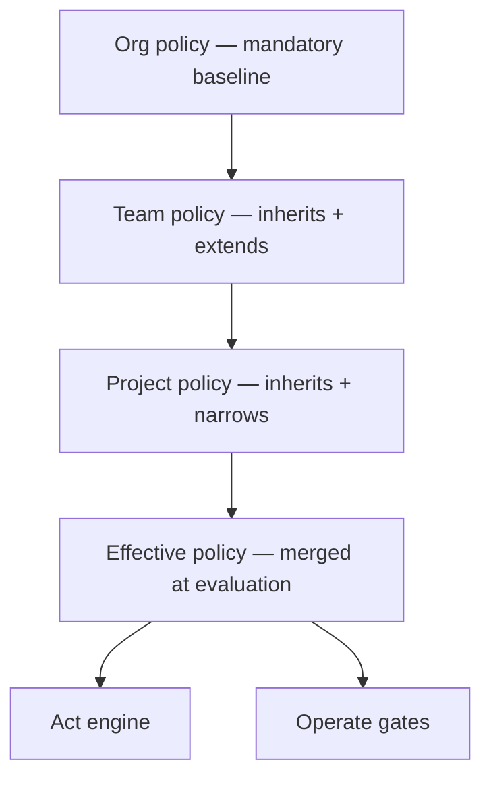

#### Precedence rules

| Rule | Behaviour |
|---|---|
| **Org mandatory** | Cannot be weakened by team/project (only formal exception workflow) |
| **Most specific wins** | Project > Team > Org for conflicting *allow* rules |
| **Deny wins** | Any level `deny` blocks the action |
| **Merge actions** | Non-conflicting actions stack (org alert + team ticket + project queue) |
| **Operate gates** | Most restrictive approval wins (org requires 2 approvers → team cannot reduce to 0) |
| **Exceptions** | Scoped override with expiry; logged in evidence |

**Evaluation pseudologic:**

```text
namespace = cert.namespace          # e.g. acme-corp/platform/payments-api/
chain = walk_up(namespace)          # [project, team, org]
policies = [load(ns/clm/policies/*) for ns in reverse(chain)]
effective = merge_mandatory_first(policies)
effective = apply_deny_overrides(effective)
effective = attach_rbac_from_vault_identity(caller, namespace)
```

#### Vault layer mapping

**Namespace hierarchy = Org → Team → Project:**

```text
root
└── acme-corp/                              # Org
    ├── clm/policies/org-default.yaml
    ├── clm/inventory/
    ├── platform/                           # Team
    │   ├── clm/policies/team-platform.yaml # inherits org-default
    │   └── payments-api/                   # Project
    │       └── clm/policies/project-payments.yaml
    └── retail/                             # Another team
        └── clm/...
```

**Vault PKI** can mirror the same tree:

```text
acme-corp/pki/
acme-corp/platform/pki/intermediate/
acme-corp/platform/payments-api/pki/role/web-server
```

**Inventory tags** tie certs to scope when a dedicated project namespace is not used:

```yaml
tags:
  org: acme-corp
  team: platform
  project: payments-api
  environment: production
  compliance_scope: pci
```

Policy resolution uses **namespace path + tags** — walk up the tree and merge.

#### Two inheritance layers (do not conflate)

| Layer | What inherits | Vault mechanism |
|---|---|---|
| **CLM policies** (Act / Govern / Operate gates) | Org → Team → Project business rules | Plugin policy store under namespace hierarchy (KV v2) |
| **Vault RBAC** (who can call what) | Org → Team → Project permissions | ACL policies + Identity groups + namespaces |

#### Worked example: three-level inheritance

**Org baseline** — `acme-corp/clm/policies/org-default.yaml` (`mandatory: true`):

```yaml
apiVersion: clm/v1
kind: PolicyBundle
metadata:
  name: org-default
  scope: org
  namespace: acme-corp/
  mandatory: true
  version: "2.0.0"
spec:
  operate_gates:
    - match: { operation: revoke, environment: production }
      gate: { require_approval: true, min_approvers: 2, approver_groups: [security-oncall, pki-admins] }
    - match: { operation: renew, cert: { managed_by: external, environment: production } }
      gate: { require_approval: true, min_approvers: 1 }
  act_policies:
    - name: org-sc081-violation
      match:
        finding_types: [standards_violation]
        standards_rule: sc081.max_validity_days
      actions:
        - type: alert
          channel: compliance
          severity: critical
        - type: queue_operate
          operation: replace
      govern: { require_approval: true }
  rbac:
    deny_auto_approve_in: [production]
```

**Vault ACL (org auditors)** — identity group `org-auditors` at `acme-corp/`:

```hcl
path "acme-corp/clm/inventory/*" {
  capabilities = ["read", "list"]
}
path "acme-corp/clm/reports/*" {
  capabilities = ["read", "list"]
}
path "acme-corp/clm/audit/*" {
  capabilities = ["read", "list"]
}
```

**Team policy** — `acme-corp/platform/clm/policies/team-platform.yaml`:

```yaml
apiVersion: clm/v1
kind: PolicyBundle
metadata:
  name: team-platform
  scope: team
  namespace: acme-corp/platform/
  inherits: acme-corp/clm/policies/org-default@2.0.0
  version: "1.1.0"
spec:
  act_policies:
    - name: platform-external-expiry
      match:
        finding_types: [expiring_soon]
        cert: { team: platform, managed_by: external, days_to_expiry_lte: 30 }
      actions:
        - type: alert
          channel: team-platform-oncall
        - type: create_ticket
          system: servicenow
          assignment_group: platform-pki
        - type: queue_operate
          operation: renew
    - name: platform-vault-nonprod-auto-renew
      match:
        finding_types: [expiring_soon]
        cert:
          team: platform
          managed_by: vault
          environment_in: [development, staging]
          days_to_expiry_lte: 14
      actions:
        - type: queue_operate
          operation: renew
          auto_approve: true
```

**Vault ACL (team operators)** — identity group `platform-operators` at `acme-corp/platform/`:

```hcl
path "acme-corp/platform/clm/inventory/*" {
  capabilities = ["create", "read", "update", "list"]
}
path "acme-corp/platform/clm/act/*" {
  capabilities = ["create", "update"]
}
path "acme-corp/platform/clm/operate/renew" {
  capabilities = ["create", "update"]
}
path "acme-corp/platform/pki/issue/*" {
  capabilities = ["update"]
}
```

**Project policy** — `acme-corp/platform/payments-api/clm/policies/project-payments.yaml`:

```yaml
apiVersion: clm/v1
kind: PolicyBundle
metadata:
  name: project-payments-api
  scope: project
  namespace: acme-corp/platform/payments-api/
  inherits: acme-corp/platform/clm/policies/team-platform@1.1.0
  version: "1.0.0"
spec:
  act_policies:
    - name: pci-payments-expiry-strict
      match:
        finding_types: [expiring_soon]
        cert:
          project: payments-api
          tags: { compliance_scope: pci }
          days_to_expiry_lte: 60
      actions:
        - type: alert
          channel: owner
          severity: critical
        - type: create_ticket
          system: servicenow
          priority: p1
        - type: queue_operate
          operation: renew
      govern:
        require_approval: true
        min_approvers: 2
        approver_groups: [payments-pki-delegates]
  operate_gates:
    - match:
        operation: renew
        cert: { project: payments-api, environment: production }
      gate:
        require_approval: true
        min_approvers: 2
        require_change_ticket: true
```

#### Effective policy for a PCI prod cert in `payments-api` expiring in 45 days

| Source | Rule applied |
|---|---|
| Org | SC-081 violation → replace + compliance alert |
| Org | Prod external renew → ≥1 approver |
| Org | Prod revoke → 2 approvers (mandatory) |
| Team | External expiry ≤30d → ServiceNow (45d: not yet triggered) |
| **Project** | PCI expiry ≤60d → **P1 ticket + 2 approvers** ← applies to this cert |

#### NL authoring with inheritance

Natural language is scoped to namespace:

- **Org:** *"All production revokes need two approvers."*
- **Team:** *"For platform team, auto-renew Vault-managed staging certs within 14 days."*
- **Project:** *"For payments-api PCI certs, alert at 60 days and require a change ticket."*

Publish validator **rejects** team/project drafts that weaken org `mandatory: true` rules.

#### Optional: Sentinel at Vault boundary (Enterprise)

Org-level EGP on `acme-corp/*/pki/revoke` — hard stop regardless of CLM plugin policy:

```sentinel
import "strings"

main = rule when strings.has_prefix(request.path, "acme-corp/") {
    request.operation is "update" and
    strings.has_suffix(request.path, "revoke") implies
    token.meta.approval_count >= 2
}
```

CLM plugin policies orchestrate *what should happen*; Sentinel enforces *what the Vault API allows* — defense in depth.

### 2.11 Customer & platform requirements — API-first design

**API-first integration is a customer and platform requirement** — how the plugin is built, delivered, and consumed — not a certificate lifecycle phase. Enterprise buyers expect to automate via CI/CD, ITSM, SIEM, and GitOps without UI dependency; the UI is a client of the same API.

Enterprise CLM must fit into existing operating models without forcing operators through a portal for every action. **API-first** means the plugin is designed as a **programmable control plane**.

**Design principle:** *If you can do it in the UI, you can do it via API — with the same RBAC, policy checks, and audit events.*

#### Why API-first matters for this plugin

| Stakeholder | API-first benefit |
|---|---|
| **Platform / SRE** | Trigger discovery, pull delta reports, queue renewals from pipelines |
| **Security / GRC** | Export posture JSON, subscribe to compliance events, feed SIEM |
| **App teams** | Tag certs, request renew/replace, check status via API — no portal dependency |
| **Integrators** | ServiceNow/Jira/PagerDuty via webhooks + REST without vendor lock-in to UI workflows |
| **HashiCorp story** | Same pattern as Vault itself — automate everything, UI optional |

A UI-only CLM tool becomes shelfware in regulated enterprises where **everything auditable must be automatable**.

#### Architecture: API as the centre

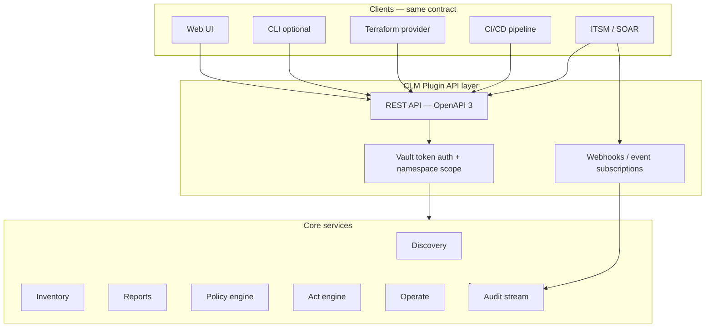

#### API surface (logical groups)

All paths are namespace-scoped (e.g. `/{namespace}/clm/v1/...`) and authenticated via **Vault token** (or delegated JWT/OIDC where configured).

| API group | Key operations | Typical integrator |
|---|---|---|
| **Discovery** | `POST /scans`, `GET /scans/{id}`, `GET /scans/{id}/results` | Pipeline, scheduled job |
| **Inventory** | `GET/POST/PATCH /certificates`, `GET /certificates/{id}`, bulk tag/import | CMDB sync, GitOps |
| **Reports** | `POST /reports/run`, `GET /reports/{id}`, `GET /reports/{id}/findings` | GRC dashboard, audit export |
| **Policies** | `GET/POST /policies`, `POST /policies/draft`, `POST /policies/{id}/publish`, simulate | Policy-as-code, NL authoring backend |
| **Act** | `POST /acts`, `GET /acts/{id}`, approval queue | SOAR, manual operator tools |
| **Operate** | `POST /operate/issue`, `/renew`, `/revoke`, `/deploy`, `/retire` | Vault PKI orchestration, runbooks |
| **Audit** | `GET /events`, `GET /events/{correlation_id}`, export | SIEM, auditor tooling |
| **Webhooks** | `POST /subscriptions` — event types, HMAC secret, retry policy | ServiceNow, Slack, PagerDuty |

**Contract requirements:**

- **OpenAPI 3** spec published and versioned (`/clm/v1`, `/clm/v2`) — breaking changes only on major version
- **Idempotency** — `Idempotency-Key` header on mutating operate/act calls
- **Pagination + filtering** — inventory and audit queries scale to large estates
- **Async jobs** — long scans and report runs return `202 Accepted` + job ID + webhook on completion
- **Structured errors** — machine-readable error codes (`POLICY_DENIED`, `RBAC_DENIED`, `APPROVAL_REQUIRED`) for automation branching
- **Correlation IDs** — client may pass `X-Correlation-ID`; echoed in audit events

#### Example: pipeline-driven delta check

```bash
# 1. Trigger monitor scan (async)
curl -s -X POST \
  -H "X-Vault-Token: $VAULT_TOKEN" \
  -H "X-Correlation-ID: pipeline-run-8842" \
  "https://vault.example.com/v1/acme-corp/clm/v1/scans" \
  -d '{"profile":"production-tls","async":true}'

# 2. Fetch delta report findings (machine-readable)
curl -s \
  -H "X-Vault-Token: $VAULT_TOKEN" \
  "https://vault.example.com/v1/acme-corp/clm/v1/reports/delta-latest/findings?severity=gte:high"

# 3. Queue renew for approved findings (policy + RBAC enforced server-side)
curl -s -X POST \
  -H "X-Vault-Token: $VAULT_TOKEN" \
  -H "Idempotency-Key: renew-payments-api-001" \
  "https://vault.example.com/v1/acme-corp/platform/clm/v1/operate/renew" \
  -d '{"certificate_id":"cert-abc","reason":"pipeline_sc081_prep"}'
```

Every call produces the same audit events as the UI — no "API bypass" path.

#### Integration patterns

| Pattern | Mechanism | Release |
|---|---|---|
| **Pull** | REST GET — inventory, reports, audit export | 1 |
| **Push** | Webhooks on `report.generated`, `act.queued`, `operate.completed`, `policy.published` | 1 (basic), 2 (full) |
| **Infrastructure-as-code** | Terraform provider for scan targets, tags, policies | 2 |
| **GitOps** | Policy bundles in Git → CI validates + publishes via API | 2 |
| **ITSM** | Webhook → ServiceNow/Jira; optional bidirectional status sync | 2 |
| **SIEM** | Audit stream export (JSON lines, syslog, or vendor connector) | 1 |
| **Vault-native** | Plugin mounts under Vault API; same token, namespace, audit device | 1 |

#### Ease-of-use principles (beyond raw API)

API-first does not mean "hard to use." Pair the API with:

| Principle | Implementation |
|---|---|
| **Sensible defaults** | Pre-built scan profiles, starter policies, one-command baseline report |
| **Progressive disclosure** | Simple REST for 80% cases; advanced filters and OPA bundles for power users |
| **Discoverability** | OpenAPI docs, example curl/terraform in docs, Postman collection |
| **UI parity** | UI built on public API — catches API gaps early |
| **CLI wrapper (optional)** | Thin client over REST for operators (`clm scan run`, `clm report delta`) — not a second logic path |
| **Terraform provider (Release 2+)** | Declarative scan targets, tags, policy publish — fits HashiCorp buyer workflow |

#### What not to do

- **UI-only features** — if it is not in the API, it does not ship
- **Undocumented internal RPC** — integrators depend on OpenAPI contract only
- **Separate auth system** — reuse Vault tokens, namespaces, identity groups
- **Synchronous-only long jobs** — discovery at scale must be async + webhook
- **Bespoke export formats** — reports and audit export as JSON first; HTML/PDF as render views of same data

#### Phasing

| Release | API / integration deliverables |
|---|---|
| **Release 1** | OpenAPI v1 for discovery, inventory, reports, act queue, audit read; webhooks for report + act events; Vault token auth |
| **Release 2** | Operate API, policy publish/simulate API, idempotency, Terraform provider alpha, ITSM webhook templates |
| **Release 3** | Bulk operations, CMDB sync API, LB deploy hooks, SDK (Go/Python), event streaming at scale |

**Product framing:** *"Automate certificate visibility and compliance the same way you automate Vault — API-first, namespace-scoped, fully auditable."*

---

## 3. What is changing: rules and governance landscape

### 3.1 The hard deadline: CA/B Forum SC-081v3

**Authoritative source:** [CA/B Forum Ballot SC081v3](https://cabforum.org/2025/04/11/ballot-sc081v3-introduce-schedule-of-reducing-validity-and-data-reuse-periods/) (approved 11 April 2025; Apple proposed; all major browser vendors voted yes).

**Scope:** Publicly trusted TLS server certificates only (Web PKI). Internal/private PKI is not directly bound, though many enterprises align voluntarily.

| Effective date | Max cert validity | Max domain/IP validation reuse |
|---|---:|---:|
| Before 15 Mar 2026 | 398 days | 398 days |
| From 15 Mar 2026 | **200 days** (ballot ceiling) | 200 days |
| From 15 Mar 2027 | **100 days** | 100 days |
| From 15 Mar 2029 | **47 days** | **10 days** |

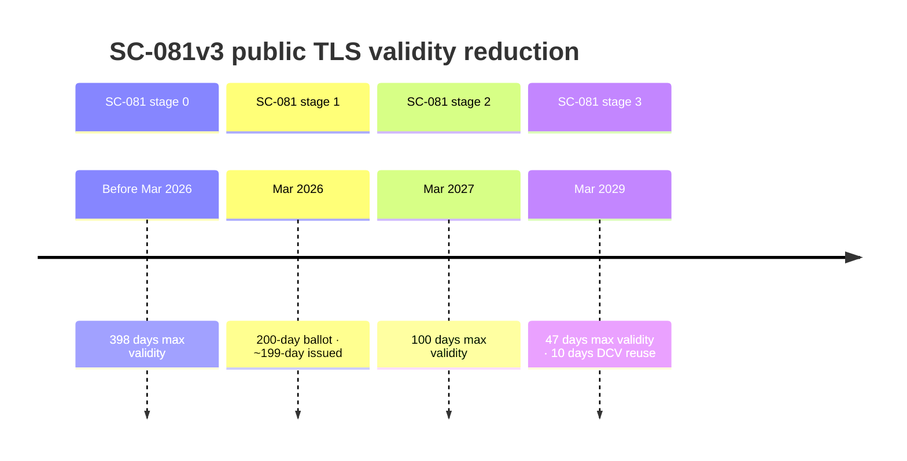

> **Ballot vs issued lifetime:** SC-081 sets a **200-day ballot ceiling** from 15 March 2026. Major public CAs (DigiCert, Sectigo) enforce **199-day maximum issued validity** in practice (from 24 February 2026). Model renewal cadence and compliance packs on **issued lifetimes (199)**, not the ballot number alone.

**Operational implication:** ~8 renewals per cert per year by 2029, plus frequent domain revalidation. Manual processes will not scale. NCSC UK explicitly warns operators to prepare and automate ([NCSC Web PKI guidance, Dec 2025](https://www.ncsc.gov.uk/guidance/provisioning-and-managing-certificates-in-the-web-pki)).

### 3.1.1 What this means for your organisation (not just a CA industry change)

SC-081v3 is not a problem for certificate authorities alone — it **redefines operating load for every organisation that runs public TLS**. The rule change flows downhill as follows:

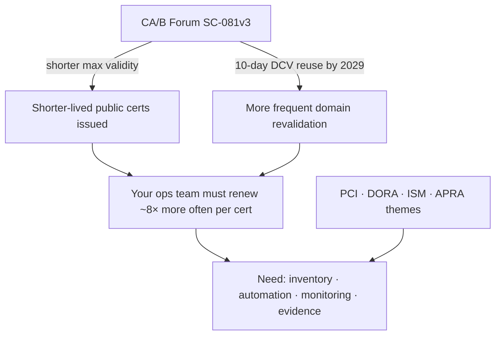

| What changes | Today (typical) | By Mar 2029 (public TLS) | Organisational impact |
|---|---|---|---|
| **Max cert lifetime** | Up to ~398 days (pre-Mar 2026) → **199 days issued** (CA practice) / 200-day ballot ceiling now | **47 days** | Renewal is a **continuous** process, not an annual project |
| **Renewals per cert per year** | ~1 | **~8** | Same headcount cannot handle 8× events without automation |
| **Domain validation reuse** | Up to 398 days | **10 days** | DNS/HTTP proof must be automated and reliable |
| **Failure window** | Weeks to notice + fix expiry | **Days** | Silent renewal failure → customer-facing outage quickly |
| **Inventory expectation** | Often incomplete / spreadsheet | PCI **mandatory**; DORA **register**; ISM **timely renewal** | "We didn't know we had that cert" is no longer a defensible answer |

**What leadership should expect:**

1. **Platform / SRE** — Renewal becomes a **pipeline**, not a calendar reminder. Manual ticket-driven renewals do not survive 47-day cadence.
2. **Security / GRC** — Auditors will ask for **inventory + evidence of timely renewal** (PCI 4.2.1.1 is already mandatory; DORA Art. 7 for EU finance). SC-081 adds **cadence pressure**, not a substitute for those obligations.
3. **Application owners** — Every public-facing service needs a **named owner**, renewal path, and deploy verification — or it becomes an outage and audit finding.
4. **Vault customers specifically** — Vault may manage **some** certs well (especially with 2.0 External CA), but **shadow certs** on LBs, legacy apps, and third-party CAs still create **estate-level** exposure unless discovery + inventory exist.

**Bottom line:** The new rules mean organisations must **see all certs, renew reliably, and prove it** — at a frequency manual processes cannot sustain.

| Standard | Mandates 47 days? | What it actually requires |
|---|---|---|
| **CA/B Forum** | Yes (public TLS) | Industry/browser enforcement |
| **ASD ISM / ACSC** | No | Key/cert lifecycle, timely renewal, appropriate validity, automation recommended ([cryptography guidelines](https://www.cyber.gov.au/business-government/asds-cyber-security-frameworks/ism/cybersecurity-guidelines/guidelines-cryptography), [key management guide](https://www.cyber.gov.au/sites/default/files/2025-08/Managing%20cryptographic%20keys%20and%20secrets_D4.pdf)) |
| **APRA CPS 234 / CPG 234** | No | Controls commensurate with risk; key lifecycle incl. renewal/revocation; control testing ([CPS 234](https://www.apra.gov.au/standards/cps-234)) |
| **APRA CPS 230** | No | Operational resilience — cert outages = service disruption risk |
| **Canada (GC / CSE)** | Via CA/B ref | Public TLS must follow [GC Recommendations for TLS Server Certificates](https://wiki.gccollab.ca/images/9/92/Recommendations_for_TLS_Server_Certificates_-_14_May_2021.pdf); validity **must not exceed CA/B Forum guidelines**; mandated via [Web Sites Configuration Requirements](https://www.canada.ca/en/government/system/digital-government/policies-standards/enterprise-it-service-common-configurations/web-sites.html) |

**Key ACSC quote (joint AU/UK/CA/NZ/JP guidance):**

> "Certificate expiry dates need to be set to an appropriate timeframe… renewed in a timely manner or revoked if compromise is detected."

**APRA does not appear to have adopted SC-081v3 as a prudential rule.** Supervisory pressure is indirect: if renewal cadence outpaces controls, that becomes a CPS 234/230 weakness.

**Canada** delegates public TLS validity limits to CA/B Forum by reference — GC guidance states certificate validity *"MUST not exceed CA/B forum guidelines"* and requires CAs to conform to CA/B Forum Baseline Requirements ([GC TLS recommendations PDF](https://wiki.gccollab.ca/images/9/92/Recommendations_for_TLS_Server_Certificates_-_14_May_2021.pdf), §2.1.2). As SC-081 phases take effect, GC-operated public TLS inherits the same reduction schedule indirectly.

### 3.3 Other jurisdictions (summary)

| Regime | Cert inventory? | Renewal discipline? | 47-day rule? |
|---|---|---|---|
| **NCSC UK** | Yes (monitor what's in use where) | Yes (ACME, ARI) | Warns explicitly on SC-081 |
| **DORA RTS Art. 7 (EU finance)** | **Yes — certificate register** | **Yes — prompt renewal** | No |
| **PCI DSS 4.2.1.1** | **Yes — mandatory since Mar 2025** | Yes | No |
| **NIST SP 1800-16** | Yes (best practice) | Yes | No |
| **FedRAMP SC-17** | Yes | Yes | No |
| **MAS TRM 10.2 (Singapore)** | Implicit | Yes (expiry/revocation) | No |
| **RBI (India payments)** | Implicit | "Renew well in time" | No |
| **ISO 27001 A.8.24** | Policy-driven | Yes (lifecycle) | No |
| **Canada GC / CSE** | Via CA/B ref | Yes (timely renewal) | Via CA/B (public TLS) |

**Pattern:** Regulators require **discipline and evidence**. CA/B Forum requires **cadence**. Enterprises need tooling that satisfies both.

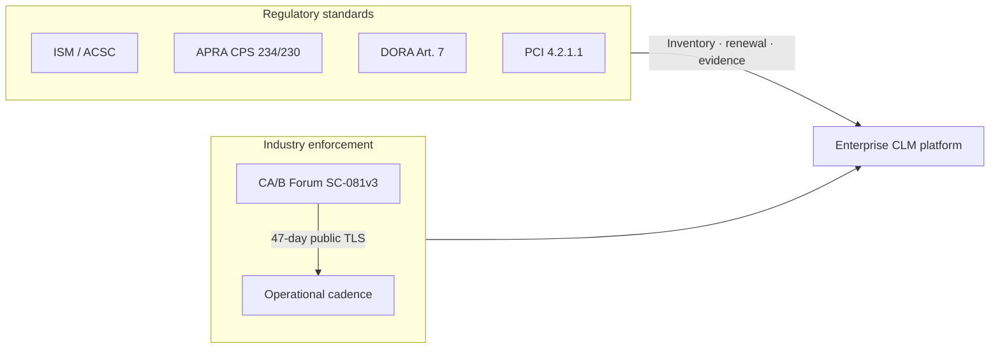

---

## 4. Lifecycle stages: why they matter, what to cover, business impact

> **Terminology (read once):**
>
> | Term | Meaning | Section |
> |---|---|---|
> | **Lifecycle stage 1–13** | What full enterprise CLM requires — capability depth model | This section (§4) |
> | **Release 1–3** | What the plugin ships and when — delivery roadmap | §9 |
> | **SC-081 enforcement stage** | CA/B ballot validity reduction schedule — industry rule, not a product release | §3.1 |

Below is the detailed breakdown with **business impact priority** (P1 = highest).

**Priority key:**

- **P1 — Critical:** Direct outage, regulatory, or security exposure
- **P2 — High:** Significant operational or audit risk
- **P3 — Medium:** Maturity / efficiency / scale enabler
- **P4 — Lower:** Advanced / niche / long-horizon

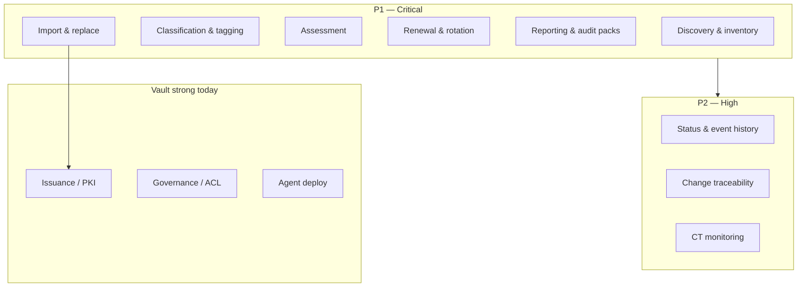

---

### Lifecycle stage 1: Discovery & inventory

**Why:** You cannot govern or renew what you cannot see. SC-081v3 increases renewal frequency; unknown certs become outage and audit findings.

**What to cover in detail:**

- Network TLS scan (host:port, SNI)
- Cloud LB / CDN / API gateway APIs
- Kubernetes secrets, cert-manager CRDs
- File/store discovery (where permitted)
- CT log correlation for public domains
- Normalised inventory schema (**human-readable first**: service, endpoint, owner; correlate Vault certs by serial/SPKI)

**What it means operationally:** First authoritative answer to "how many certs do we have, and where?"

| Business impact | Priority |
|---|---|
| Prevents expiry outages on unknown assets | **P1** |
| Required for PCI 4.2.1.1, DORA register, FedRAMP SC-17 | **P1** |
| Foundation for all automation and reporting | **P1** |
| Reduces manual audit preparation time | **P2** |

**Vault today:** No native network discovery. HCP Certificates Inventory covers **Vault-issued only**. Vault Radar scans **secrets in code**, not TLS endpoints.

---

### Lifecycle stage 2: Classification & tagging

**Why:** External public certs face SC-081v3; internal certs face different policy. Automation and reporting must be scoped.

**What to cover:**

- Trust type: public / private / self-signed / unknown chain
- Owner, team, environment (dev/test/prod)
- Service/application, criticality tier
- Compliance scope (APRA-critical, PCI, etc.)
- Automation policy assignment
- Change process routing

**What it means:** Enables targeted renewal SLAs, scoped reports, and policy-driven auto-approval.

| Business impact | Priority |
|---|---|
| Correct prioritisation under 47-day regime (public first) | **P1** |
| Accountability when certs expire | **P1** |
| Scoped automation reduces blast radius | **P2** |
| Enables chargeback / team-level reporting | **P3** |

**Vault today:** PKI roles and namespaces provide **issuance** scoping, not post-hoc tagging of discovered external certs.

---

### Lifecycle stage 3: Assessment & risk posture

**Why:** Inventory alone is not action. Teams need prioritised remediation.

**What to cover:**

- Expiry windows (30/60/90 days)
- Weak algorithms / key sizes
- Overlong validity vs SC-081 phase
- Orphan certs (no owner/service)
- Duplicate certs across endpoints
- Drift: issued cert ≠ deployed cert
- CT unexpected issuance

| Business impact | Priority |
|---|---|
| Prevents "wrong cert renewed first" | **P1** |
| Supports APRA/ISM risk-based control narrative | **P2** |
| Reduces audit finding volume | **P2** |
| CT monitoring catches mis-issuance / compromise | **P2** |

**Vault today:** HCP saved views for expired/revoked **Vault certs**. No cross-estate risk scoring.

---

### Lifecycle stage 4: Governance, policy & RBAC

**Why:** Automation at scale without policy recreates chaos faster. **Policy engine, inheritance, and RBAC all live here** — not as separate lifecycle phases.

**What to cover:**

- Allowed CAs, max TTL, key types, SAN rules
- **Policy engine:** YAML/OPA policies, Org→Team→Project inheritance, operate gates, exceptions (§2.8–§2.10)
- **Policy authoring:** NL → draft → review → publish (§2.9)
- Approval workflows (manual + policy-based auto-approve)
- Exception/waiver with expiry
- Role separation (requester / approver / operator / auditor)
- Fine-grained RBAC integrated with Vault ACL + Identity (§2.7)
- Internal vs external policy differences

| Business impact | Priority |
|---|---|
| Prevents unauthorised issuance | **P1** |
| Customisable policy without hard-coded logic | **P1** |
| Required for regulated entity control frameworks | **P2** |
| Enables safe automation at 47-day cadence | **P2** |

**Vault today:** **Strong** for PKI roles, ACL policies, namespaces, EAB for ACME — but no CLM action/operate policy engine or Org→Team→Project inheritance for discovery/report/act workflows.

---

### Lifecycle stage 5: Issuance & enrollment

**Why:** Controlled creation under policy.

**What to cover:**

- Vault PKI (internal CA)
- ACME (Vault 1.14+), SCEP/EST/CMPv2 (Enterprise)
- External CA via Vault Agent `pki_external_ca`
- CSR workflows for exceptions

| Business impact | Priority |
|---|---|
| Core to Vault value proposition | **P1** (for Vault-managed) |
| Less relevant for already-orphaned external estate | **P2** |

**Vault today:** **Strong** for Vault-as-CA and ACME. External CA integration improving via Agent.

---

### Lifecycle stage 6: Deployment / binding

**Why:** Issuance without deployment still causes outages.

**What to cover:**

- Vault Agent templates
- cert-manager, ACME clients
- LB/CDN API integration
- Post-deploy verification (TLS handshake check)
- Rollback on failed deploy

| Business impact | Priority |
|---|---|
| Directly prevents renewal "success" that still breaks prod | **P1** |
| Complex integrations vary by customer | **P2–P3** |

**Vault today:** Agent/template pattern is solid for **workloads already in Vault ecosystem**. No generic multi-platform deploy orchestration.

---

### Lifecycle stage 7: Monitoring & alerting

**Why:** At 47-day validity with 10-day DCV reuse, silent renewal failure becomes outage within days.

**What to cover:**

- Expiry alerts by tag/criticality
- Failed renewal detection
- Drift detection
- CT log alerts
- Escalation paths

| Business impact | Priority |
|---|---|
| Prevents overnight expiry incidents | **P1** |
| CPS 230 operational resilience story | **P2** |

**Vault today:** Audit logs + HCP inventory views. No enterprise-wide alerting fabric for non-Vault certs.

---

### Lifecycle stage 8: Renewal & rotation

**Why:** SC-081v3 makes this the dominant operational load.

**What to cover:**

- Scheduled renewal (renew at 25–33% remaining life — NCSC recommendation)
- ARI (RFC 9773) support for ACME
- Emergency rotation (compromise, CA distrust)
- Key rotation on renewal (best practice)
- Overlap period for failed retry

| Business impact | Priority |
|---|---|
| Core business case for SC-081v3 | **P1** |
| RBI "renew well in time", DORA "prompt renewal" | **P1** |

**Vault today:** **Strong** for Vault-issued / ACME-managed paths. No renewal orchestration for discovered external certs on non-integrated systems.

---

### Lifecycle stage 9: Revocation & decommission

**Why:** Compromised or retired certs must be invalidated and removed.

**What to cover:**

- CRL/OCSP publication (for CA)
- Revocation workflows
- Removal from all binding points
- Trust store cleanup

| Business impact | Priority |
|---|---|
| Incident response | **P1** (during incidents) |
| Day-to-day hygiene | **P2** |

**Vault today:** PKI revocation supported. NCSC correctly notes Web PKI revocation is unreliable — short lifetimes + rotation preferred.

---

### Lifecycle stage 10: Change traceability

**Why:** Auto-approved renewals still need audit evidence. Regulators ask "show me what changed and under what authority."

**What to cover:**

- Change record per renewal (ITSM integration)
- Policy ID that authorised auto-approval
- Before/after cert fingerprint
- Deploy verification result
- Linked ticket for exceptions

| Business impact | Priority |
|---|---|
| APRA/ISO/DORA audit evidence | **P1** |
| Differentiates "automation" from "untracked automation" | **P2** |

**Vault today:** Audit log entries exist per Vault API call. **No** structured change-record model, ITSM integration, or business-readable lifecycle timeline.

---

### Lifecycle stage 11: Status management & event history

**Why:** Hostname alone is insufficient — one service identity rotates through many cert instances.

**What to cover:**

- Logical `cert_instance_id` (stable service identity)
- Physical cert identity (serial + issuer, fingerprint)
- Endpoint bindings (hostname:port, IP, service ID)
- Event timeline (see diagram below)

| Business impact | Priority |
|---|---|
| Root-cause analysis on recurring failures | **P2** |
| Audit lineage ("which cert replaced which") | **P2** |
| Enables reliable automation | **P2** |

**Vault today:** Serial-based PKI storage. No cross-system logical identity or endpoint binding model.

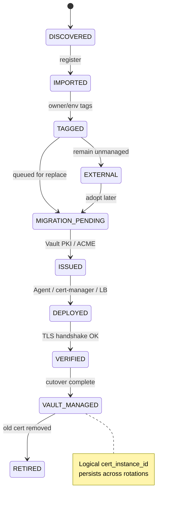

---

### Lifecycle stage 12: Reporting, analysis & action

**Why:** Discovery and monitoring produce data; **reports turn data into decisions**. Without structured analysis and configurable action, inventory becomes a static spreadsheet. Auditors need evidence, but operators need **delta reports and risk highlights every cycle**.

**What to cover:**

**Reporting & analysis (continuous, not one-off):**

- Baseline report after first discovery
- Delta report on each monitor cycle: new / changed / removed certs
- Risk highlights: expiry, SC-081, orphan, untagged, weak crypto, external unmanaged
- Standards pack results (SC-081, ISM, DORA Art.7, PCI 4.2.1.1, internal)
- External vs internal slices, by owner/environment/service
- Trend view over time (optional Release 2+)
- Export: HTML/PDF/CSV + machine-readable for action engine

**Action engine (configurable, policy-driven):**

- Alert owner / team (email, Slack, PagerDuty)
- Create ITSM ticket (ServiceNow, Jira)
- Import to inventory (`managed_by: external`)
- Queue renew / import & replace / **create / revoke** (operate queue)
- Escalate or route to exception workflow
- Log-only (no action) for low-priority findings
- All actions recorded as evidence regardless of auto vs manual

| Business impact | Priority |
|---|---|
| Turns discovery into operational workflow | **P1** |
| Delta reports catch new shadow certs early | **P1** |
| Configurable actions reduce manual triage | **P1** |
| Audit-ready standards results (distinct from evidence trail) | **P1** |
| Executive / program reporting on SC-081 readiness | **P2** |

**Vault today:** HCP CSV/JSON export (max 1,000 rows) for Vault-issued certs only. No delta analysis, no risk report, no standards packs, no action engine.

---

### Lifecycle stage 12b: Audit evidence (separate from operational reporting)

**Why:** Operational reports drive action; **audit evidence** proves actions were taken correctly over time. Auditors ask for point-in-time posture **and** proof that remediation occurred.

**What to cover:**

- Immutable event history linked to report findings
- Point-in-time reproducible posture snapshots
- Exception workflow with approver + expiry
- Evidence bundle export (finding → action → outcome)

| Business impact | Priority |
|---|---|
| APRA/ISO/DORA audit proof | **P1** |
| Closes loop: report finding → action taken → evidenced | **P2** |

**Vault today:** Audit logs for Vault API calls only — not linked to cross-estate report findings or action outcomes.

---

### Lifecycle stage 13: Import & replace (certificate adoption)

**Why:** Discovery finds certs Vault does not manage. Without a migration path, inventory is a report — not a remediation program. SC-081v3 and DORA/PCI expectations require moving unmanaged certs under controlled, auditable lifecycle — ideally Vault-managed.

**What to cover:**

- **Import (register):** Add discovered cert to inventory with metadata, chain, endpoint bindings, tags, and `managed_by: external` status
- **Assess for replacement:** SAN coverage, trust type (public vs internal), deployment target, renewal method today
- **Plan replacement:** Choose Vault PKI (internal) vs Vault Agent + ACME / `pki_external_ca` (public)
- **Issue:** New cert from Vault under policy (manual approval or auto-approved by policy)
- **Deploy:** Agent template, cert-manager, or LB API hook
- **Verify:** TLS handshake, optional app smoke test
- **Cutover:** Overlap window where old + new coexist if required
- **Retire:** Remove old cert from endpoint; update status to `managed_by: vault`
- **Evidence:** Change record, before/after fingerprint, linked event history
- **Optional revoke:** Old public cert if still valid and policy requires

**What "import" does not mean (by default):** Importing every legacy private key into Vault for long-term custody. The default pattern is **inventory import + Vault-issued replacement**, not permanent key storage of external certs.

**What it means operationally:** Shadow certs become Vault-managed assets with full lifecycle history — the core migration story for SC-081 preparation.

| Business impact | Priority |
|---|---|
| Closes gap between Vault inventory and real-world estate | **P1** |
| Enables SC-081 migration programs (manual → automated) | **P1** |
| DORA/PCI remediation path, not just inventory finding | **P2** |
| Strengthens Vault upsell (PKI + Agent) without competing with PKI | **P2** |
| Bulk migration campaigns (e.g. all prod public certs by Q3) | **P3** |

**Vault today:** Strong at **issuing** and **deploying** Vault-managed certs (PKI, Agent, ACME). No workflow to **adopt** an external cert discovered elsewhere — no import-to-inventory, no replace orchestration, no `external → vault` status transition.

---

## 5. Business impact priority summary

Consolidated view for roadmap and presentation:

| Priority | Capabilities | Primary driver |
|---|---|---|
| **P1 — Do first** | Discovery, inventory, classification, **baseline + delta reports**, **action engine**, **OpenAPI v1 + webhooks**, **audit event stream (v1)**, **RBAC (core roles)**, SC-081 in reports, tagging | SC-081v3 + PCI/DORA + pipeline/ITSM integration |
| **P2 — Do next** | **Operate loop** (create/renew/revoke/deploy/retire via Vault), import & replace, full traceability chain, fine-grained RBAC, ITSM hooks | Audit evidence + Vault migration + delegated ops |
| **P3 — Mature** | Multi-platform deploy, CMDB sync, advanced drift, PQC readiness packs | Scale and efficiency |
| **P4 — Selective** | Full ITSM replacement, all-cloud LB integrations, legacy VPN auto-wrap | Customer-specific professional services |

---

## 6. HashiCorp Vault: current capability map

### 6.0 Vault version scope: 1.x baseline vs Enterprise 2.0

Most of this report describes gaps against **Vault 1.x**: the PKI secrets engine, Agent templates, and (on HCP) Certificates Inventory reporting that enterprises deploy today. **Vault Enterprise 2.0** ([release notes](https://github.com/hashicorp/vault/releases/tag/v2.0.0), [product blog](https://www.hashicorp.com/en/blog/vault-enterprise-20-modernizes-identity-security-at-scale)) improves certificate issuance and renewal, but does not close the CLM visibility and compliance story.

#### What Vault Enterprise 2.0 adds for certificates

| Feature | What it does | Impact on this report |
|---|---|---|
| **PKI External CA secrets engine** (Enterprise plugin) | Dedicated engine to acquire **public** certs from ACME CAs (Let's Encrypt, DigiCert, Sectigo); CSR and identifier workflows; cert caching ([docs](https://developer.hashicorp.com/vault/docs/secrets/pki-external-ca)) | Strengthens **Operate — create/renew** for public TLS via Vault; supersedes Agent-only `pki_external_ca` as first-class path |
| **Vault Agent: native ACME** | Agent supports public CA ACME workflows directly | Better **deploy/renew** automation for Vault-managed public certs |
| **Agent template integration (Public PKI CA)** | Templates auto re-render when External CA cert is issued or renewed | Closes part of deploy-on-renew gap for Agent users |
| **`sys/billing/certificates`** (Enterprise) | API endpoint returning count of **Vault PKI-issued** certificates ([docs](https://developer.hashicorp.com/vault/api-docs/system/billing#read-billing-certificate-count)) | Utilization metric only; not a CLM inventory or human-readable estate view |
| **`sys/billing/overview`**, External CA consumption | License metric **`normalized_external_ca_cert_units`** (PKI External CA cert consumption), alongside other consumption metrics | Billing/entitlement; separate from `sys/billing/certificates`; not compliance posture |
| **PKI engine improvements** | ACME challenge IP allow/deny ranges; AuthorityKeyID in issue responses; SCEP/EST/CMPv2 hardening | Better control, not estate discovery |

#### What remains out of scope for Vault 2.x (plugin still needed)

| CLM need | Vault 2.0 status |
|---|---|
| Discover certs Vault did not issue (LB, legacy, external CA outside Vault) | **Still no** network/service discovery |
| Human-readable inventory (service, endpoint, owner) | **Still PKI-internal** (serial/key/mount) in OSS UI; HCP table unchanged in scope |
| Unified Vault + non-Vault estate view | **Still Vault-issued centric** |
| SC-081 / ISM / DORA / PCI standards packs + delta reports | **Still no** |
| Report → Act → Operate → Evidence loop | **Still no** plugin-level orchestration |
| Import & replace for shadow certs | Partially easier if target is External CA engine; workflow still missing |
| Cross-estate audit chain linked to report findings | **Still audit logs only** |

**Summary:** Vault 2.x is a real step forward for issuing and renewing public and private certs through Vault. The plugin still owns visibility, compliance reporting, and orchestration on top. It should integrate with PKI External CA and Agent ACME as Operate targets, not compete with them.

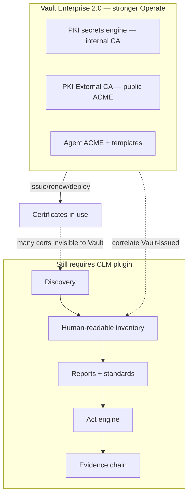

### 6.1 What Vault does well

| Area | Capability | Notes |
|---|---|---|
| **Internal CA / PKI** | Dynamic X.509 issuance, roles, TTL, CRL/OCSP | Core product strength (1.x + 2.x) |
| **Public CA via Vault** | **2.0:** PKI External CA engine (ACME); **1.x:** Agent `pki_external_ca` | 2.x first-class; 1.x Agent-based |
| **Protocols** | ACME (1.14+); SCEP, EST, CMPv2 (Enterprise) | Good enrollment coverage |
| **External CA delivery** | Vault Agent templates, cert caching; **2.0:** auto re-render on External CA renew | Works for Vault-centric workloads |
| **Access control** | Policies, namespaces, PKI roles, EAB | Strong governance for issuance |
| **Audit** | API audit logs for all PKI operations | Raw evidence, not CLM reports |
| **HCP reporting** | Certificates Inventory (Vault-issued) | CN, expiry, role in table — but PKI-telemetry model (mountpath, serial); not service/endpoint/owner view |
| **Secrets scanning** | Vault Radar (HCP) | Code/repos — **not** TLS discovery |
| **Short-lived certs** | Design centre — TTL-based, ephemeral certs | Aligns philosophically with SC-081 direction |

### 6.2 Where Vault stops

| Gap | Detail |
|---|---|
| **PKI-native visibility UX** | OSS UI lists certs by **serial number only**; Keys by **key_id**; navigation is mount → roles/issuers/certs — PKI operator model, not CLM (see §6.3) |
| **No network/service discovery** | Cannot scan endpoints to find non-Vault certs |
| **Inventory = Vault-issued only** | HCP reporting explicitly limited to certs Vault manages |
| **No external estate view** | Public DigiCert/Sectigo certs on LBs unknown to Vault invisible |
| **No owner/service tagging model** | For discovered assets |
| **No logical lifecycle identity** | Serial-based; no service-centric history across rotations |
| **No change-record integration** | Audit logs ≠ ITSM change evidence |
| **No standards compliance engine** | No SC-081 / ISM / DORA rule packs |
| **No operational report or action loop** | No delta reports, risk highlights, or configurable act-on-finding |
| **No external vs internal analytics** | Not a first-class reporting dimension |
| **Radar ≠ CLM** | Different problem (secret sprawl in code vs cert sprawl on wire) |
| **Deploy orchestration** | Agent-centric; not a universal CLM delivery plane |
| **No import & replace workflow** | Cannot adopt external certs into Vault-managed lifecycle with orchestrated cutover |
| **No unified CLM audit trail** | Vault audit logs are API-level only — no cross-estate report→act→operate chain |
| **No plugin-level RBAC** | Vault RBAC covers PKI API; not discovery/report/act/operate on external estate |

### 6.3 Visibility gap: PKI-internal grouping vs human-readable CLM view

A gap that is easy to overlook because Vault **does** have certificate inventory — but it is organised for **PKI operators**, not for **estate owners, app teams, or auditors** asking *"which certs protect which services, and what is at risk?"*

#### What Vault shows today (validated)

| Surface | How certs are grouped / identified | Human-readable? |
|---|---|---|
| **Vault OSS PKI UI — Certificates** | List shows **serial number only**; click each serial to load CN/SANs/expiry on detail page | **No** — list view is opaque ([open issue #27249](https://github.com/hashicorp/vault/issues/27249)) |
| **Vault OSS PKI UI — Keys** | Grouped by **key_id** / managed key name | **No** — crypto asset model, not service model |
| **Vault OSS PKI UI — Navigation** | Secrets engine **mount** → Roles / Issuers / Certificates / Keys | PKI config topology, not application topology |
| **`LIST /pki/certs` API** | Returns serial numbers only; metadata requires **per-cert GET** | **No** at list scale ([API docs](https://developer.hashicorp.com/vault/api-docs/secret/pki#list-certificates)) |
| **HCP Certificates Inventory** | Table with Common name, Valid until, Role, Mountpath, Serial — filterable saved views | **Partial** — better than OSS, still **Vault-issued only**, PKI columns (mountpath, mount accessor, serial), 1,000-row export cap |

HashiCorp acknowledges the OSS UI limitation: with millions of certs, the list endpoint cannot return metadata without performance impact; operators at scale are directed to **audit logs** for tracking ([PKI considerations](https://developer.hashicorp.com/vault/docs/secrets/pki/considerations)).

#### What operators and auditors actually need

| Human-readable dimension | Example | Vault PKI / HCP inventory |
|---|---|---|
| **Service / application** | `payments-api`, `customer-portal` | Not first-class |
| **Endpoint / binding** | `lb.prod.example.com:443`, K8s ingress | Not shown (no discovery) |
| **Owner / team** | Platform team, app owner email | Not first-class |
| **SANs / hostname coverage** | `api.example.com`, `*.example.com` | Detail page only (OSS); CN column (HCP) |
| **Trust type** | Public TLS vs internal vs self-signed | Not first-class |
| **Compliance status** | SC-081 pass/fail, days to expiry risk | Not available |
| **Logical cert identity** | Same service across rotation (fingerprint chain) | Serial-per-row; no service-centric history |
| **Managed by** | Vault vs external vs unknown | Vault-assumed only |

#### Why this matters for the plugin

Vault answers *"what did PKI issue under this mount and role?"* Enterprise CLM must answer *"what certificates exist across the estate, where are they used, who owns them, and what needs action?"*

The plugin's **inventory + classification + tagging + reports** layer is deliberately **human-readable first**:

- Primary keys: service, endpoint, logical cert ID — not serial/key_id
- Vault-issued certs **correlated in** (via serial/SPKI fingerprint) but displayed alongside external/discovered certs in one view
- Reports and dashboards speak in **owner, environment, risk, standards** language — the same language ITSM and audit workflows use

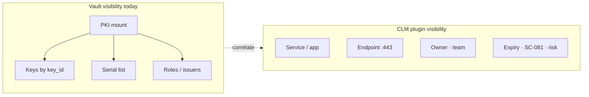

**Plugin positioning line:** *Vault manages issuance; the plugin makes the certificate estate readable, searchable, and actionable.*

```mermaid
flowchart TB
    subgraph estate["Full certificate estate"]
        E1[Public TLS on LBs/CDN]
        E2[Internal PKI / AD CS]
        E3[Legacy manual installs]
        E4[Vault-issued certs]
    end
    subgraph vault_sees["Vault sees today"]
        V4[Vault-issued certs]
    end
    subgraph vault_blind["Vault blind spot"]
        B1[Public TLS on LBs/CDN]
        B2[Internal PKI / AD CS]
        B3[Legacy manual installs]
    end
    E4 --> vault_sees
    E1 --> vault_blind
    E2 --> vault_blind
    E3 --> vault_blind
    plugin[CLM Discovery Plugin] --> estate
    plugin -->|import & replace| V4
```

**Positioning nuance:** Vault is an excellent control plane for secrets and PKI. It is not a full enterprise CLM platform for heterogeneous estates. HashiCorp's own messaging pairs Vault with Radar for secrets exposure and partner integrations (DigiCert TLM, etc.) for broader CLM.

### 6.4 Market positioning: competitive landscape and build / buy / partner

The funding question is straightforward: **why build next to Vault when Venafi and others already sell full CLM?**

#### Who owns what today

| Vendor / product | Strength | Gap vs this plugin |
|---|---|---|
| **Venafi / CyberArk** | Broad discovery (credentialed stores, appliances), connector library, mature workflow | Separate control plane from Vault; weak correlation with Vault token/namespace/audit |
| **Keyfactor / AppViewX** | Enterprise CLM, HSM integration, policy workflow | Not Vault-adjacent; migration story is vendor-centric |
| **DigiCert TLM / Sectigo CLM** | CA-native lifecycle, public TLS focus | CA-tied; limited shadow-cert, internal PKI, and Vault orchestration |
| **Vault PKI + 2.0 External CA** | Issuance, ACME public CA, Agent deploy, audit | No estate discovery, no human-readable inventory, no standards reporting for non-Vault certs |
| **This plugin** | Vault-native discovery, compliance, orchestration, shadow-cert migration | Narrow discovery in Release 1; not a Venafi replacement |

#### Why not Venafi / AppViewX / Keyfactor?

Incumbents solve broad CLM well, especially credentialed store discovery, code-signing, and appliance connectors. Many large FSIs already own one. We are not positioning this as a day-one rip-and-replace.

**What to say in the room:**

> We are not rebuilding Venafi. We are closing the Vault blind spot: certs Vault did not issue, reported in audit language, remediated back through Vault PKI, External CA, or Agent, on the same token, namespace, and audit model the customer already runs.

#### Build vs buy vs partner

| Option | When it wins | When it loses |
|---|---|---|
| **Buy (Venafi / Keyfactor / DigiCert TLM)** | Greenfield CLM, no Vault standardisation, need credentialed store discovery on day one | Vault-heavy estate paying twice; shadow certs invisible to Vault; duplicate RBAC and audit |
| **Partner / OEM incumbent** | Fast time-to-market for connector breadth | Margin, roadmap dependency, weak Vault-native story |
| **Build (this plugin)** | Vault-standardised org with a shadow-cert problem; wants migration without a second control plane | No Vault PKI adoption; needs full appliance connector library immediately |
| **Integrate Ansible Automation Platform** | Deploy collectors and remediation playbooks on hosts Ansible already manages | Ansible alone does not discover certs or produce compliance reports |

**Recommended stance:** Build the narrow wedge; partner for breadth. Ansible Automation Platform is the deliberate integration point for collector placement and deploy/remediation playbooks. It is not a dependency on a broader IBM security portfolio. For credentialed store discovery beyond Release 1, use partners or customer-run agents rather than claiming Venafi parity on day one.

#### Internal funding rationale (HashiCorp / IBM)

After the acquisition, leadership will ask why to fund this inside Vault instead of pointing at an existing IBM asset.

| Question | Answer |
|---|---|
| **Proposed sponsor** | **Vault product line** (PKI / secrets platform). Extends adoption and closes a gap Vault 2.0 does not address. |
| **Why not IBM Verify / Guardium / Concert?** | Those products serve identity governance, SIEM/SOAR, and broad GRC/resilience. Different buyer, different architecture. For certificate discovery, SC-081 reporting, and Vault-native remediation, they add operational cost and integration burden that Vault customers rarely want. This wedge stays lightweight and Vault-adjacent. |
| **Why build vs OEM Venafi?** | OEM buys connector breadth. Build keeps the same token, namespace, and audit model and gives a path to migrate shadow certs into Vault PKI / External CA. |
| **Open question for leadership** | Whether IBM plans a separate CLM SKU. This doc assumes a Vault-adjacent build unless directed to partner or OEM. We are not recommending bundling with the heavy IBM security stack. |

**Internal one-liner:** Fund Vault CLM Discovery because it drives Vault PKI and External CA consumption and fixes an estate visibility problem that Vault 2.0 alone does not solve, without asking customers to take on another enterprise security suite.

#### Ideal customer profile (and who this is weak for)

| Strong fit | Weak fit |
|---|---|
| Vault Enterprise / HCP customer with PKI or External CA in production | No Vault deployment; shopping for standalone CLM |
| Known shadow certs (LBs, legacy apps, third-party public CA) | Already happy with Venafi and no intent to migrate toward Vault |
| ANZ FSI / gov with APRA, ISM, PCI inventory pressure | Needs mainframe and full appliance library in Release 1 |
| Platform team wants one audit chain (plugin → Vault API) | Expects zero customer effort on ownership assignment and remediation |

**Set expectations:** The plugin finds orphans and can queue action. The customer still assigns owners and runs remediation (or automates via policy and Ansible where that is configured).

#### Public vs internal TLS

| Cert type | What Vault does | What the plugin orchestrates |
|---|---|---|
| **Internal / private TLS** | Vault PKI issues and renews | Discover, classify, replace with Vault PKI + Agent |
| **Public TLS (ACME-capable CA)** | Vault 2.0 PKI External CA or Agent ACME | Discover, queue renew/replace via Vault driving the public CA (not swapping in an internal CA cert) |
| **Public TLS (non-ACME CA)** | Integrate via CSR/API where available | Inventory, expiry reporting, manual/ITSM workflow; no pretending the cert is Vault-issued |
| **HSM / appliance-bound keys** | Vault PKI with HSM backend | Replace is not the same as re-key; new cert may need a CSR from the appliance; verify and rollback plan (Release 2) |

#### Out of scope (say it upfront)

- **Service mesh / SPIFFE / SPIRE SVIDs:** mesh control planes manage their own short-lived identities; correlate only if the customer exports inventory
- **Code-signing, S/MIME, document signing:** deferred (Release 3+ or partner)
- **Competing as a public CA:** never; Vault + External CA handles issuance

### 6.5 Discovery scope boundaries and collector topology

Experts will ask whether you can see certs that never listen on a port. State the boundary clearly.

#### Discovery scope matrix

| Source / method | Release 1 (in scope) | Release 2 | Deferred / partner |
|---|---|---|---|
| **TLS network scan** (host:port, SNI) | Yes, core | Expand profiles | — |
| **Cloud LB / CDN APIs** (AWS ALB/NLB, GCP, Azure) | Yes, major providers | More resource types | Every niche LB |
| **Kubernetes** (secrets, cert-manager CRDs) | Yes | Drift detection | — |
| **Certificate Transparency logs** | Correlation for owned domains | Active monitoring | Real-time CT streaming at scale |
| **Vault / HCP inventory correlation** | Yes (serial/SPKI match) | Deep audit chain | — |
| **Credentialed store scan** (Windows cert store, Java keystore, IIS) | No | Pilot via optional agent | Venafi-level parity: partner or Release 3 |
| **Network appliances** (F5, NetScaler, Palo Alto) | Metadata via API where customer provides creds | Read-only cert export hooks | Universal appliance library |
| **Non-listening certs** (client/mTLS, code-signing, S/MIME) | No in Release 1–2 | mTLS inventory if exported from mesh/API | Credentialed store agents |
| **Mainframe / legacy OS** | No | Customer-specific | Services engagement |

#### Collector topology (Release 1)

```mermaid
flowchart TB
    subgraph control["Plugin control plane (Vault-adjacent)"]
        API[OpenAPI + policy + reports]
        INV[Unified inventory]
    end
    subgraph collectors["Discovery collectors"]
        NET[Network TLS scanner]
        CLD[Cloud LB API reader]
        K8S[K8s cert-manager / secret reader]
        CT[CT log correlator]
    end
    subgraph optional["Optional / Release 2+"]
        AGT[Customer-placed agent (credentialed stores)]
        AAP[Ansible Automation Platform (deploy / remediate)]
    end
    NET --> INV
    CLD --> INV
    K8S --> INV
    CT --> INV
    AGT -.-> INV
    API --> INV
    API --> AAP
```

**Deployment notes:**

- Network scanners run from customer-controlled jump hosts or subnets with firewall access to target `:443` (and configurable ports). They do not run inside the Vault server process.
- Cloud API readers use customer IAM roles. The plugin should not store cloud root keys.
- Ansible Automation Platform (optional): run discovery playbooks on hosts Ansible already manages; use for cert deploy/remediation where Vault Agent is not viable. Integration only, not portfolio lock-in.

#### HSM / appliance re-key (Release 2)

"Issue from Vault and deploy" assumes you can place a new private key on the target. With HSM-bound or appliance-bound keys, replacement usually looks like this:

1. Generate CSR on the appliance (or HSM)
2. Issue or sign via Vault PKI or a public CA workflow
3. Import the signed cert back to the appliance
4. Verify TLS and keep a rollback plan

The plugin can orchestrate and record that path. It cannot swap keys on hardware by itself.

#### Inventory identity resolution (hard problem)

Turning sightings from network scan, cloud LB API, CT log, and Vault correlation into one logical cert record is harder than it looks:

- Same cert on multiple IPs or LBs (wildcard `*.example.com`, CDN fronting)
- Multi-SAN certs covering unrelated services
- Rotated certs: new serial, same endpoint
- CT entries for domains you have not scanned yet

Release 1 uses endpoint + SPKI fingerprint + SAN set heuristics, with explicit `possible_duplicate` and `needs_review` states. We do not silently auto-merge. Better entity resolution is Release 2 work.

#### Crypto-agility / PQC

SC-081's rationale includes preparing for crypto-agility. Full PQC issuance is Release 3+ vision, but Release 1 should already report algorithm inventory (RSA vs ECDSA, key length, SHA-1 and weak cipher flags) in standards packs. Auditors are starting to ask before PQC mandates land.

#### Revocation, CRL, and trust-store cleanup (deferred)

Enterprise CLM covers revocation propagation, CRL/OCSP at scale, and trust-store cleanup on retire. Vault PKI revokes Vault-issued certs. The plugin can orchestrate and record revoke requests in Release 2, but it does not replace enterprise CRL infrastructure or appliance trust-store management in Release 1–2. Treat that as Release 3, partner, or customer PKI ops.

---

## 7. Gap analysis: enterprise CLM vs Vault (+ plugin opportunity)

| CLM capability | Enterprise need | Vault today | Gap severity | Plugin opportunity |
|---|---|---|---|---|
| Network/service discovery | P1 | None | **Critical** | **Core plugin value** |
| Unified inventory (Vault + non-Vault) | P1 | Partial (Vault only) | **Critical** | **Core plugin value** |
| Human-readable visibility (service/endpoint/owner) | P1 | Partial (serial/key/mount) | **High** | **Core differentiator** |
| External vs internal classification | P1 | None | **High** | Yes |
| Owner/env/service tagging | P1 | None (for discovered) | **High** | Yes |
| Expiry/risk prioritisation | P1 | Partial (Vault certs) | **High** | Yes |
| SC-081 / ISM / DORA standards packs | P1 | None | **High** | **Differentiator** |
| Operational reports (baseline + delta) | P1 | None | **High** | **Core plugin value** |
| Action engine (orchestration) | P1 | None | **High** | **Core plugin value** |
| Governance, policy & RBAC | P1 | Partial (Vault PKI ACL) | **High** | **Platform requirement** |
| Policy authoring (NL → review → publish) | P2 | None | **Medium** | **Differentiator** |
| API-first design (customer requirement) | P1 | Partial (Vault API only) | **High** | **Platform delivery** |
| Operate — create / renew / revoke | P1 | Partial (Vault PKI; **2.0 + External CA**) | **High** | Integrate + orchestrate |
| Traceability & audit (full chain) | P1 | Partial (Vault API logs) | **High** | **Platform requirement** |
| RBAC — fine-grained | P1 | Partial (Vault policies) | **High** | **Platform requirement** |
| Audit posture reports | P1 | Basic export | **High** | Yes |
| Status + event history | P2 | Audit logs only | **Medium** | Yes |
| Change traceability (ITSM) | P2 | None | **Medium** | Release 2 |
| Renewal orchestration (non-Vault) | P2 | None | **Medium** | Release 2 (integrate, not replace) |
| CT log monitoring | P2 | None | **Medium** | Release 2 |
| Import to inventory (unmanaged certs) | P1 | None | **High** | Release 1 (metadata) / Release 2 (workflow) |
| Replace with Vault-managed cert | P2 | Partial (issue+deploy only) | **High** | **Core Release 2 differentiator** |
| Certificate adoption status (`external` → `vault`) | P2 | None | **High** | Yes |
| Issuance / PKI | P1 | **Strong** | Low | **Integrate with Vault PKI — don't rebuild** |
| Policy / ACL governance | P1 | **Strong** | Low | Leverage Vault |
| Agent-based deploy | P2 | **Good** | Low | Complement |
| Revocation (as CA) | P2 | **Good** | Low | Complement |

### Gap analysis conclusion

The plugin should **not** compete with Vault PKI. It should:

1. **See** what Vault cannot see — and present **all** certs in human-readable terms (service, endpoint, owner), not serial/key/mount grouping alone
2. **Classify and report** in regulatory language customers audit against
3. **Act** on findings (configurable orchestration)
4. **Operate** — create, renew, revoke, deploy, retire — via Vault where appropriate
5. **Evidence** — traceable audit trail for every Act and Operate step
6. **Enforce RBAC** — fine-grained control over who can view, act, and operate
7. **Govern with policy** — customisable, inherited Org→Team→Project rules with human-reviewed publishing
8. **Integrate via API** — OpenAPI-first, webhooks, Vault-native auth; automate without UI dependency

That is the HashiCorp-adjacent pitch: Vault secures and issues; the plugin finds shadow certs, drives remediation under policy, runs the lifecycle where appropriate, and gives auditors a traceable record through the same API your pipelines already use.

---

## 8. Business case for the plugin

### 8.1 Problem statement (for executives)

Public TLS certificate lifetimes are dropping to 47 days by 2029. Renewal frequency roughly **8×** current levels. Domain validation reuse drops to **10 days**. Most enterprises cannot produce a complete certificate inventory today. Manual renewal and spreadsheet tracking will cause outages and audit findings.

**Cost of inaction:** **§8.5** — outage risk, compliance failure (PCI inventory already mandatory), operational load manual teams cannot absorb. **Procurement worksheet:** **§8.6**. **What the rules mean organisationally:** **§3.1.1**.

Vault customers already trust HashiCorp for secrets and PKI. They still have **large blind spots** outside Vault-managed issuance — legacy apps, cloud LBs, third-party public CAs, acquired systems, and shadow IT.

### 8.2 Why now

| Factor | Timing |
|---|---|
| SC-081 enforcement stage 1 (200-day ballot / **199-day issued**) | **In effect** (from Mar 2026) |
| PCI 4.2.1.1 inventory | **Mandatory** (from Mar 2025) |
| DORA RTS | In force for EU finance |
| NCSC/ACSC guidance | Explicit automation + prepare for 47-day |
| APRA supervision | Indirect pressure via CPS 234/230 |

### 8.3 Value proposition

| Stakeholder | Value |
|---|---|
| **CISO / Risk** | Posture visibility, standards-based reporting, reduced unknown cert risk |
| **App owner / SRE** | Human-readable inventory (service, endpoint, owner) — not serial/key hunting in PKI UI |
| **Platform / PKI / SRE** | Vault stays issuance engine; readable estate view, prioritised renewal queue, Vault cert correlation |
| **Audit / Compliance** | Evidence packs mapped to ISM, DORA, PCI, APRA themes |
| **HashiCorp field** | Extends Vault into CLM conversations; import & replace drives PKI/Agent adoption |
| **Customer** | One control plane (Vault) + visibility/compliance layer + migration path for shadow certs |

### 8.4 What is technically viable vs not (honest view)

| Viable (Release 1–2) | Hard / customer-specific (Release 3+) |
|---|---|
| TLS network discovery | Auto-deploy to every legacy appliance |
| Cert parsing, chain analysis, classification | Full ServiceNow workflow replacement |
| Tagging model + manual/auto enrichment | All cloud LB APIs in one product |
| SC-081 + ISM + PCI rule packs | Real-time sync with every CMDB |
| Vault PKI inventory correlation | 100% automated owner assignment |
| CSV/PDF audit reports | Zero-touch renewal for non-ACME legacy |
| Expiry alerting | Full mTLS mesh observability |
| Read-only ITSM ticket creation | On-prem air-gapped CT streaming at scale |
| Vault API integration for remediation | Competing with DigiCert/Sectigo full CLM suites |
| Import to inventory + replace via Vault PKI/Agent | Zero-touch replace on every legacy appliance type |
| Replace workflow with verify + rollback | Universal LB API coverage day one |

**Recommendation:** Lead with visibility, compliance, and prioritisation. Treat import & replace as a Release 2 migration story backed by Vault, not a day-one promise for every deployment target. See §6.4 for competitive framing and ideal customer; §6.5 for discovery scope.

### 8.5 Cost of doing nothing

This is the executive counterweight to plugin investment: **what happens if the organisation keeps spreadsheets, ad-hoc renewals, and Vault-only visibility?**

#### Consequence categories

| Category | If we do nothing | Who feels it first |
|---|---|---|
| **Outage / revenue** | Expired or mis-deployed cert takes down customer-facing TLS (payments, login, API) | App owner, SRE, customer |
| **Operational load** | Manual renewal workload scales with SC-081 (~**8×** renewals per public cert by 2029) | Platform / PKI team — burnout, missed certs |
| **Audit / compliance** | PCI 4.2.1.1 inventory gap; DORA register incomplete; ISM/APRA "timely renewal" finding | GRC, internal audit, regulators |
| **Incident cost** | During breach or outage, **unknown certs** extend MTTR — team hunts serial numbers instead of services | Security ops, incident commander |
| **Migration debt** | Shadow certs stay external; each SC-081 phase forces **fire-drill replacements** under time pressure | Program office, all teams |
| **Vault ROI gap** | Vault PKI investment covers only the **managed subset**; leadership still cannot answer "how many certs do we have?" | CISO, HashiCorp customer sponsor |

#### Illustrative operational math (public TLS estate)

Assumptions for planning — adjust with your real inventory:

| Variable | Today | SC-081 phase (2029) |
|---|---:|---:|
| Public TLS certs in scope | 500 | 500 |
| Renewals per cert per year (~199-day issued → ~8 by 2029) | ~1 | ~8 |
| **Total renewal events / year** | **500** | **~4,000** |
| Manual effort per event (find, order, deploy, verify) | ~2 hours | ~2 hours (if still manual) |
| **Manual hours / year** | **~1,000 h** | **~8,000 h** |

At ~8,000 hours/year, manual renewal is roughly **four full-time equivalents** for renewal alone — before counting discovery, audit prep, or shadow cert remediation. Automation and inventory are not optional optimisations; they are **capacity requirements**.

> This is illustrative FTE math, not a quote for your organisation. Replace 500 and 2 hours with discovery scan results.

#### Outage and audit — qualitative but real

We do not cite specific dollar figures here (outage cost varies enormously by industry and channel). Patterns that consistently appear in post-incident reviews:

- **Customer-facing TLS expiry** — immediate revenue and reputation impact for e-commerce, banking, SaaS login flows
- **Audit finding → remediation program** — months of consultant-led inventory projects costing far more than proactive tooling
- **Regulatory scrutiny** — APRA CPS 234/230 themes: control weakness becomes supervisory question; PCI QSA **fail** on 4.2.1.1 blocks attestation
- **Program delay** — SC-081 phase transitions force **compressed** replacement projects when overlong certs can no longer be reissued

#### What "do something" looks like (contrast)

| Do nothing | Do something (plugin + Vault) |
|---|---|
| Spreadsheet inventory, stale on day one | Continuous discovery + delta reports |
| Renew when calendar reminder fires | Policy-driven queue; auto-renew where safe |
| Audit scramble every year | Evidence chain: report → act → operate → export |
| Vault sees Vault-issued only | Unified human-readable estate + Vault correlation |
| 8× manual renewals by 2029 | Automated operate path via Vault PKI / External CA / Agent |

**Executive one-liner:** Doing nothing still has a cost: outage risk, audit failure, and roughly 8× renewal load on a fixed calendar, while most organisations still cannot list their certificates.

See also **§3.1.1** (what the rules mean organisationally), **§8.1–8.2** (problem statement and timing), and **§8.6** (ROI worksheet for procurement).

### 8.6 ROI worksheet, TCO & payback (for procurement)

§8.5 explains *why* inaction is costly. This section gives a **worksheet** a business analyst can take to procurement — replace placeholders with org-specific numbers from a pilot scan.

#### Step 1 — Inventory baseline (from Release 1 pilot)

| Input | Your value | Notes |
|---|---|---|
| Public TLS certs discovered | _____ | From first network + cloud scan |
| Internal / shadow certs discovered | _____ | Often 2–5× Vault-issued count in hybrid estates |
| Certs with no owner tag | _____ | % untagged = audit finding risk |
| Certs expiring < 60 days | _____ | Immediate queue |
| SC-081 / PCI violations | _____ | From standards pack report |

#### Step 2 — Cost of one outage (customer fills in)

| Input | Low | Mid | High | Your estimate |
|---|---:|---:|---:|---:|
| Revenue per hour (customer-facing TLS) | $50K | $500K | $5M+ | _____ |
| Typical cert-outage duration before detect + fix | 2 h | 4 h | 8 h | _____ |
| **Direct outage cost (single event)** | $100K | $2M | $40M+ | _____ |
| Reputational / regulatory follow-up | Qualitative | APRA CPS 230 reportable event; PCI attestation risk | | |

> One prevented SEV1 cert outage often pays for the program. Use **your** payment-channel numbers — do not rely on industry averages in the business case.

#### Step 3 — FTE savings (extends §8.5 math)

| Variable | Today | With plugin (Release 1–2) | Your value |
|---|---:|---:|---:|
| Public TLS certs in scope | 500 | 500 | _____ |
| Renewals per cert per year (199-day issued → ~8 by 2029) | ~1 now | ~8 by 2029 | _____ |
| Manual hours per renewal event | 2 h | 0.5 h (automated where policy allows) | _____ |
| **Manual hours / year** | 1,000 h | 2,000 h automated + 500 h manual | _____ |
| FTE equivalent (@ 1,800 h/FTE) | ~0.6 | ~1.4 manual remaining | _____ |
| Audit prep hours / year (inventory scramble) | 200 h | 40 h (continuous evidence) | _____ |

#### Step 4 — TCO (3-year planning horizon)

| Cost line | Year 1 | Year 2 | Year 3 | Notes |
|---|---:|---:|---:|---|
| Plugin licence (Vault add-on / HCP) | $_____ | $_____ | $_____ | Pricing TBD — model as Vault-adjacent SKU |
| Vault Enterprise / HCP (existing) | (baseline) | | | Usually already budgeted |
| Professional services — scanner placement, firewall rules, pilot | $_____ | $_____ | $0 | Higher for segmented on-prem FSI |
| Ansible Automation Platform integration (optional) | $_____ | $_____ | $_____ | Deploy playbooks only — if customer already uses AAP |
| ServiceNow / CMDB integration (Release 2–3) | $0 | $_____ | $_____ | Customer or SI effort |
| Internal FTE — platform team run | _____ h | _____ h | _____ h | Lower after Release 2 automation |

#### Step 5 — Payback summary

Use **ranges**, not a single unsourced outage probability. Derive P(outage) from the org's own incident history where possible.

| Metric | Formula | Low | Mid | High |
|---|---|---:|---:|---:|
| **P(cert-related outage / year)** | From incident log or risk register | 1% | 3% | 8% |
| **Cost per outage** | Customer revenue / channel impact (Step 2) | $500K | $2M | $10M+ |
| **Annual risk avoided** | P(outage) × cost | $5K | $60K | $800K |
| **Annual FTE saved** | (hours saved / 1,800) × loaded FTE cost | $40K | $120K | $200K |
| **Annual audit efficiency** | audit hours saved × consultant rate | $10K | $32K | $80K |
| **Total annual benefit** | sum of above | ~$55K | ~$212K | ~$1.08M |
| **Year 1 TCO** | licence + PS + internal (Step 4) | | e.g. $280K | |
| **Simple payback** | Year 1 TCO ÷ annual benefit | | **Mid case ~16 mo** if benefit = FTE + audit only; **faster** if outage avoided | |

> **Procurement tip:** Lead with FTE and audit savings (numbers you can back from a pilot scan). Treat outage avoidance as upside. If you use a probability, derive it from your own cert or TLS incidents over the last 3–5 years.

Replace every example with pilot data. The worksheet is meant to start the conversation, not imply false precision.

#### Honest constraints for the BA

1. The ideal customer is narrower than "every enterprise." Strongest fit: Vault-heavy estates with shadow certs (§6.4).
2. The plugin finds problems; the customer still assigns owners and runs remediation (unless policy + Ansible automates that).
3. Many accounts already own incumbent CLM. Position as a Vault complement and migration accelerator, not rip-and-replace.

---

## 9. Proposed plugin: scope and priorities

### 9.0 Release 1 commitment vs product vision

> Scope initial funding to Release 1 only. The rest of this document describes the full CLM vision. Treat it as reference material, not committed delivery.

| **Release 1 (funded)** | **Release 2+ (vision, not initial scope)** |
|---|---|
| TLS + cloud LB + K8s discovery | Credentialed store agents, appliance libraries |
| Human-readable inventory (service, endpoint, owner) | Full entity resolution, CMDB sync |
| Vault serial/SPKI correlation | Full Report → Act → Operate → Evidence loop |
| SC-081 + PCI baseline/delta reports + algorithm inventory | ISM/DORA/APRA template packs at scale |
| Alert + webhook on findings | ITSM integration, NL policy authoring, OPA/Rego |
| Audit event stream (discover, report, alert) | Operate audit chain linked to Vault request_id |
| Core RBAC (viewer, auditor, admin) | Fine-grained operate permissions, approver separation |
| OpenAPI v1 read + webhooks | Operate API, Terraform provider, bulk migration |
| Import metadata to inventory (`managed_by: external`) | Import & replace workflow, PKI External CA orchestration |
| Blind-spot reveal demo as POV opening | Venafi-level enterprise CLM parity |

**Release 1 in one sentence:** Scan the estate, show what Vault cannot see, report SC-081/PCI violations in plain terms, and alert. Prove the blind spot.

When you present to engineering or finance, fence §2.8–§2.10 (policy depth), §4 lifecycle stages, and §10 import & replace as direction, not commitment.

### 9.1 Product name (working)

**Vault CLM Discovery & Compliance** (plugin / add-on)

### 9.2 Release roadmap

> See **§9.0** for what Release 1 commits to vs vision.

```mermaid
flowchart LR
    subgraph release1["Release 1 · committed wedge"]
        P1D[Discovery]
        P1I[Human-readable inventory]
        P1R[SC-081 + PCI reports]
        P1A[Alert + webhook]
        P1API[API v1 read]
        P1AU[Audit v1]
        P1RB[RBAC core]
    end
    subgraph release2["Release 2 · vision"]
        P2O[Operate loop]
        P2Ad[Import and replace]
        P2POL[Policy engine v2]
        P2AU[Audit chain]
    end
    subgraph release3["Release 3 · vision"]
        P3CMDB[CMDB sync]
        P3LB[LB deploy hooks]
        P3PQC[PQC readiness packs]
    end
    release1 --> release2 --> release3
```

#### Release 1 — Prove the blind spot (0–3 months) — COMMITTED

**Goal:** One scan that shows certs Vault cannot see, plus an audit-ready SC-081/PCI report. This is the POV opening demo (§12).

**In scope:**

- TLS discovery (IP/DNS targets, configurable scan profiles)
- Cloud LB APIs (AWS, GCP, Azure, major resource types)
- Kubernetes secrets and cert-manager CRDs
- CT log correlation for owned domains
- Inventory normalisation with honest dedup (`possible_duplicate`, `needs_review`; see §6.5)
- Human-readable fields: service, endpoint, owner (manual tag and import)
- External / internal / self-signed classification
- SC-081v3 and PCI 4.2.1.1 standards packs (including algorithm inventory and weak crypto flags)
- Baseline posture report and delta report each monitor cycle
- Alert and webhook on critical findings (expiry, SC-081 violation, untagged prod)
- Audit event stream v1: discover, report, alert (append-only)
- RBAC v1: viewer, auditor, admin (environment-scoped)
- OpenAPI v1: inventory, reports, audit read; webhooks `report.generated`, `finding.critical`
- Vault correlation via serial/SPKI fingerprint
- Import discovered certs as metadata (`managed_by: external`)

**Out of Release 1:** Operate (issue/renew/revoke), import & replace workflow, YAML/OPA policy engine, NL authoring, Org→Team→Project inheritance, ITSM, fine-grained operate RBAC.

**Business outcome:** "Vault sees N certs. We found M. Here are the SC-081 violations." That should land in ten seconds.

#### Release 2 — Close the loop (3–6 months) — VISION

**Goal:** Move from finding to action, including migration to Vault-managed lifecycle. Depends on Release 1 proof and a customer pilot.

- Logical cert instance ID + event history
- Change record emission (webhook / ServiceNow/Jira)
- Auto-approved policy events still logged with policy reference
- CT log monitoring for owned domains
- Renewal queue with priority scoring (fed by report findings)
- **Action engine v2:** queue create, renew, revoke, import & replace, ITSM tickets
- **Policy engine v1:** YAML policy bundles, Org→Team→Project inheritance, form-based authoring + review and publish
- **Policy engine v2:** embedded OPA (Rego), NL → draft → simulate → review → publish, inheritance validator
- **Operate via Vault:** create/issue, renew, revoke, deploy, retire — each step audited
- **Audit chain v2:** correlate report_id → act_id → operate_id → Vault request_id
- **RBAC v2:** fine-grained permissions per function; approver vs operator separation
- **API v2:** operate endpoints, policy publish/simulate, idempotency keys, Terraform provider alpha
- **Webhooks v2:** `operate.completed`, `policy.published`, ITSM payload templates
- **Import & replace workflow (certificate adoption):**
  - Register unmanaged cert with full binding context
  - Plan replacement (Vault PKI vs Agent + ACME)
  - Issue → deploy → verify → retire old cert
  - Status transition: `external` → `migration_pending` → `vault_managed`
  - Before/after fingerprint in event history
- Trigger Vault PKI issue, **PKI External CA order (2.0)**, or Agent renewal for in-scope targets
- Drift detection: inventory vs live scan

**Business outcome:** Report problems and migrate certs under Vault management, with audit evidence.

#### Release 3 — Enterprise integration (6–12 months) — VISION

**Goal:** Scale for regulated enterprise operating models.

- CMDB/service catalog enrichment
- DORA / APRA-mapped report templates
- Multi-tenant / namespace alignment with Vault Enterprise
- API for SOC/SIEM integration
- Selective deploy hooks (K8s, major LB platforms)
- Exception/waiver workflow with expiry
- Bulk migration campaigns (scoped by tag/environment)
- PQC readiness packs (algorithm migration planning)

### 9.3 Priority matrix

```mermaid
quadrantChart
    title Build priority (business impact vs feasibility)
    x-axis Low feasibility --> High feasibility
    y-axis Low impact --> High impact
    quadrant-1 Build first
    quadrant-2 Strategic / phase later
    quadrant-3 Deprioritise
    quadrant-4 Partner / services
    Discovery: [0.85, 0.95]
    SC-081 audit packs: [0.80, 0.90]
    Classification: [0.85, 0.88]
    Tagging: [0.82, 0.85]
    Vault correlate: [0.75, 0.82]
    Import replace: [0.65, 0.78]
    Event history: [0.70, 0.65]
    ITSM traceability: [0.55, 0.68]
    CT monitor: [0.60, 0.62]
    CMDB sync: [0.45, 0.50]
    Full deploy plane: [0.25, 0.55]
```

**Build first (high impact, high feasibility):** Discovery, inventory, classification, standards packs, tagging, Vault correlation, inventory import.

**Build second:** Import & replace workflow, history, change traceability, CT, renewal queue.

**Partner or phase later:** Universal deploy orchestration, full ITSM, bulk migration at scale.

---

## 10. Import & replace: detailed design (certificate adoption)

This section expands lifecycle stage 13 / capability 19 — the bridge from discovery to Vault as control plane.

### 10.1 Why this capability exists

Most enterprises have a large **unmanaged certificate estate**:

- Public certs from DigiCert/Sectigo on cloud load balancers
- Internal certs from legacy Microsoft AD CS
- Certs installed manually on VMs, VPN gateways, legacy apps
- Acquired systems nobody owns

Vault's HCP Certificates Inventory and PKI engine only know about **certs Vault issued**. Everything else is invisible to Vault lifecycle, renewal, and audit — even if Vault is deployed in the same organisation.

**Import & replace** is the controlled migration path:

> Discover shadow cert → register in inventory → replace with Vault-managed cert → verify → retire old cert → prove it in audit trail.

### 10.2 Three meanings of "import" (be precise)

| Type | What happens | When to use | Risk |
|---|---|---|---|
| **Inventory import** | Metadata + chain + bindings stored in plugin inventory. No private key in Vault. | Default for all discovered certs | Low |
| **Operational import** | Adds deployment context, owner, renewal method, migration plan | Before replace workflow | Low |
| **Custody import** | Cert/key stored in Vault KV or similar for legacy apps that cannot use dynamic issuance yet | Exception cases only | Medium–High |

**Default pattern:** Inventory import + Vault-issued replacement. **Not** long-term import of every external private key into Vault.

### 10.3 Replace workflow

```mermaid
flowchart TB
    DISC["DISCOVER<br/>Cert on lb.example.com:443<br/>DigiCert · expires 45 days"]
    IMP["IMPORT<br/>Register in inventory<br/>managed_by: external · tags applied"]
    ASSESS["ASSESS<br/>SC-081 check · SAN match<br/>migration_pending if queued"]
    PLAN["PLAN<br/>Vault PKI or Agent+ACME<br/>Change record created"]
    ISSUE["ISSUE<br/>New cert from Vault<br/>Event: ISSUED"]
    DEPLOY["DEPLOY<br/>Agent / cert-manager / LB<br/>Event: DEPLOYED"]
    VERIFY["VERIFY<br/>TLS handshake OK<br/>Event: VERIFIED"]
    RETIRE["RETIRE<br/>Remove old cert<br/>managed_by: vault_managed"]
    EVID["EVIDENCE<br/>Change closed · audit updated<br/>Optional: revoke old cert"]

    DISC --> IMP --> ASSESS --> PLAN --> ISSUE --> DEPLOY --> VERIFY --> RETIRE --> EVID
```

### 10.4 Status model for adoption

| Status | Meaning |
|---|---|
| `discovered` | Seen by scan, not yet registered |
| `external` | In inventory, not Vault-managed |
| `migration_pending` | Queued or in progress for replace |
| `vault_managed` | Replaced; Vault issues/renews going forward |
| `retired` | Old cert removed after successful cutover |
| `exception` | Waived from migration (approver + expiry required) |

```mermaid
stateDiagram-v2
    discovered --> external : import to inventory
    external --> migration_pending : queue replace
    migration_pending --> vault_managed : successful cutover
    vault_managed --> retired : old cert removed
    external --> exception : approved waiver
    exception --> external : waiver expires
```

Logical `cert_instance_id` persists across statuses — the service identity stays stable while physical cert fingerprints change.

### 10.5 Vault integration points (do not rebuild PKI)

| Step | Vault capability | Plugin role |
|---|---|---|
| Issue (internal) | `pki/issue/:role` | Select role, call API, record serial/fingerprint |
| Issue (public) | Agent `pki_external_ca` + ACME | Trigger/configure Agent, track outcome |
| Deploy | Vault Agent templates | Generate config, monitor render success |
| Audit | Vault audit log | Correlate plugin events with Vault request IDs |
| Inventory correlate | HCP Certificates Inventory API | Match by serial/SPKI; avoid duplicate records |

```mermaid
sequenceDiagram
    participant Plugin as CLM Plugin
    participant Vault as Vault PKI
    participant Agent as Vault Agent
    participant Target as Endpoint / LB

    Plugin->>Plugin: Discover & import (external)
    Plugin->>Vault: pki/issue/:role
    Vault-->>Plugin: New cert + serial
    Plugin->>Agent: Deploy template / ACME
    Agent->>Target: Install cert
    Plugin->>Target: TLS verify
    Plugin->>Plugin: Status → vault_managed
    Plugin->>Vault: Correlate audit log
```

Vault does **not** natively offer "import this external leaf cert and adopt it." The plugin orchestrates **re-issue from Vault**, not import-into-PKI-as-managed-object.

### 10.6 Business scenarios

| Scenario | Import | Replace target | Value |
|---|---|---|---|
| Public cert on AWS ALB, manual renewal | Scan + inventory | Agent + ACME or Vault PKI + manual ALB update | SC-081 survival |
| Internal cert from AD CS | Scan + inventory | Vault PKI issue + Agent deploy | Centralised internal CA |
| Orphan cert, unknown owner | Scan + tag gap report | Hold until owner assigned | Audit hygiene |
| PCI PAN-path cert not in inventory | Scan + classify | Vault-managed + inventory update | PCI 4.2.1.1 remediation |
| Post-acquisition cert estate | Bulk import | Phased migration campaign | M&A integration |

### 10.7 Capability checklist

| Capability | Release | Priority |
|---|---|---|
| Import discovered cert to inventory (metadata) | 1 | P1 |
| `managed_by` status field | 1 | P1 |
| Mark migration candidate (SC-081 / expiry / policy) | 1 | P2 |
| Replacement plan UI/API | 2 | P2 |
| Trigger Vault PKI issue from plugin | 2 | P2 |
| Trigger Agent / ACME path | 2 | P2 |
| Deploy verify (TLS handshake) | 2 | P2 |
| Retire old cert + update history | 2 | P2 |
| Change record on replace | 2 | P2 |
| Bulk migration by tag/environment | 3 | P3 |
| LB API deploy hooks (AWS/GCP/Azure) | 3 | P3 |

### 10.8 Positioning line

> **Discovery finds shadow certs. Import registers them. Replace migrates them under Vault-managed lifecycle.**

---

## 11. HTML presentation plan

Open with the blind-spot reveal. That is the whole argument in ten seconds.

1. **Blind-spot reveal demo** — one scan: Vault cert count vs discovered count, SC-081 violations (POV opening; build from CLM-discovery prototype)
2. **The problem is real** — SC-081 timeline and regulatory inventory mandates
3. **CLM is bigger than PKI** — visibility / control / operations
4. **Vault's strength** — PKI, External CA, Agent, audit (§6.0)
5. **The gap** — blind spot diagram
6. **Release 1 wedge vs vision** — §9.0; do not scope-creep in the room
7. **Report and analyze** — baseline/delta reports, algorithm inventory
8. **Competitive and internal funding** — why not Venafi; why not heavy IBM GRC; Vault as sponsor (§6.4)
9. **Discovery scope** — in/out of scope, dedup honesty (§6.5)
10. **Business case** — cost of doing nothing, ROI ranges (§8.5, §8.6)
11. **Release 2–3 vision** — Act/Operate, import & replace, policy (appendix only)
12. **Ask** — pilot customer, Release 1 sign-off, fund the wedge

Appendix if needed: full 19-capability model (§4), policy engine (§2.8–§2.10), import & replace (§10).

This deck shows you know the full spec, know where Vault stops, and are asking for a fundable wedge rather than a multi-year platform on slide one.

---

## 12. Recommended immediate actions

1. **Build the blind-spot reveal demo (POV opening).** One customer-shaped scan: Vault-issued count vs total discovered, shadow cert count, SC-081/PCI violation count. Use the CLM-discovery prototype repo.
2. **Freeze Release 1 scope (§9.0).** Discovery, human-readable inventory, SC-081/PCI reports, algorithm inventory, alert/webhook, audit v1, core RBAC, API read. No operate, no policy engine, no import & replace workflow.
3. **Publish OpenAPI v1 spec.** Inventory, reports, audit read; webhooks; async scan jobs; Vault token auth.
4. **Spec dedup / identity model.** Endpoint + SPKI + SAN heuristics; `possible_duplicate` and `needs_review` (§6.5).
5. **Backlog Operate and policy schemas for Release 2.** Do not fold into Release 1 funding.
6. **Design import & replace workflow** (Release 2): status model, Vault PKI / PKI External CA (2.0) / Agent integration.
7. **Document Vault integration points.** PKI list/issue/revoke, PKI External CA API, HCP inventory, `sys/billing/certificates` vs `normalized_external_ca_cert_units`, Agent ACME.
8. **Prepare HTML deck from §11.** Blind-spot reveal first; vision in appendix.
9. **Identify pilot profile.** Vault-heavy ANZ FSI or gov, hybrid estate, known shadow certs, not a Venafi replacement on day one.

---

## 13. Document versioning

### 1.6.1 · 27 Jun 2026 · David Joo

- §9.0 Release 1 commitment vs product vision — ruthless wedge fence; policy/operate moved to Release 2+ vision
- §6.4 internal funding rationale — Vault product sponsor; explicit **not** IBM Verify/Guardium/Concert (operational/architectural weight)
- §6.0 billing fix — `sys/billing/certificates` vs `normalized_external_ca_cert_units` (via `sys/billing/overview`)
- §8.6 payback — outage probability ranges; FTE/audit-led defensible case
- §6.5 — inventory dedup honesty, PQC algorithm inventory (Release 1), revocation deferred
- §1.1 six-term glossary; "how to read" navigation box
- §11/§12 — blind-spot reveal demo first

### 1.6.0 · 27 Jun 2026 · David Joo

- §6.4 market positioning — competitive landscape, build/buy/partner, ideal customer, public vs internal TLS clarity
- §6.5 discovery scope boundaries & collector topology (in-scope / deferred; Ansible AAP as optional integration)
- §8.6 ROI worksheet, TCO & payback for procurement
- Terminology pass: **lifecycle stage 1–13** (§4) vs **Release 1–3** (§9) vs **SC-081 enforcement stage** (§3.1)
- SC-081: 199-day issued lifetime vs 200-day ballot ceiling
- Executive summary: Release 1 plain-language deliverable; competitive pointer

### 1.5.5 · 27 Jun 2026 · David Joo

- §3.1.1 what SC-081/regulatory changes mean for organisations
- §8.5 cost of doing nothing (outage, audit, 8× renewal FTE math, do-nothing vs do-something)

### 1.5.4 · 27 Jun 2026 · David Joo

- §6.0 Vault version scope — 1.x baseline vs Enterprise 2.0 (PKI External CA, Agent ACME); gaps that remain

### 1.5.3 · 27 Jun 2026 · David Joo

- §6.3 visibility gap — Vault PKI/HCP grouped by serial/key/mount; plugin provides human-readable CLM view (validated against Vault UI, API, GitHub #27249)

### 1.5.2 · 27 Jun 2026 · David Joo

- Canada GC TLS source links (CA/B validity delegation by reference)
- Policy engine folded into **Govern** (§4 lifecycle stage 4) — not a separate lifecycle stage
- API-first reframed as **customer/platform requirement** (§2.11), not lifecycle capability
- Capability model → **19 lifecycle capabilities** + Govern depth + platform requirements

### 1.5.1 · 27 Jun 2026 · David Joo

- §2.11 ease of use / integration — API-first approach (OpenAPI, webhooks, async jobs)
- Release 1 roadmap: OpenAPI v1 + webhooks
- Validation pass: reference links, SC-081 exec summary wording, §4 vs §9 phase disambiguation

### 1.5.0 · 27 Jun 2026 · David Joo

### 1.4.0 · Jun 2026 · David Joo

- §2.8 policy engine (OPA, three layers, starter catalogue)
- §2.9 natural language → draft → review → publish
- §2.10 Org → Team → Project policy inheritance with Vault namespace examples

### 1.3.0 · Jun 2026 · David Joo

- §2.6 traceability & auditability
- §2.7 fine-grained RBAC

### 1.2.0 · Jun 2026 · David Joo

- Report → Act → Operate → Evidence lifecycle
- Baseline + delta reporting
- §2.5.1 operate action items (create / renew / revoke → evidence)

### 1.1.0 · Jun 2026 · David Joo

- Diagrams converted to Mermaid
- Import & replace (certificate adoption) — §10

### 1.0.0 · Jun 2026 · David Joo

- Initial report: CLM definition, regulatory landscape, Vault gap analysis, business case, phased plugin proposal

---

## 14. Sources (primary where possible)

- [CA/B Forum SC-081v3](https://cabforum.org/2025/04/11/ballot-sc081v3-introduce-schedule-of-reducing-validity-and-data-reuse-periods/)
- [NCSC UK — Web PKI certificate management (Dec 2025)](https://www.ncsc.gov.uk/guidance/provisioning-and-managing-certificates-in-the-web-pki)
- [ASD ISM — Guidelines for cryptography](https://www.cyber.gov.au/business-government/asds-cyber-security-frameworks/ism/cybersecurity-guidelines/guidelines-cryptography)
- [ASD — Managing cryptographic keys and secrets (Aug 2025)](https://www.cyber.gov.au/sites/default/files/2025-08/Managing%20cryptographic%20keys%20and%20secrets_D4.pdf)
- [APRA CPS 234](https://www.apra.gov.au/standards/cps-234)
- [GC Web Sites and Services Configuration Requirements](https://www.canada.ca/en/government/system/digital-government/policies-standards/enterprise-it-service-common-configurations/web-sites.html) (mandates GC TLS recommendations)
- [GC Recommendations for TLS Server Certificates (May 2021 PDF)](https://wiki.gccollab.ca/images/9/92/Recommendations_for_TLS_Server_Certificates_-_14_May_2021.pdf) — validity must not exceed CA/B Forum guidelines
- [DORA RTS — Commission Delegated Regulation 2024/1532 (Art. 6–7)](https://ec.europa.eu/finance/docs/level-2-measures/dora-regulation-rts--2024-1532_en.pdf)
- [PCI DSS v4.0 Summary of Changes (4.2.1.1)](https://listings.pcisecuritystandards.org/documents/PCI-DSS-v3-2-1-to-v4-0-Summary-of-Changes-r1.pdf)
- [Vault Enterprise 2.0 release notes](https://github.com/hashicorp/vault/releases/tag/v2.0.0)
- [Vault Enterprise 2.0 blog](https://www.hashicorp.com/en/blog/vault-enterprise-20-modernizes-identity-security-at-scale)
- [Vault PKI External CA docs](https://developer.hashicorp.com/vault/docs/secrets/pki-external-ca)
- [Vault sys/billing/certificates API](https://developer.hashicorp.com/vault/api-docs/system/billing#read-billing-certificate-count)
- [Vault sys/billing/overview API](https://developer.hashicorp.com/vault/api-docs/system/billing#read-billing-overview) (includes `normalized_external_ca_cert_units`)
- [HashiCorp Vault PKI docs](https://developer.hashicorp.com/vault/docs/secrets/pki)
- [HashiCorp Vault Sentinel (Enterprise)](https://developer.hashicorp.com/vault/docs/enterprise/sentinel)
- [Open Policy Agent (OPA)](https://www.openpolicyagent.org/)
- [Vault PKI — list certificates API](https://developer.hashicorp.com/vault/api-docs/secret/pki#list-certificates) (serials only at list)
- [Vault PKI considerations](https://developer.hashicorp.com/vault/docs/secrets/pki/considerations) (scale / audit-log tracking guidance)
- [Vault GitHub #27249 — CN in certificate list UI](https://github.com/hashicorp/vault/issues/27249) (open)
- [HCP Certificates Inventory Reporting](https://developer.hashicorp.com/hcp/docs/vault/reporting/certificates-inventory-reporting)
- [Vault Agent PKI External CA](https://developer.hashicorp.com/vault/docs/agent-and-proxy/agent/pki-external-ca)
