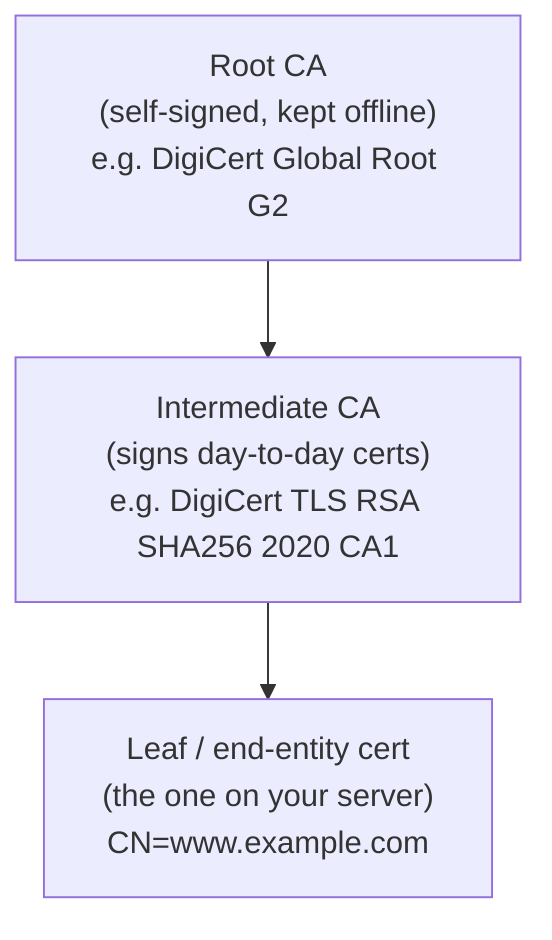
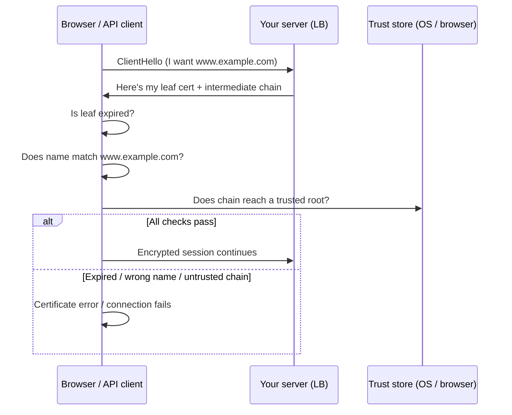
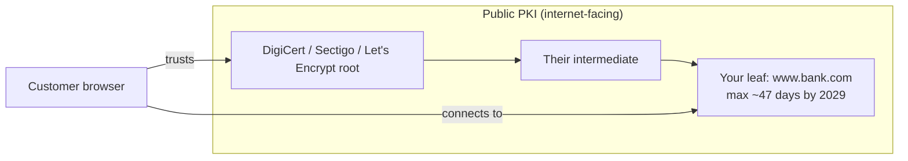
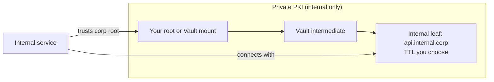
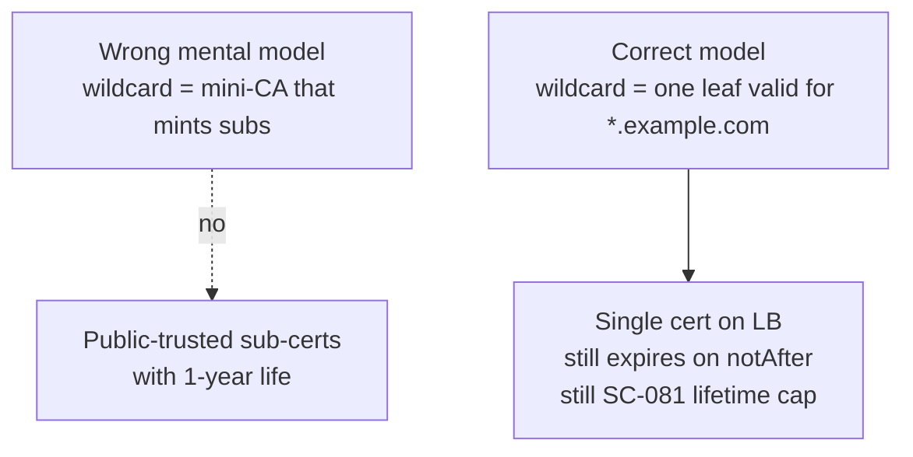
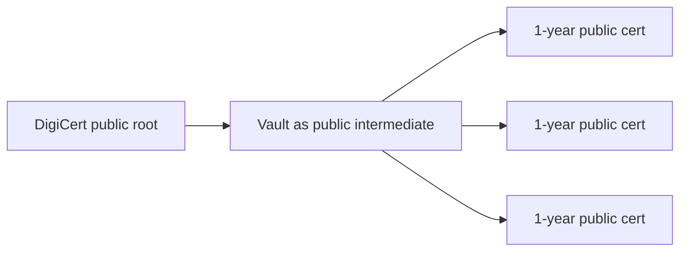
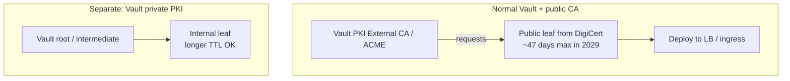
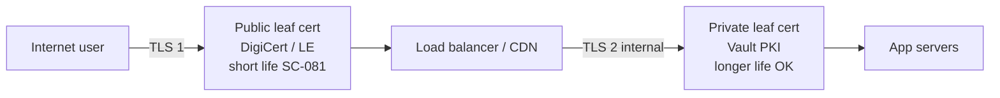
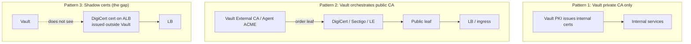
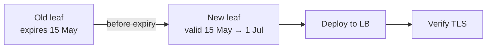

# Certificate architecture for dummies

A plain-language guide to how TLS certificates are structured, who trusts them, and where Vault fits. Written to complement the [CLM research report](./certificate-lifecycle-management-research-report.md).

---

## 1. The one-minute version

A TLS certificate is a **digital ID card** for a server (or sometimes a client). It says:

- **Who** this server claims to be (`www.example.com`)
- **Who vouches for that claim** (a Certificate Authority, or CA)
- **How long** the ID is valid (`notBefore` → `notAfter`)

Browsers and API clients only trust the connection if:

1. The cert is **not expired**
2. The name matches the site they asked for
3. The cert **chains** to a CA they already trust (built into the OS/browser)

That chain is usually: **leaf → intermediate CA → root CA**.

---

## 2. Root, intermediate, and leaf (the chain)

Think of it like a company org chart for trust.

| Piece | What it is | Typical lifetime | Where it lives |
|---|---|---|---|
| **Root CA** | Top of the trust pyramid. Self-signed. Browsers ship its public key in their trust store. | 10–25 years | CA vault, offline / HSM |
| **Intermediate CA** | Signs leaf certs. Protects the root (if intermediate is compromised, revoke intermediate, root survives). | ~5–10 years | CA systems, HSM |
| **Leaf (end-entity)** | The cert on **your** load balancer, web server, or API gateway. | **Short** for public TLS (199 days now; ~47 days by 2029 under SC-081) | Your LB, K8s secret, Vault, etc. |

**Leaf** = the cert clients actually see when they connect to `https://www.example.com`.

**Intermediate** = the CA that signed the leaf (clients may download this as part of the chain).

**Root** = already trusted on the laptop/phone; usually not sent on the wire.

---

## 3. What happens during a TLS handshake (simplified)

**If the leaf expires:** step "Is leaf expired?" fails → **TLS fails** → users see errors or APIs break. No grace period from the browser.

---

## 4. Public PKI vs private PKI (two different worlds)

This is the confusion behind "can't Vault just mint the rest?"

### Public PKI (Web PKI)

- CAs like **DigiCert, Sectigo, Let's Encrypt**
- Roots are **pre-installed** in Chrome, Safari, Firefox, phones
- Used for **internet-facing** sites customers visit
- Rules set by **CA/B Forum** (including SC-081 max leaf lifetime)
- You get **leaf certs** from them (via portal, CSR, or ACME). You do **not** normally get your own public intermediate.

### Private PKI (your org)

- **You** run the root (or buy a private hierarchy), often via **Vault PKI**, Microsoft AD CS, etc.
- Trust only exists on machines **you configure** (corp laptops, internal services)
- **SC-081 does not apply** to purely internal certs
- You **can** issue long-lived leaves (e.g. 1 year) because **you** control policy

| | Public PKI | Private PKI (e.g. Vault) |
|---|---|---|
| **Who trusts it** | Everyone on the internet | Only devices you configure |
| **Typical use** | Public website, public API | Internal APIs, mTLS east-west, dev/test |
| **Max leaf lifetime (2029)** | ~47 days (SC-081) | Your policy (often longer) |
| **Wildcard on public site** | Still a **leaf**, still short-lived | N/A for public trust |

---

## 5. Wildcard certs are still leaves (not a CA)

`*.example.com` covers many hostnames **in one leaf certificate**. It is **not** a permission to mint child certificates.

You cannot sign new publicly trusted certs with a wildcard's private key unless that cert were explicitly a **CA certificate** (public CAs do not issue those to normal customers via ACME).

---

## 6. "Can Vault be a public intermediate?" (the FAQ)

**What people hope:**

**What actually happens for almost all organisations:**

| Question | Answer |
|---|---|
| Can Vault PKI issue certificates? | Yes, as **private** CA |
| Does ACME make Vault a public intermediate? | **No.** ACME returns **leaf** certs only |
| Could we get a public sub-CA cert into Vault? | Theoretically for a tiny number of enterprises; **not** standard; heavy audit |
| If we had a public sub-CA in Vault, can we issue 1-year **public** leaves? | **No.** SC-081 caps **subscriber certificate** lifetime regardless of who signs |
| What should we do? | Automate **short public leaf** renewal; use **private PKI** for internal long-lived certs |

---

## 7. Split termination (pattern that actually works)

Common in banks and large enterprises:

- **Public cert** on the edge: must follow SC-081
- **Private cert** behind the edge: your rules
- You are **not** bypassing SC-081; you are using two trust domains for two audiences

---

## 8. Where Vault sits (three common patterns)

| Pattern | Vault role | SC-081 on public cert? |
|---|---|---|
| Private CA | Issues and renews internal certs | N/A (internal) |
| External CA / ACME | Automates public **leaf** issue/renew | **Yes** |
| Shadow cert | No visibility until discovery plugin finds it | **Yes**, and easy to miss |

The CLM discovery plugin targets **Pattern 3**: certs in use that Vault did not issue.

---

## 9. Renewal in plain terms

**Renewal** = get a **new** leaf cert (new `notAfter`) and **deploy** it before the old one expires.

SC-081 means you do this **~8 times per year per public cert** by 2029, not once a year.

Failure modes:

| Failure | Result |
|---|---|
| Forgot to renew | Leaf expires → TLS fails |
| Renewed at CA but not deployed | Old expired cert still on LB → TLS fails |
| DCV / domain validation failed | No new cert issued → old expires → TLS fails |
| Cert not in inventory | Nobody owns renewal → TLS fails |

---

## 10. Glossary (quick reference)

| Term | Meaning |
|---|---|
| **CA** | Certificate Authority. Signs certs vouching for identities. |
| **Root CA** | Top of chain. Trusted by browsers/OS. |
| **Intermediate CA** | Signs leaf certs. Chains to root. |
| **Leaf / end-entity** | Cert on your server. What clients validate. |
| **CSR** | Certificate Signing Request. "Please sign this public key for this name." |
| **ACME** | Protocol to automate public cert issue/renew (e.g. Let's Encrypt). |
| **SC-081** | CA/B rule shortening max **public leaf** lifetime toward ~47 days by Mar 2029. |
| **Public CA** | DigiCert, Sectigo, Let's Encrypt (internet trust). |
| **Private PKI** | Your own CA (e.g. Vault PKI). Trust you control. |
| **Shadow cert** | Cert in production that your control plane (Vault) did not issue or track. |

---

## 11. Mental model checklist

Before proposing an architecture, ask:

1. **Who must trust this cert?** Internet users → public PKI. Internal services only → private PKI.
2. **Is this a leaf or a CA cert?** Almost always a **leaf** on a server.
3. **Does SC-081 apply?** Only to **publicly trusted TLS server leaves**.
4. **Where does the private key live?** LB, HSM, Vault, K8s secret, appliance?
5. **Who renews and deploys before `notAfter`?** If the answer is "someone gets a calendar reminder," SC-081 will hurt.

---

## Related reading

- [CLM research report §3.1](./certificate-lifecycle-management-research-report.md) — SC-081 timeline
- [CLM research report §6.0](./certificate-lifecycle-management-research-report.md) — Vault 2.0 and External CA
- [CLM research report §6.4](./certificate-lifecycle-management-research-report.md) — public vs internal TLS positioning
- [CA/B Forum SC-081v3](https://cabforum.org/2025/04/11/ballot-sc081v3-introduce-schedule-of-reducing-validity-and-data-reuse-periods/)
- [Vault PKI docs](https://developer.hashicorp.com/vault/docs/secrets/pki)
- [Vault PKI External CA docs](https://developer.hashicorp.com/vault/docs/secrets/pki-external-ca)
